# bot-trade handover: the work since Claude Code took over from Codex

## TL;DR

**Written 27-09-2026 about 08:30 SGT (00:30Z).** §0 to §12 are the snapshot at 27-09 06:00 SGT (26-09 22:00Z); the box in §7.2 carries the events after it. This TL;DR, the six stages and §13–§16 were added at about 08:30 SGT and describe the state then. Short ids (S-8, CV-2, M7, OD-n, …) are in the glossary, §12; CLS is the Reasons page's layout-shift score.

- **Takeover:** 25-09 11:40 SGT (03:40Z). Claude Code took over from Codex as the single implementing session and rebuilt from `83c94e6`.
- **Merged since the takeover: 75 PRs.** 71 were merged at the snapshot (#1085–#1160). The owner then merged #1156, #1162, #1158 and #1161 (26-09 22:41–23:39Z).
- **Files:** 597 changed since the takeover (221 added, 376 modified), **0 deleted** (git, `83c94e6..584237b`). At the snapshot it was 572.
- **Production:** `584237b`, status ok, 0 errors, 26 open positions (read 23:40Z 26-09, **first-hand**). CI's `test` job on `main` at `584237b` passed at 23:46:27Z.
- **Plan 1's goal**, "parallel scanners both tick and time should be active now":
  - met as **observation** (the bridge is on, `orderAuthority` is false);
  - **not** met as trading: tick is refused `tick_not_ready` on 7 of 7 accounts until the owner's evidence thresholds pass.
- **Plan 2 (V3):** 27 of the 41 queue items are merged (23 at the snapshot, then K3, B2b, C8 and C9). **None of the 8 groups is accepted.** Acceptance is calendar-bound into January 2027.
- **Plan 3 (integrated):**
  - Wave 1 is done.
  - Wave 2: 4 of its 7 rows merged (#1158, #1156, #1161, #1162, all merged by the owner); #1155 (CV-2) and #1159 (M7) are in fix rounds and M7 is out of Monday; T4 (row 2.7) is a branch waiting on OD-1/OD-15.
  - Wave 3: S-8 (#1163) is ready but waits on **OD-8**, deadline 30-09 about 15:00Z. GW-1 and the `/health` hotfix (#1164) wait for a gateway restart window.
- **Top risks:**
  - M7's exit timing is not yet safe: 5 reproduced blockers in round 3.
  - A CV-2 mute can be forgotten on a restart.
  - The loop's breaker can never fire (§7.5).
  - Account ids are on two open `/health` routes, the gateways' and cpp-verify's, in a repository that is public.
  - The HKEX 01-10 date is inferred from the exchange calendar, not from any broker row.
  - Reasons CLS is still Failed.
- **The automated PR "review" check does not review.** `ANTHROPIC_API_KEY` is not set, so a passing "review" check is a skip (the skip notice is on the heads of #1085, #1120, #1147, #1162 and #1164) (§16). The only code review is the session's own checker agents, then the merge: by the owner, or by the session under the standing auto-merge policy (§10.3); GitHub cannot tell which (§9.13).
- **Owner decisions needed** (§8.2):
  - OD-8 (S-8);
  - the gateway restart window, and whether cpp-verify's leak rides with it;
  - yes or no to #1155's merge of `main`;
  - the loop breaker;
  - the named-corrections dry run;
  - OD-1 and OD-15 (T4);
  - OD-24, by 28-09.
- **The count:** 81 = 75 merged + 4 open drafts (#1155, #1159, #1163, #1164) + 2 pushed branches with no PR (T4, GW-1). The owner estimated "more than 100".
- **Where to start reading:** §1.4 or §8.1 for the next actions, §7 for open work, §13–§16 for models, skills and CI/CD.

## The six stages: Intent → Interpretation → Assumptions → Invariants → Execution → Evidence

`CLAUDE.md` §9 sets the chain every change follows. Citations use short file tags: DE, IP, R3, VS, TK and CL (§12). Here it is applied to the whole programme since the takeover (to 27-09 00:30Z), then per plan. Assumptions are marked **held**, **failed** or **not verified**. Invariants are reported as **Passed**, **Failed** or **Not Verifiable** (`CLAUDE.md` P3).

### The whole programme

| Stage | Item | Result | Evidence |
|---|---|---|---|
| **Intent** | 25-09 11:40 SGT: take over and complete "the latest assessment plan"; "the goal of parallel scanners both tick and time should be active now" | — | `docs/claude-takeover-2026-09-25.md:7-9` |
| **Intent** | 25-09 21:30 SGT, for the overnight run: "no false or falsified records, no still-stuck records, no stalled controllers, no fake results on the website" | — | `v3-sequence-2026-09-25.md:784` |
| **Intent** | 26-09 about 13:40 SGT: "I thought the plan is approved" (the integrated plan) | — | `docs/v3-integrated-plan-2026-09-26.md:5` |
| **Intent** | The standing owner principles: no demo/live distinction; nothing fake on the website; "unknown" must not happen; vetoes minimised; trade direction matters; no account-specific setups | — | `CLAUDE.md`, "Owner principles" |
| **Interpretation** | "The latest assessment plan" = the dual-environment plan (DE) | — | `docs/claude-takeover-2026-09-25.md:31-34` |
| **Interpretation** | "Active now" = observation on now; trading only once the owner's evidence thresholds pass | — | `CLAUDE.md` thresholds; DE:53-55 |
| **Interpretation** | V3's eight frozen groups stay the acceptance bar; the integrated plan orders the work | — | IP:8, IP:75 |
| **Interpretation** | "Done" = merged on a passing gate and read back in production; "accepted" only on calendar evidence | — | `v3-sequence-2026-09-25.md:656-662` |
| **Assumptions** | Codex's local build is unrecoverable, so rebuild from `83c94e6` | **held** | `docs/claude-takeover-2026-09-25.md:15-18` |
| **Assumptions** | A single independent checker is enough for money-path code | **failed**: the adversarial pass overturned 4 of 5 (26-09 about 22:45 SGT); M7 and CV-2 then failed re-checks again | first-hand; §7.2 |
| **Assumptions** | A passing "review" CI check means the diff was reviewed | **failed**: the job skips without `ANTHROPIC_API_KEY` | the annotation on `88b839b` (26-09 23:37Z = 27-09 07:37 SGT); §16 |
| **Assumptions** | The Monday merge window would hold | **failed** (overtaken): the owner merged four Wave 2 PRs on Sunday morning SGT by choice | git; §7.2 |
| **Assumptions** | The broker's calendar will list the HKEX 01-10 holiday | **not verified**: 0 broker holidays in the next 14 days at 22:44Z and 23:17Z | first-hand; `v3-sequence-2026-09-25.md:736` |
| **Assumptions** | The gateways' `/health` is reachable from the internet | **not verified** | §8.3 |
| **Assumptions** | The git identity in the shared clone is correct | **failed**: a placeholder `integ <x@x>` was set from about 14:30Z 26-09 and removed 23:0xZ | first-hand; the co-author lines in the squash commits (git) |
| **Assumptions** | Agents kill only their own processes, by PID | **failed** twice: two pattern kills | first-hand |
| **Assumptions** | The test environment matches production | **failed**: better-sqlite3 11.10.0 against `^12.8.0`, so CI is the real gate | §9 item 1 |
| **Invariants** | No change merges without an independent check and CI | **Failed once**: #1095 was merged by the owner with 3 checker blockers open, fixed by #1097 (`CLAUDE.md` ledger). Otherwise **Passed** as recorded first-hand. **Not Verifiable** for all 75 from git alone | §5; first-hand |
| **Invariants** | Every merge is read back in production | **Passed** for the four Sunday merges (first-hand: 22:44Z, 22:53Z, 23:40Z). **Not Verifiable** for all 75 from git | §7.2 |
| **Invariants** | The scanners hold no order authority | **Passed**: `orderAuthority` false; CV-1 Passed | IP:84 |
| **Invariants** | Tick entries stay refused until the evidence thresholds pass | **Passed**: `tick_not_ready` on 7 of 7 | §1.2 |
| **Invariants** | Positions stay protected | **Not Verifiable** from this document: the read-backs at 22:44Z and 23:40Z recorded 26 open positions and `ok` heartbeats, but no per-position protection count is quoted | first-hand |
| **Invariants** | Nothing destructive | **Passed**: 0 files deleted (git); no production writes except the owner-ordered ones recorded first-hand | git; first-hand |
| **Invariants** | Owner-gated items wait for their answers | **Passed**: T4 waits on OD-1 and OD-15, S-8 on OD-8; C8 merged after the owner's yes | §7; the #1161 comment |
| **Invariants** | Every guard can fire (the mutation rule) | **Passed** where recorded per PR (Appendix A). **Failed** for a pre-existing guard found after the cutoff: the loop breaker | §7.5 |
| **Invariants** | The documents match git | **Failed** at the cutoff: stale PR bodies, a stale Wave 2 table, V3-SEQUENCE dangling. Partly repaired by this handover | §11 |
| **Execution** | The pipeline: maker → independent checker → fix → re-check → adversarial pass (money path) → draft PR → CI → merge → read-back | — | §10.1 |
| **Execution** | 417 helper agents in the window (411 in the first measurement; 6 workflow-only agents found missing and added; §13) | — | §13 |
| **Execution** | Workflows for fan-out: the Wave 1 build (`w1-build-lanes`, 17 agents, then `w1-build-lanes-v2`, 19 agents) and the Wave 2 verification (`wave2-merge-verify`: 1 integration merge + 5 refuters) | — | first-hand; §13 |
| **Evidence** | git: 75 merges; 572 files at the snapshot, 597 now. The GitHub API: CI check-runs, PR states | — | Appendix A–C |
| **Evidence** | Production read-backs (first-hand, GET only); the performance traces (first-hand) | — | §4.4, §7.2 |
| **Evidence** | The adversarial repros (first-hand) | — | §7.2 |
| **Evidence** | The measured model and effort table | — | §13 |

### Per plan

| Stage | Plan 1: takeover / dual environment | Plan 2: V3 closure | Plan 3: integrated plan |
|---|---|---|---|
| **Intent** | Parallel scanners, tick and time, active now; accepted only on "a sustainable rise in win factor and win ratio" (DE:8-9) | Close the eight frozen groups of revision 3's performance, protection and scanner work (R3:1; CL:179) | One order for all open work; owner requests 1 and 2 (IP:1) |
| **Interpretation** | Observation now; trading only after the owner's evidence thresholds | The frozen groups are the acceptance bar; calendar evidence decides | Waves 1–4 order the work; OD-0 … OD-43 hold the owner's decisions |
| **Assumptions** | Codex's build is unrecoverable: **held**. The scanners can trade through admission: **not verified** (C7 is blocked) | A single checker suffices: **failed** | The Monday window would hold: **failed** (overtaken by the owner's Sunday merges) |
| **Invariants** | `orderAuthority` false: **Passed**. Tick refused until the thresholds pass: **Passed** | No group accepted without calendar evidence: **Passed** (none is accepted) | Owner-gated items wait: **Passed**. No merge inside the P1/P4 window: **Not Verifiable** yet (the window is Mon 28-09) |
| **Execution** | #1085, #1086, #1087; C3, C4, CV-1 (#1088, #1099, #1112); runbook R2–R5 applied 25-09 22:31–22:35Z | 30 queue PRs, 11 integrity, 12 website, 2 infrastructure; since the snapshot K3, B2b, C8, C9 | Wave 1 (10 PRs); Wave 2 4 of 6 merged; Wave 3 pre-built (S-8 #1163, GW-1, #1164) |
| **Evidence** | `/state/basis-performance`; CV-1 Passed (IP:84); `tick_not_ready` 7 of 7 | git; the 41-item queue status (§4.3); read-backs | The Wave 1 traces (Reasons CLS Failed); the Sunday read-backs (first-hand) |

---

**Snapshot (§0 to §12): 27-09-2026 06:00 SGT = 26-09-2026 22:00Z.** Takeover: 25-09-2026 11:40 SGT = 03:40Z. `origin/main` = `b414a06` (#1160). Companion files: [`handover-2026-09-27-appendix.md`](handover-2026-09-27-appendix.md) (every file, per PR and by area), [`handover-2026-09-27.html`](handover-2026-09-27.html) (both documents on one page) and [`v3-sequence-2026-09-25.md`](v3-sequence-2026-09-25.md) (the V3 queue file the plans cite).

---

## 0. Read this first

**Who wrote this, and for whom.**

- Written by Claude Code, the single implementing session since the takeover. The facts come from fact sheets built by four independent read-only agents and checked against git and GitHub, plus the implementing session's own first-hand notes. A separate agent vets this document before it is committed.
- It is written for other models and engineers who pick up this repository. It assumes no memory of the session.
- The owner's order (27-09-2026, for 06:00 SGT; **first-hand**): an update of the work done since taking over from Codex, in Markdown and HTML, explicit and thorough, with diagrams; the files changed, added and deleted; what needs to be done; the three plans explained; the challenges; vetted by another agent.

**The state at the cutoff.**

| Fact | Value | How it was read |
|---|---|---|
| `origin/main` | `b414a06` (#1160, merged 26-09 13:11:38Z) | `git fetch`; unchanged when re-read at 22:2xZ |
| Production commit | `b414a06` | GET `/health`, 22:09Z |
| Production status | ok; `errorsToday` 0; 26 open positions; 26 open trades; version 0.1.381 | same read; the implementing session read the same at 05:37 SGT |
| Merged since the takeover | 71 PRs, #1085–#1160 | `git log --first-parent 83c94e6..b414a06` |
| Open work | 6 draft PRs, 3 pushed branches without a PR, 1 hotfix being built | GitHub API and `git ls-remote` |

**How to check any claim yourself.**

```
git fetch origin
git log --first-parent --format='%h %cI %s' 83c94e6..origin/main      # the 71 merges
git show --name-status --format= <sha>                                  # files of one merge
git diff --stat 83c94e6 b414a06                                         # the whole range
git ls-remote origin 'refs/heads/claude/w*'                             # open branch heads
git merge-tree --write-tree origin/main <head>                          # does a branch still merge?
curl -s https://api.github.com/repos/ang-kl/bot-trade/commits/<sha>/check-runs   # CI on a commit (public)
```

- **Reading CI:** in the check-runs, count `test` (and `build-test` where a C++ workflow runs). The `review` check reports success but skips, because `ANTHROPIC_API_KEY` is not set (§16).
- **Production:** `https://sg-trade.up.railway.app`. GET only, on `/health` and `/state/...`, with the read-tier bearer (the value of `AGENT_SECRET_READ`). Never print it; never call `/actions/...`.
- Every number in this document is traceable to one of: git, the GitHub API, a document on `main` (cited as file and line), or the implementing session's notes (marked **first-hand**). Anything marked **inference** is reasoning, not a record.

**Conventions.**

- Times: `Z` = UTC. SGT = UTC+8. Dates are day-month (26-09 = 26 September 2026).
- Accounts are named by their last four digits: …0058, …0949. This document introduces no full account id.
- Results: **Passed**, **Failed**, **Not Verifiable**. Status marks, used in words and shapes, never colour: ✔ passed or merged · ✖ failed or blocked · ◐ in progress · ? not verifiable.
- "V3" = the V3 closure programme (plan 2). "The integrated plan" = `docs/v3-integrated-plan-2026-09-26.md` (plan 3). "The new plan" = `docs/plan-ui-and-strategy-review-2026-09-26.md` (owner requests 1 and 2). Short ids (S-2, K3, OD-8, …) are in the glossary, §12.

---

## 1. Summary

### 1.1 The count

**The owner estimated "more than 100 PRs" (first-hand). Measured at the cutoff: 77 PRs (71 merged, 6 open drafts) plus 3 pushed branches with no PR, 80 in all.** #1146, a duplicate closed unmerged after 83 s, is not counted.

| What | Count | Evidence |
|---|---:|---|
| PRs merged since the takeover | **71** | #1085–#1160, one squash commit each on `main`. #1146 was closed unmerged as a duplicate (26-09 06:01:20Z → 06:02:43Z). The other four numbers in the range are open drafts |
| Open draft PRs | **6** | #1155, #1156, #1158, #1159, #1161, #1162 |
| Pushed branches without a PR | **3** | `claude/w2-t4` (T4), `claude/w3-s8-web6b` (S-8 + WEB-6b), `claude/w3-gw1` (GW-1) |
| **Total at the cutoff** | **80** | It becomes 81 when the gateway `/health` hotfix branch `claude/gw-health-ids` is pushed; it was still being built at the cutoff and was not on the remote at 22:2xZ |

**Files.** The 71 merged PRs made **983 file changes** between them, but the net result on `main` is **572 distinct files** (210 added, 362 modified, **0 deleted**; +76,028 / −2,833 lines). The two numbers differ because 172 files were changed by more than one PR; `agent/routes/state.js` alone was changed by 22 PRs and `agent/loop.js` by 20.

### 1.2 What was done since the takeover

At the takeover the owner ordered: *"claude code to take over the complete the latest assessment plan. the goal of parallel scanners both tick and time should be active now"*. In 42 hours and 20 minutes (25-09 03:40Z → 26-09 22:00Z):

- **Plan 1, dual environment (3 PRs of its own, plus 3 shared with V3).** One account can admit bar ("time") and tick entries together (#1085, #1087). Performance is reported per entry basis with intervals (#1086). The scanner bridge, tick receipts and the scanner/verifier relay (#1088, #1099, #1112) were built, and the scanners were switched on in observation at 25-09 22:35Z with 796 profiles.
- **Plan 2, V3 closure (30 PRs).** 23 of the 41 queue items merged, with their follow-ups: load and recovery measurement (M1, M2, M2b, M3, M5), partial take-profit arithmetic and recovery (T1, T1b, T2, T3), calendars (K1, K1b, K1c, K2), accounting (B1, B2, B3, B4, B4b, B4c), research honesty (Q0, Q1, Q1b, Q3, Q4b), acceptance tooling (A1, R1, R2), scanners (C3, C4, CV-1).
- **Record integrity (11 PRs), added to V3 during the build.** A 35-rule order-lifecycle report (L1, L1b, L1c), truthful order and close writers (L2a, L2b), the resting-order fix X1, a reconcile that cannot stall (I1), truthful controllers (I2), a stuck-record resolver (I3), every account's closes captured (V1), an outbox held by a setting named (STK-08v2).
- **Website fixes (12 PRs)** from the owner's 8,989-A list: stops attributed to their own account, money per deposit currency and never summed across currencies, the daily stop in force, measured data-feed latency, labelled gaps instead of false numbers.
- **Infrastructure (2 PRs).** better-sqlite3 12.8.0 before a second database writer (DEP-SQLITE); the tick spool cap set from the environment (GW-CAP).
- **Plan 3, the integrated plan (11 PRs).** The new plan for owner requests 1 and 2 (#1143), all seven Wave 1 rows (#1147–#1154), the follow-up W1-FU (#1157) and the plan update (#1160). Wave 1 finished about 34 h before its deadline.
- **Other (2 PRs).** A CI fixture that failed every night from 21:00 to 23:00Z (#1120); a docs write-back (#1131).

**The owner's goal, "parallel scanners both tick and time should be active now":**

- ✔ **Met as observation.** The bridge is on, both scanners are reachable, `orderAuthority` is false. The integrated plan records CV-1 **Passed** (`orderAuthority` false) and the mirror counts read at 26-09 04:59:22Z: 282 matched, 33 `delivery_failed` (`docs/v3-integrated-plan-2026-09-26.md:84`).
- ✖ **Not met as trading.** Every "Time + tick" request is refused `tick_not_ready` on all 7 accounts under the owner's evidence thresholds. The C++ scanners observe only; the one path by which they could trade (C7) is newly blocked on OD-5 and OD-8.

### 1.3 Where each plan stands

| Plan | Governs | State at the cutoff |
|---|---|---|
| **1. Takeover / dual environment** (25-09) | Nothing on its own now: its PR sequence was folded into plan 2's queue on 25-09 09:35Z | P0, P1, P2 and the scanner items merged. P3 split, P4 part, P5–P6 open or built-not-merged, P7–P8 calendar-bound and not started |
| **2. V3 closure** (revision 3, frozen 24-09) | **Acceptance.** Its eight frozen groups define "done" | 23 of 41 queue items merged, 8 built not merged, 5 open (C5, C7 and Q2 wait on owner answers; W3 waits on CV-2's soak; B5 is in Wave 3.5, OD-12 answered), 4 conditional, 1 superseded. **None of the eight groups is accepted.** Acceptance is calendar-bound into January 2027 |
| **3. Integrated plan** (26-09, owner-approved) | **Order.** Its Waves 1–4 and its decision register OD-0 to OD-43 | Wave 1 ✔ merged. Wave 2 ◐ six drafts and one branch, merges Mon 28-09. Wave 3 ◐ two items pre-built on branches, the rest not started. Wave 4 not started (evidence-gated) |

### 1.4 What happens next

**Now: the current next actions** (27-09 08:30 SGT = 00:30Z, after the cutoff; the events behind them are in the box in §7.2):

1. **The owner decides:**
   - OD-8, which S-8 (#1163) waits on;
   - the `/health` restart window for #1164, and whether cpp-verify's own `/health` leak rides with it;
   - yes or no to #1155's merge of `main` (the permission system blocked it);
   - switching on the loop's backoff and circuit breaker (§7.5);
   - the named-corrections dry run (B2b; the apply after it is a production write).
   - OD-24 (the research path), by 28-09, for stage A and the holdout;
2. Watch for C8's first book-cap refusals in the Reasons list (weekend: crypto only; FX from Monday's open). The read-back of #1161's deploy is done (**first-hand**): live 23:40:32Z; `/health` commit `584237b`, status ok, 0 errors, 26 open positions; every controller heartbeat ok except `pending_orders`, retired by design.
3. Fix round 3 for #1155 (CV-2), then a re-check.
4. #1159 (M7) round 4, then an adversarial re-check. It is out of Monday's merges (the session's rule).
5. S-8 (#1163) merges after OD-8, before 30-09 about 15:00Z.
6. GW-1 rebases after #1164 merges.
7. T4 after OD-1 and OD-15.

**At the cutoff (superseded by the list above; kept as the snapshot):**

- **Before Mon 28-09 01:00Z:** re-check the post-cutoff fix rounds (#1158, #1161; #1156 already re-checked MERGE), finish the #1155 counter fix and the #1159 redesign, finish S-8 round 3's re-check, build the `/health` hotfix, and ask the owner the open questions (§8.2).
- **Mon 28-09 01:00–13:00Z:** merge Wave 2, one PR at a time, each read back: the plan's 2.1 → 2.4 → 2.3 (IP:298), that is #1158 → #1156 → #1155, then #1159 → #1161 → #1162 (the session's order for "the rest", **first-hand**). The 12:00Z cut-off for #1159 is the session's rule (**first-hand**).
- **Mon 13:30–16:00Z and about 20:00Z:** the P1/P4 load window. No merges and no traces inside it.
- **Tue 29-09:** T4, if the owner answers OD-1 and OD-15.
- **By Wed 30-09 about 15:00Z:** S-8 deployed, before HKEX's 01-10 holiday starts at 30-09 16:00Z. GW-1 and the `/health` hotfix in an owner-chosen gateway window.

### 1.5 The top five risks (synthesis, each with its evidence)

1. **Money-path fixes merging on Monday without a clean re-check.** On 26-09 about 22:45 SGT an adversarial "prove it wrong" pass reproduced blockers in 4 of the 5 money-path Wave 2 PRs that single checks had passed (first-hand, §7.2). The PR bodies and the integrated plan's Wave 2 table still say "ready" or "MERGE" (§11).
2. **The HKEX holiday deadline.** S-8 must be deployed before 30-09 about 15:00Z. It conflicts with T4 in `autoTrade`'s market gate (`agent/loop.js:386-392`), a semantic conflict that a text merge cannot resolve, and its hours source (OD-8) is still unanswered. The 01-10 date is inferred from HKEX's calendar, not from a broker row (`v3-sequence-2026-09-25.md:736`): if no broker row appears, S-8 will not refuse on 01-10 and the P2 real-holiday test slips. At 23:17Z (after the cutoff; **first-hand**) there were 0 broker holidays in the next 14 days across all 136 demanded calendars; the collector's receipt was 30 s old and the oldest calendar observation 11.7 h.
3. **Account and symbol ids on the open gateway `/health`.** Account ids have been on the unauthenticated route since #881 (11-09) and symbol ids since #914 (17-09). The fix needs a gateway restart in an owner window. And the fix alone does not make the ids private: the repository is public, and the full account ids already appear in 233 files on `main` (§8.3).
4. **An unfinished performance proof.** Reasons CLS is 0.53 desktop / 0.46 phone against a target of ≤ 0.25 (**Failed**, improved from 0.74 / 0.55). LCP rose on all four page-and-profile pairs after Wave 1 and the cause is **not attributed**.
5. **An owner-gated, calendar-bound finish.** Eight open decisions block dated work (OD-1, OD-15, OD-8, OD-9, OD-16, OD-20, OD-23, OD-24), plus OD-5 for the restores. V3's acceptance runs on the market calendar through the DST weekends of 25-10 and 01-11, a momentum checkpoint on 19-12 and a demo retire not before late January 2027.

**Found after the cutoff:** the loop's backoff and circuit breaker can never trigger (§7.5); the one-line fix is ask-first.

### 1.6 Decisions only the owner can make

Grouped by what they unblock; the full list with recommendations is §8.2.

- **Not blocking:** C8's sub-questions (the `cross_sectional_book` exemption, slot rotation, 2R/7 sizing). C8 ships as built and they stay open as follow-ups (the #1161 PR comment of 14:19:05Z).
- **The corrections:** whether B2b's named corrections are applied after the owner sees the dry-run list.
- **For Tuesday (T4):** OD-1 (resume momentum entries) and OD-15 (resting orders count toward caps and margin).
- **For Wave 3:** OD-8 (hours source for S-8), OD-9 and OD-16 (S-4, S-5), OD-20 (UI-8), OD-23 (C5), OD-24 (Q2 and the research stage A), OD-5 (restoring fib, rsi2 and donchian).
- **For the gateways:** the restart window for the `/health` hotfix (the options as the session framed them: this weekend, Monday before 01:00Z, or a time the owner chooses; **inference**), then GW-1's window.
- **Found after the cutoff:** the loop's backoff and circuit breaker can never trigger (§7.5); the one-line fix is ask-first. The owner's other decisions since the cutoff are item 1 of the current list in §1.4.

---

## 2. System architecture

All file:line references are to `b414a06`. Railway's own dashboard settings were not read; facts that depend on them are marked **Not Verifiable**.

### 2.1 Services and what restarts them

| Service | Role | Port · health | Redeploys on a push to `main` touching |
|---|---|---|---|
| **Node agent + website** | The trading loop, risk gates, protection, records (one SQLite file), the `/state` and `/actions` API, and the built website. Root `Dockerfile` builds the frontend then the agent and runs `node agent/index.js` (`Dockerfile:25-61`, `:111`) | 3001 · `/health` | **Anything.** The root `railway.json` has no `watchPatterns` (`railway.json:1-11`), so every merge restarts Node, docs-only merges included |
| **cpp-exec** (demo gateway) | The broker session for the cTrader demo host: orders, amends, closes, the tick-level trail, the tick recorder, shadow and firer | 8091 · `/health` | `cpp-exec/**`, `agent/lib/exec-engine.*` (`cpp-exec/railway.json:13-16`) |
| **cpp-acct** (live gateway) | The same binary and image for the cTrader live host | as cpp-exec | as cpp-exec: **both gateways restart together** (**inference**: cpp-acct is built from the same image and root directory, `docs/tick-momentum/option-2-observation-rollout.md:41`; its Railway settings were not read) |
| **cpp-verify** | Independent verifier, read-only at the broker (it has no write route: `cpp-verify/src/main.cpp:1-19`), and the service watchdog | 8080 · `/health` public | `cpp-verify/**`, `cpp-exec/src/ws_client.*`, `cpp-exec/src/http_server.*` |
| **cpp-scan-timeframe** | Bar-strategy mirror, `orderAuthority:false` | 8080 · `/health` | `cpp-scan-timeframe/**` (added by #1112; before it, every merge) |
| **cpp-scan-tick** | Tick-strategy mirror, `orderAuthority:false` | 8080 · `/health` | `cpp-scan-tick/**` (added by #1112; before it, every merge) |

- Restart policy: `ON_FAILURE` everywhere; the gateways and cpp-verify also set `restartPolicyMaxRetries: 10` and a 30 s health timeout.
- `agent/railway.json` and `agent/Dockerfile` (backend only) still exist. Whether any Railway service still points at `agent/` is **Not Verifiable** from the repo.

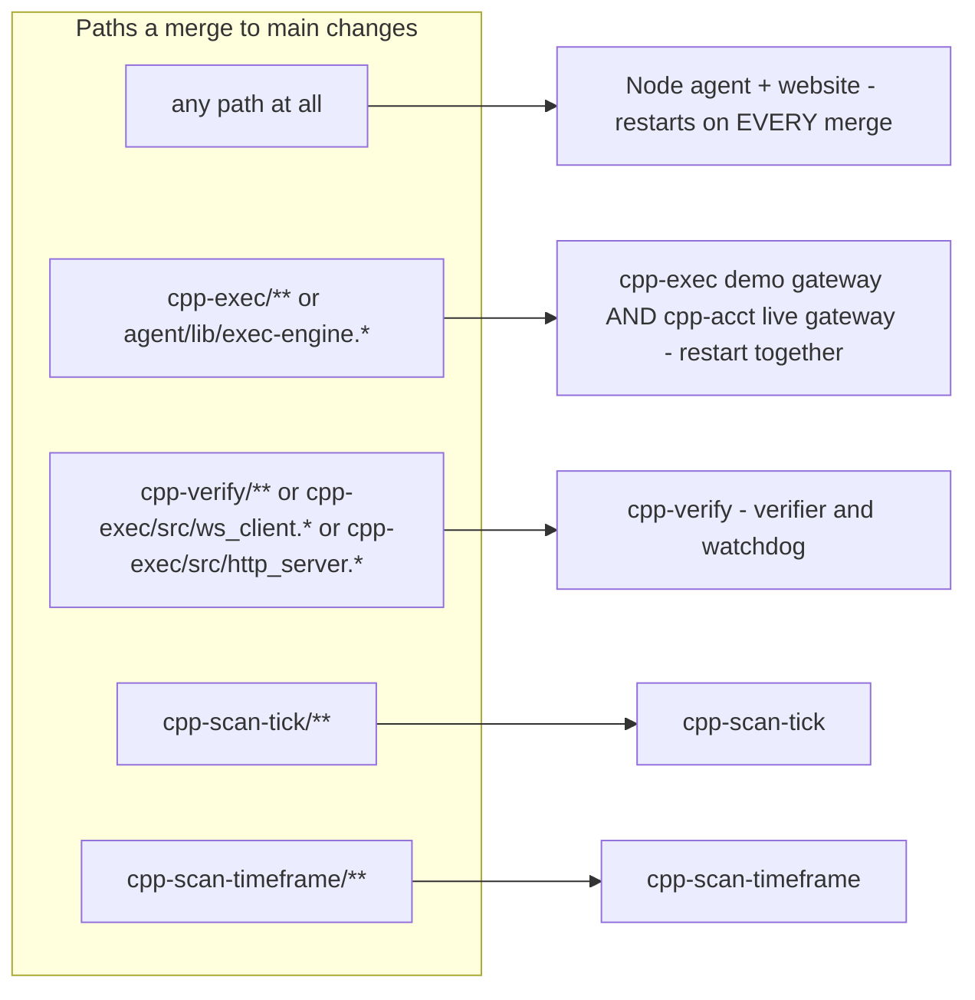

**What this meant for the 71 merges** (inference from paths; Railway's deploy history was not read): all 71 redeployed Node and the website; #1111 and #1113 redeployed both gateways; #1112 redeployed cpp-verify; the 27 merges up to and including #1112 also redeployed both scanners, because the scanners had no `watchPatterns` until #1112 added them.

### 2.2 Topology

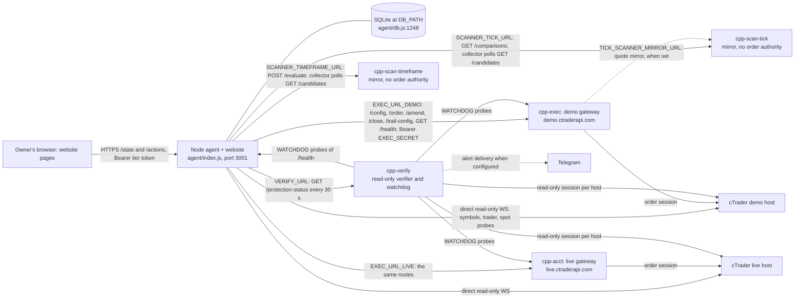

- **Gateway choice:** `execBaseFor(creds)` picks `EXEC_URL_LIVE` or `EXEC_URL_DEMO` by the account's broker host (`agent/lib/exec-engine.js:93-104`). Every call carries `Bearer ${EXEC_SECRET}` with a 30 s abort (`:113-135`). On the gateway, every route except `GET /health` returns 401 without that bearer (`cpp-exec/src/http_server.cpp:185-196`).
- **The open `/health`:** with the bearer, the gateway returns a "trusted" view (`cpp-exec/src/main.cpp:591-597`). But `guard.entryEpochs` (keyed by account id, `main.cpp:693-696`) and `tick.shadowSim.costs.symbolClass` (keyed by symbol id, `main.cpp:725` → `tick_shadow.cpp:56-58`) sit outside the trusted branch. That is the leak in §8.3.
- **`/config` push:** the guard sync and the tick-permit feeder both push through `POST /config`, from the band's `cpp_probe`, which runs every 120 s inside the 60 s protection band (`agent/services/fast-monitor.js:958`: `due('cpp_probe', 120, ...)`; `agent/services/heartbeat.js:1371`, `:1518`, `:1556`).
- **`/config` is not a full replace.** "Each field is optional; only the ones present are changed" (`cpp-exec/src/main.cpp:1380-1381`). Inside it, `tickEntryAccounts` is a full replace (an account that leaves the set loses its permits at once), but `tickPermits` are set one account, symbol and side at a time and are not cleared as a set on `main` (`main.cpp:1489-1526`). GW-1 adds the full replace.
- **The scanner collector** polls `GET /candidates` on both scanners, from its isolated process (`agent/services/scanner-candidates.js:165-193`; the path is built at `:169`).
- **Which gateway has `TICK_SCANNER_MIRROR_URL` set** is Not Verifiable from the repo.

### 2.3 The bar entry path

The loop runs every `loop_interval_min` (default 5 min, clamped 1–60, re-read each cycle; the integrated plan records 1 min in production, `docs/v3-integrated-plan-2026-09-26.md:395`). A loop still running skips the tick (`agent/loop.js:2809-2813`).

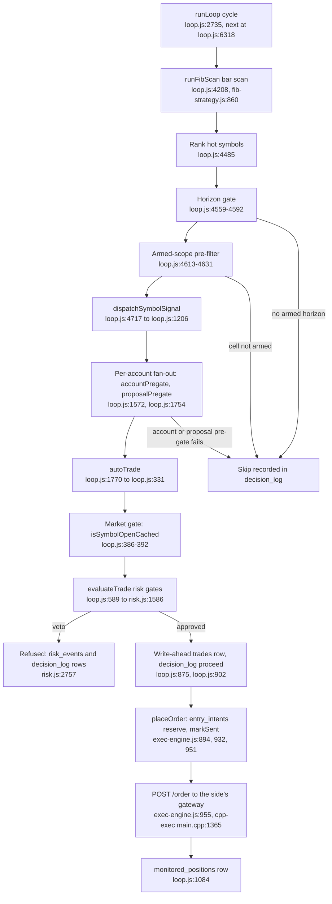

The market gate at step H2 (`loop.js:386-392`) is where two open branches collide: T4 adds a named closed-market momentum refusal on `isSymbolOpenCached`, and S-8 replaces `isSymbolOpenCached` with `resolveEntryMarketGate` (§7.4).

**The main `evaluateTrade` gates** (`agent/services/risk.js`; the labels are the code's own, and "0b", "4b" and "5b" each appear twice):

| Label | Gate | Veto at |
|---|---|---|
| 0 | 5A global capital protection | `risk.js:1671-1679` |
| 0a | Fail closed on a balance that is not this account's | `:1690-1722` |
| 0b | News window (config-gated, default off) | `:1724-1736` |
| 0c / 0d | Carry cost; commission drag (config-gated, default off) | `:1740-1764` |
| 0e | Margin-level floor | `:1768-1802` |
| 1 | Daily loss limit / campaign stop / unknown P&L | `:1806-1812` |
| 2 | Consecutive-loss cooldown | `:1814-1818` |
| 3 | Max open positions | `:1820-1827` |
| 4 | No duplicate on the same symbol | `:1829-1839` |
| 4b | Opposing leg on another account (B4) | `:1845-1858` |
| 4a / 4a-ii | Per-symbol ceiling; book-wide symbol ceiling across accounts (C8 in #1161 fixes its `side` read) | `:1865-1908` |
| 4b | Per-symbol re-entry cooldown | `:1911-1980` |
| 5 / 5b | Blocked symbol; the 30-close verdict | `:2004-2044` |
| 6 | R:R floor | `:2051-2080`, `:2143-2161` |
| 5b | Hourly-ATR stop floor | `:2082` |
| 7 | SL distance floor | `:2171-2175` |
| 8 / 8b | Currency-exposure cap; correlation cap | `:2178-2188` |
| 9 / 10 / 11 | Equity-aware sizing; Kelly sizing; aggregate margin headroom | `:2190-2462` |

### 2.4 The protection path

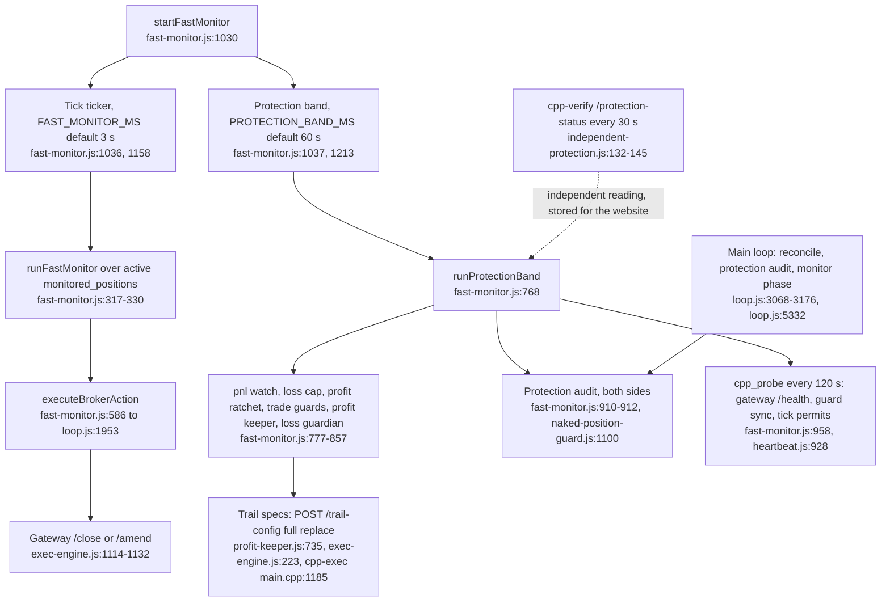

- The trail push to the gateway is best-effort; if it fails the profit keeper's own ratchet still runs (`exec-engine.js:218-235`).
- cpp-verify cannot act: it has no broker write path. The dotted edge means its reading is shown beside Node's, never acted on by it.
- The comment at `loop.js:6414` still says "30s ticker"; the code default has been 3 s since 24-07 (`fast-monitor.js:1033`).

### 2.5 The tick path (dormant at the cutoff)

No account admits tick entries. The gateway places tick entries only for accounts listed in `/config tickEntryAccounts`, and none is listed at boot (`cpp-exec/src/main.cpp:282-288`, `:372`).

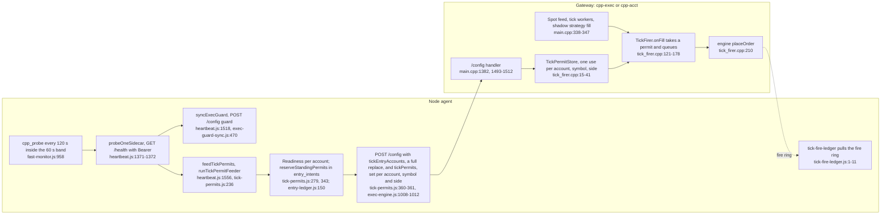

Pending changes on this path at the cutoff: C9 (#1161) adds combined tick/bar risk, boot binding and a restart hold, all dormant (merged by the owner after the cutoff, at 23:39:04Z; **first-hand**); GW-1 adds per-fire slots and makes `tickPermits` a full replace on the gateway (on `main` they are set per account, symbol and side and never cleared as a set).

### 2.6 Where records go

All tables live in the one SQLite file at `DB_PATH` (`agent/db.js:1248-1249`).

| Table | Written by | Holds |
|---|---|---|
| `trades` | the write-ahead insert before every bar send (`loop.js:875`); the reconciler (`reconciler.js:283`) | one row per order attempt, then its fill and close |
| `monitored_positions` | `loop.js:1084` after a fill | live positions under management |
| `entry_intents` | `entry-ledger.js` (reserve, markSent, resolve, expireStale, reconcile; tick standing permits) | the durable entry ledger of one-use permits |
| `decision_log` | `recordDecision` (`decision-log.js:66-72`) | every skip, veto and proceed, with stage and reason |
| `risk_events` | `risk.js:2757` | each `evaluateTrade` decision with its checks |
| `controller_heartbeats` | `beat` (`heartbeat.js:440`) | liveness per controller |
| `agent_state` | `getState` / `setState` | key/value state |
| `action_log` | the `/actions` middleware (`index.js:1150-1168`) | owner and API actions |

### 2.7 Environment variables that wire the services (names only)

| Variable | Links |
|---|---|
| `EXEC_URL`, `EXEC_URL_DEMO`, `EXEC_URL_LIVE`, `EXEC_SECRET` | Node → gateways |
| `VERIFY_URL` (+ `EXEC_SECRET`) | Node → cpp-verify |
| `SCANNER_BRIDGE_ENABLED`, `SCANNER_TIMEFRAME_URL/SECRET`, `SCANNER_TICK_URL/SECRET` | Node → scanners |
| `TICK_SCANNER_MIRROR_URL/SECRET`, `TICK_SCANNER_CONFIG_VERSION`, `TICK_SCANNER_CANDIDATE_TTL_MS` | gateway → cpp-scan-tick |
| `TICK_SPOOL_PATH`, `TELEMETRY_PATH`, `TICK_SPOOL_CAP_BYTES`, `TICK_SPOOL_RESERVE_MIN_BYTES`, `TICK_SPOOL_RESERVE_PCT` | the gateway volume at `/data` (the last three since #1111) |
| `WATCHDOG_*` | cpp-verify → everything |
| `FAST_MONITOR_MS`, `PROTECTION_BAND_MS` | protection cadence |
| `AGENT_SECRET`, `AGENT_SECRET_READ` | website → Node (token tiers) |
| `DB_PATH` | the SQLite file |

---

## 3. Timeline since the takeover

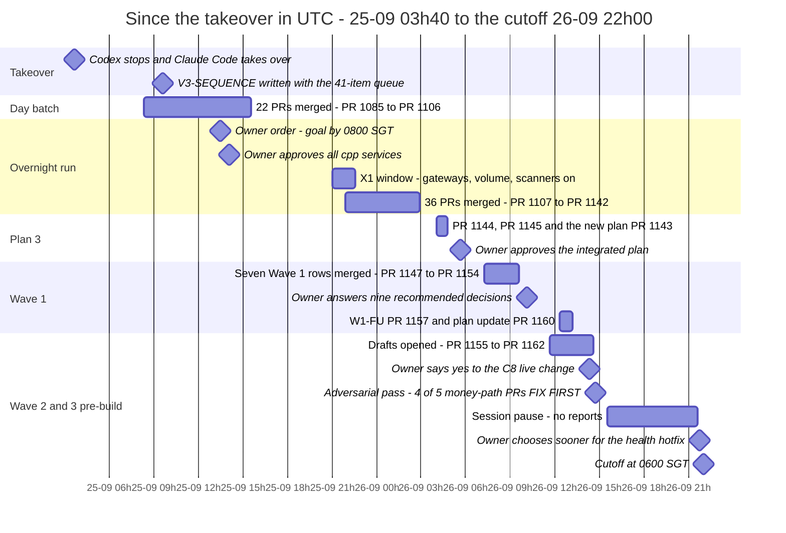

| When (UTC) | When (SGT) | What | Source |
|---|---|---|---|
| 25-09 03:40 | 25-09 11:40 | Owner: Codex has run out; Claude Code takes over "the latest assessment plan" (the dual-environment plan) | `docs/claude-takeover-2026-09-25.md:3-9` |
| 25-09 08:21 | 16:21 | First merge, #1085 (dual admission) | git |
| 25-09 09:35 | 17:35 | V3-SEQUENCE written: one 41-item PR queue across P0–P8, with plan 1's sequence folded in | `docs/v3-sequence-2026-09-25.md:1-3` |
| 25-09 08:21–15:33 | 16:21–23:33 | Day batch: 22 PRs, #1085–#1106 | git |
| 25-09 13:30 | 21:30 | Owner, for the overnight run: "Goal by 08:00 SGT: no false or falsified records, no still-stuck records, no stalled controllers, no fake results on the website"; X1 approved; the stuck-record write-off rule | `v3-sequence:782-787` |
| 25-09 14:03 | 22:03 | Owner: "Approve to ensure all cpp services passed." | `v3-sequence:791` |
| 25-09 21:00–22:35 | 26-09 05:00–06:35 | X1 window: cpp-acct volume, gateway variables, GW-CAP, X1, then the runbook R2–R5: 796 profiles registered, bridge ON, `orderAuthority` false (22:31–22:35Z) | `v3-sequence:795-799` |
| 25-09 21:54 – 26-09 02:54 | 26-09 05:54–10:54 | Overnight run: 36 PRs, #1107–#1142 | git |
| 26-09 04:01–04:47 | 12:01–12:47 | #1144, #1145, then #1143 (the new plan, merged by the owner at 04:46:56Z) | git; `docs/v3-integrated-plan-2026-09-26.md:5` |
| 26-09 about 05:40 | about 13:40 | Owner: "I thought the plan is approved" = OD-0 yes | `docs/v3-integrated-plan-2026-09-26.md:5` |
| 26-09 06:01–06:02 | 14:01–14:02 | #1146 opened and closed unmerged (a duplicate roadmap lane) | GitHub API |
| 26-09 07:16–09:34 | 15:16–17:34 | Wave 1: #1147–#1154, 34 h 25 min before its Sun 27-09 20:00Z deadline | git |
| 26-09 about 10:05 | about 18:05 | Owner answers: the recommended answers to OD-2, 3, 6, 7, 10, 11, 12, 14, 22; OD-4 as proposed; OD-41 yes | `docs/v3-integrated-plan-2026-09-26.md:346` |
| 26-09 11:38–14:36 | 19:38–22:36 | Wave 2 drafts opened: #1155, #1156, #1158, #1159, #1161, #1162. Branches pushed: T4 (13:05Z), GW-1 (from 13:26Z), S-8 (from 13:41Z) | GitHub API; git |
| 26-09 12:21, 13:11 | 20:21, 21:11 | W1-FU #1157; the plan and roadmap update #1160 | git |
| 26-09 12:46–13:02 | 20:46–21:02 | Performance traces after W1-FU (median of 3 after a warm-up) | first-hand; `docs/v3-integrated-plan-2026-09-26.md:268-280` |
| 26-09 about 14:18 | about 22:18 | Owner: "yes" to C8's live book-cap change (recorded in a #1161 comment posted 14:19:05Z whose text says "22:2x SGT") | first-hand; GitHub |
| 26-09 about 14:45 | about 22:45 | Owner asks for "ultracode" (accuracy). An adversarial verification merges the six Wave 2 PRs in Monday order and finds reproduced blockers in 4 of 5 money-path PRs | first-hand |
| 26-09 15:33 – 21:34 | 23:33 – 27-09 05:34 | Session pause, no reports | first-hand |
| 26-09 about 21:4x | 27-09 about 05:4x | Owner: "(b) sooner" for the gateway `/health` hotfix; restart window not yet chosen | first-hand |
| 26-09 22:00 | 27-09 06:00 | **Cutoff** | — |

---

## 4. The three plans

### 4.1 How the three fit together

There are three plans, and they no longer compete:

- **Plan 1 is folded into plan 2's queue.** On 25-09 09:35Z its PR sequence PR-1 … PR-11 became V3 items (PR-3 → C3, PR-4 → C4, PR-5 → C5, PR-6 → CV-1, PR-7 → C7, PR-8 → C8, PR-9 → C9, PR-10 → GW-1, PR-11 → C11). It does not run as a separate sequence any more.
- **Plan 3 governs ORDER.** The integrated plan "Supersedes the sequences in V3-SEQUENCE and the new plan's §8 for ordering; they keep their detail" (`docs/v3-integrated-plan-2026-09-26.md:8`).
- **Plan 2's eight groups govern ACCEPTANCE.** "None of the eight frozen groups is accepted" (`docs/v3-integrated-plan-2026-09-26.md:75`). Plan 3 changes the groups' wording, not their bar.
- **Binding on all three:** the owner principles and thresholds in `CLAUDE.md`, the merge policy and P7 scope in `CLAUDE.md`, and `docs/tick-momentum/plan.md` (the predeclared research search).

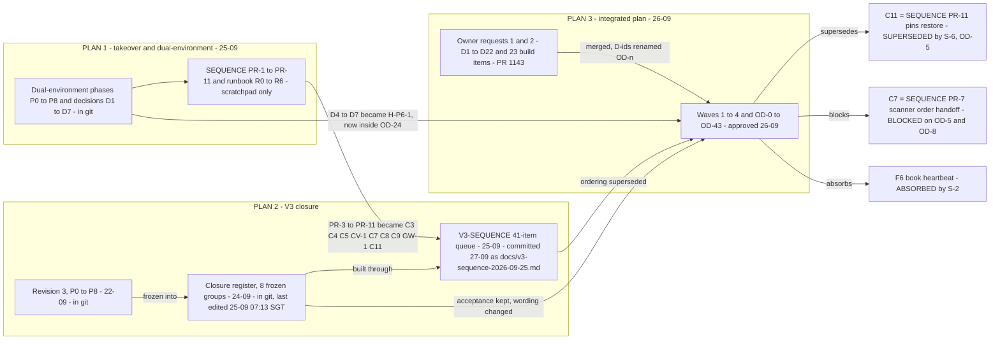

### 4.2 Plan 1: the takeover / dual-environment plan (25-09)

**Purpose and origin.**

- The owner's note, 25-09 11:40 SGT, verbatim: *"note: record this date and time that codex runs out of token to build. claude code to take over the complete the latest assessment plan. the goal of parallel scanners both tick and time should be active now"* (`docs/claude-takeover-2026-09-25.md:7-9`).
- "The latest assessment plan" is `docs/dual-environment-plan-2026-09-25.md` (DE), presented at 25-09 11:24 SGT. It serves order 8,991: remove time-based-only logic, route entries from both C++ scanners to the two gateways, and let cpp-verify diagnose tick and other entry refusals. Tick and time run in parallel, "accepted only when tests show a sustainable rise in win factor and win ratio".
- Base `83c94e6` (#1084). Codex's dual-entry build was local and never pushed, so it was rebuilt from `main` and nothing was assumed from it.
- Owner decisions at the takeover: "TRADE AS SOON AS BUILT" (candidates go through `admitEntry` and the risk checks; thresholds and caps still apply); "RESTORE THE POSITIVE ONES" (fib_confluence, rsi2_reversion, donchian_breakout on all accounts); D1 yes (win factor = PF in R); D2 yes (win rate with intervals); D3 "sustainable" = a consistent computation.

**Structure: phases P0–P8** (DE:88-215).

| Phase | What | Gate |
|---|---|---|
| P0 | Rebuild dual-entry plumbing: one account admits bar + tick; UI "Time + tick" | none |
| P1 | Basis on each closed trade; per-account, per-basis report with Wilson interval, PF, expectancy lower bound | none |
| P2 | Counterfactual re-score of 30 days of tick shadow with the stop floor and trend filter | none, report only |
| P3 | Shadow = live: the C++ ShadowBook and the JS replayer get the live filters | D5 |
| P4 | Research path: dated windows, holdout, openings ledger, pooled evaluation | D6 |
| P5 | Runtime tick profile via `/config` with a hash check | D7 |
| P6 | Combined-risk gaps: cap per fire, permit clearing, spend after checks, book-wide symbol limit | ask-first |
| P7 | Evidence: stage-A grid, one test opening, REPLAY_PASSED, then shadow ≥ 48 h / 200 signals / 30 trades, SHADOW_PASSED | calendar |
| P8 | Parallel A/B, time-only vs time + tick | only after each basis alone shows PF > 1 out of sample |

A build sequence PR-1 … PR-11 and a runbook R0–R6 lived only in the scratchpad file `SEQUENCE.md` (not committed).

**Acceptance.** "Tests show a sustainable rise in both win factor and win ratio" (DE:8-9). P7 uses the owner's thresholds unchanged: replay 40 trades, PF ≥ 1.3, max DD 8R, expectancy lower bound ≥ 0; shadow 200 signals, 48 h, 30 trades, 8 losses, PF ≥ 1.3, lower bound ≥ 0, max DD 8R, resets ≤ 20 %. P8 expects about 360 trades per arm before a win-rate rise can be shown (DE:215).

**Status at the cutoff.**

| Item | Status | Evidence |
|---|---|---|
| P0 dual admission (WP-A) | ✔ MERGED #1085 + #1087 | git |
| P1 + P2 (PR-1) | ✔ MERGED #1086 | git; commit body names "Plan P1/P2" |
| PR-3 bridge (C3), PR-4 tick receipt (C4), PR-6 relay (CV-1) | ✔ MERGED #1088, #1099, #1112 | git |
| Runbook R2–R5 (profiles, Node and gateway variables) | ✔ APPLIED 25-09 22:31–22:35Z | `v3-sequence:792`, `:799`; not a git fact |
| Runbook R6 (one-hour check) | open | `docs/v3-integrated-plan-2026-09-26.md:84` |
| P3 shadow = live | ◐ SPLIT: the JS replayer half merged as Q3 #1128; the C++ half is inside GW-2 (conditional) | git |
| P4 research path | ◐ PART: Q1 #1092 and Q1b #1096 merged; Q2 waits on OD-24 | git |
| P5 runtime profile | open, inside GW-2, needs D7 | — |
| P6 Node half (C9) | ◐ built, draft #1161 | GitHub |
| P6 gateway half (GW-1) | ◐ built, branch `claude/w3-gw1`, no PR | git |
| PR-5 equity-stop push (C5) | open, waits on OD-23 | — |
| PR-7 scanner order handoff (C7) | ✖ newly blocked on OD-5 and OD-8 | integrated plan :106 |
| PR-8 book cap (C8) | ◐ built, draft #1161; the owner said yes to the live change | GitHub: #1161 PR comment, 14:19:05Z |
| PR-11 pins restore (C11) | superseded by S-6 | integrated plan :107 |
| P7, P8 | not started; calendar-bound | — |

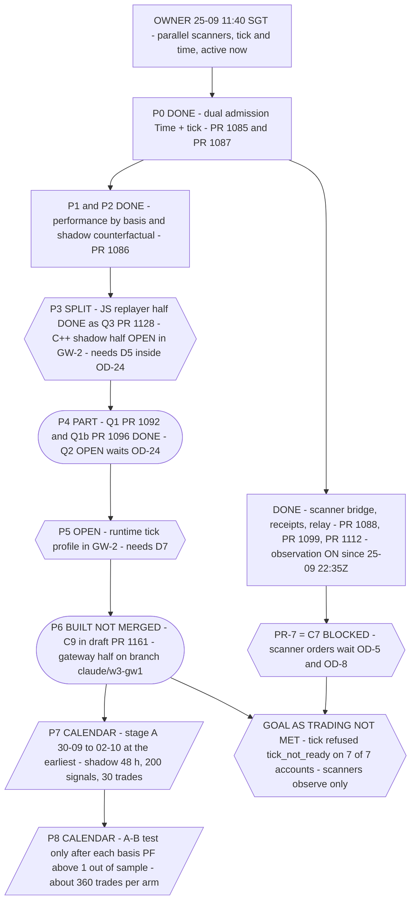

Shapes: rectangle = done; stadium = built, not merged; hexagon = waits on an owner decision or blocked; parallelogram = calendar-bound evidence.

**Relation to the other plans.** Absorbed into V3 as group P5c (plus P6/P7 for research). The integrated plan reopens the owner's 25-09 restore order as OD-5, recommending "fib (B); rsi2 and donchian (C)", that is, withdraw two of the three; the new plan itself names the tension with the 25-09 "trade as soon as built" order. One takeover question has no home in any later register: "whether the 24-hour browser disconnection counts from inactivity or from login" (`docs/claude-takeover-2026-09-25.md:78-79`).

### 4.3 Plan 2: the V3 closure plan

**Purpose and origin.**

- **Root: revision 3**, approved 22-09 ("Good. I approved. Create a revised plan … Then we build.") and merged in #1005: `docs/performance-cards-reassessment-2026-09-22-revision-3.md`. Its P0–P8 phases cover performance, protection and the scanners.
- **Frozen 24-09:** "freeze the eight groups in reply 8,794 and work them to closure" (`docs/v3-closure-2026-09-24.md:179`). The owner also chose partial TP1 plus a runner, and confirmed seven accounts (four demo, three live).
- **Handed to Claude Code** by the single-session rule (`docs/v3-handover-2026-09-24.md:3-4`) and the takeover record (`docs/claude-takeover-2026-09-25.md:19`). No separate owner quote orders the V3 takeover (**inference** from those two records).
- **Claude Code's build plan** for V3 is V3-SEQUENCE: "one PR queue across P0–P8", written 25-09 09:35Z. It is committed with this handover as `docs/v3-sequence-2026-09-25.md` (§4.5).

**Structure: three layers.** R3's phases P0–P8 → the closure register's eight frozen groups → V3-SEQUENCE's 41-item queue. Items were added around the queue during the build: REC (L1, L1b, L1c, L2a, L2b, X1), WEB (WEB-1 … WEB-10, WEB-8b, WEB-9b), integrity (I1–I3, V1), what the roadmap files as "cpp services" (GW-CAP, a gateway change; DEP-SQLITE and STK-08v2, which change Node only), follow-ups (T1b, M2b, Q1b, K1b, K1c, B4b, B4c), plan 1's WP-A and PR-1, and follow-ups F1–F9.

| Frozen group | R3 phases | Queue items |
|---|---|---|
| P0/P3 targets | P0 existing protection, P3 TP1 policy | T1, T2, T3, T4 |
| P1/P4 protection performance | P1 capacity, P4 tick protection | M1, M2, M3, M4\*, M5, M6\*, M7 |
| P2 accounts/calendars | P2 | K1, K2, K3 |
| P5a watchdog delivery | P5a | CV-2, W3 |
| P5b/P5d accounting/reporting | P5b, P5d | B1, B2, B2b, B3, B4, B5 |
| P5c scanners | P5c | C3, C4, CV-1, C5, C7, C8, C9, C11 |
| P6/P7 research/configuration | P6, P7 | Q0, Q1, Q2, Q3, Q4b, Q5\*, GW-2\* |
| P8 maintenance/final acceptance | P8 | A1, R1, R2, GW-1 |

\* conditional.

**Acceptance: two levels** (`v3-sequence:656-662`). "Built and tested" = unconditional PRs merged on a passing gate, mutations confirmed, a production read-back, and owner-gated PRs merged or held with their question. "Accepted" = calendar time and natural evidence on top. "A passing normal cycle never erases a failed observation."

| Group | Accepted when | Calendar |
|---|---|---|
| P0/P3 | After T4: a natural entry reaches ARMED; a deploy survives; one terminal outcome carries deal ids | a natural confirmed partial: weeks, not dated |
| P1/P4 | Owner-confirmed limits; a ≥ 2 h weekday window plus a US-closed hour with a Node restart inside; a GW-1 restart window | Mon 28-09 13:30–16:00Z + about 20:00Z |
| P2 | `/state/calendar-coverage` for 7 of 7; Friday close, Sunday reopen, Monday open with no false incident; one real holiday | HKEX 01-10; weekend 02/04/05-10; DST 25-10 and 01-11 |
| P5a | Backlog disposed; a 24 h muted soak; recipient bound; observer provisioned; P5a drills D1–D4 | soak = CV-2 deploy + 24 h |
| P5b/P5d | `/state/unknown-pnl` ambiguous 0; reconciliation per account; the owner's authenticated UI session | 7-day windows 29-09 17:30Z; 30-day 22-10 17:30Z |
| P5c | Runbook R0–R6; the first `scanner_timeframe` admission traced end to end | runbook R4/R5 at the GW-1 rollout |
| P6/P7 | E0 parity, then stage A; most likely result "no qualifying profile" | stage A 30-09 → 02-10; momentum checkpoint 19-12 |
| P8 | P8 T0–T5, including a P8 T1 recovery drill at GW-1, P8 T2 natural retire, P8 T4 natural end-to-end | live retire about 25-10 → 01-11; demo not before late January 2027 |

**Status at the cutoff: the 41-item queue**, each checked against git (23 merged ✔, 8 built not merged ◐, 5 open and gated, 4 conditional, 1 superseded):

| # | Id | Status | Evidence |
|---|---|---|---|
| 1 | A1 | ✔ merged | #1090, 25-09 10:56Z |
| 2 | C3 (PR-3) | ✔ merged | #1088, 25-09 10:04Z |
| 3 | M1 | ✔ merged | #1098, 25-09 14:50Z |
| 4 | M2 (+M2b) | ✔ merged | #1089 10:43Z; M2b #1123 23:05Z |
| 5 | B1 | ✔ merged | #1116, 22:53Z |
| 6 | T1 (+T1b) | ✔ merged | #1091 11:34Z; T1b #1110 21:55Z |
| 7 | T2 | ✔ merged | #1124, 22:35Z |
| 8 | T3 | ✔ merged | #1132, 23:44Z |
| 9 | C4 (PR-4) | ✔ merged | #1099, 14:56Z |
| 10 | Q0 | ✔ merged | #1127, 23:26Z; "Not verifiable until a sidecar restart" (integrated plan :85) |
| 11 | K1 (+K1b, K1c) | ✔ merged | #1129 23:31Z; K1b #1138 26-09 00:45Z; K1c #1141 01:31Z |
| 12 | Q1 (+Q1b) | ✔ merged | #1092 11:42Z; Q1b #1096 13:36Z |
| 13 | B2 | ✔ merged | #1135, 26-09 00:11Z |
| 14 | B3 | ✔ merged | #1093, 25-09 11:48Z |
| 15 | B4 (+B4b, B4c) | ✔ merged | #1140 26-09 01:08Z; B4b #1144 04:01Z; B4c #1145 04:11Z |
| 16 | R1 | ✔ merged | #1130, 25-09 23:31Z |
| 17 | M3 | ✔ merged | #1126, 23:26Z. Its harness was "not running" at 26-09 05:16Z; a restart since is **Not Verifiable** |
| 18 | M5 | ✔ merged | #1136, 26-09 00:08Z |
| 19 | K2 | ✔ merged | #1133, 25-09 23:48Z |
| 20 | Q3 | ✔ merged | #1128, 23:27Z |
| 21 | Q4b | ✔ merged | #1094, 12:00Z |
| 22 | R2 | ✔ merged | #1137, 26-09 00:29Z |
| 23 | M4 | conditional | Wave 4 |
| 24 | M6 | conditional | re-measure after S-4 |
| 25 | CV-1 (PR-6) | ✔ merged | #1112, 25-09 22:11Z |
| 26 | CV-2 | ◐ built, draft #1155 | adversarial FIX FIRST (§7.2) |
| 27 | W3 | open | Wave 3.4, after CV-2's soak |
| 28 | C5 (PR-5) | open | Wave 3.5, OD-23 |
| 29 | C8 (PR-8) | ◐ built, draft #1161 | owner yes to the live change |
| 30 | C9 (PR-9) | ◐ built, draft #1161 | adversarial FIX FIRST (§7.2) |
| 31 | C7 (PR-7) | ✖ newly blocked | Wave 4, OD-5 and OD-8 |
| 32 | T4 | ◐ built, branch `claude/w2-t4`, no PR | OD-1, OD-15 |
| 33 | M7 | ◐ built, draft #1159 | adversarial FIX FIRST (§7.2) |
| 34 | K3 | ◐ built, draft #1156 | adversarial FIX FIRST, fixed after the cutoff |
| 35 | B2b | ◐ built, draft #1162 | MERGE after 3 fix rounds |
| 36 | B5 | open | Wave 3.5; OD-12 answered |
| 37 | Q2 | open | Wave 3.6, OD-24 |
| 38 | GW-1 (PR-10) | ◐ built, branch `claude/w3-gw1`, no PR | needs an owner gateway window |
| 39 | C11 (PR-11) | superseded by S-6 | integrated plan :107 |
| 40 | Q5 | conditional | — |
| 41 | GW-2 | conditional | — |

All 27 added items (WP-A, PR-1, L1, L1b, WEB-6, I1, WEB-2, WEB-7, WEB-10, WEB-9, DEP-SQLITE, I2, I3, GW-CAP, X1, L1c, WEB-3, V1, WEB-9b, WEB-1, L2b, WEB-5, WEB-4, L2a, STK-08v2, WEB-8, WEB-8b) are merged; their PRs are in §5. Still open outside the queue: WEB-6b (with S-8), and follow-ups F2 (#1158), F5-N7 (OD-37), F6 (absorbed by S-2), F7 (no rows), F8 (checked from fills before T4; whether the check is done is **Not Verifiable**), F9 (OD-38). F1, F3, F4 and F5-N6 merged in Wave 1.

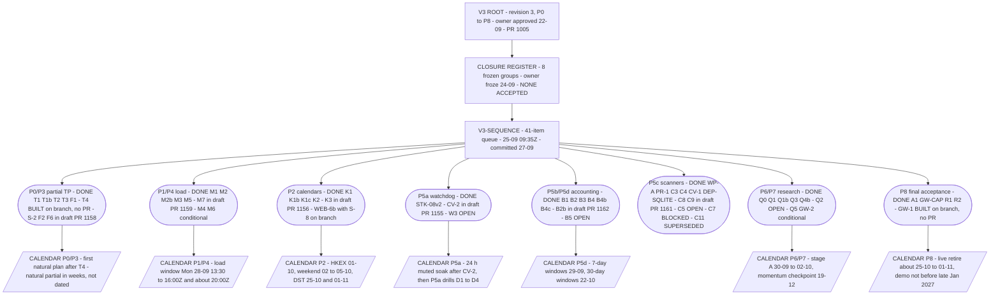

V3's calendar-bound evidence, earliest dates in UTC, not promises:

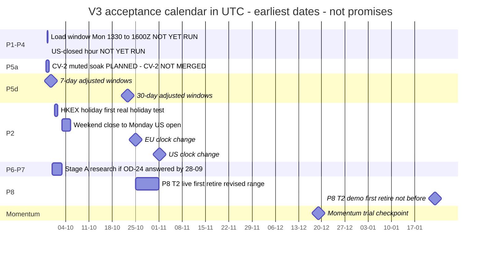

**Relation to the other plans.** Plan 1 was absorbed into it on 25-09. Plan 3 re-orders and re-words it but reopens no merged item: of V3's 28 open items, 7 are unchanged, 18 changed, 2 superseded or absorbed (C11, F6) and 1 newly blocked (C7) (`docs/v3-integrated-plan-2026-09-26.md:35`). **The closure register itself is stale:** `docs/v3-closure-2026-09-24.md` was last changed by Codex's #1081 (25-09 07:13 SGT) and none of the 71 merges since is written into it; the status lives in V3-SEQUENCE and the integrated plan's §2.

### 4.4 Plan 3: the integrated plan (26-09)

**Purpose and origin.**

- The owner's requests 1 and 2 (the sidebar, the Reasons page, the AI page; the Performance cards, why strategies are OFF, a strategy review, historical data) produced the new plan, `docs/plan-ui-and-strategy-review-2026-09-26.md`, merged by the owner in #1143 at 26-09 04:46:56Z with an unchecked draft of the integrated plan. It carries the owner's mandate: "Mandate to run performance trace through the Chrome Devtools MCP".
- The checked integrated plan and its roadmap page rode Wave 1.1 in #1147. #1146, a duplicate roadmap lane, was closed unmerged.
- **Approved:** "#1143 merged at 12:46 SGT, then 'I thought the plan is approved' at about 13:40 SGT. That also answers OD-0 yes" (`docs/v3-integrated-plan-2026-09-26.md:5`).
- **Its job:** merge V3's open work with the new plan's 23 build items and 22 decisions into one sequence (Waves 1–4) and one decision register (OD-0 to OD-43, plus OD-22b: 45 rows).

**Structure.**

| Wave | Window | Rows |
|---|---|---|
| Wave 1 | Sat 26-09 → Sun 27-09 20:00Z (planned) | 1.1 NEW-1 + SAFE-0a · 1.2 UI-1 + PERF-1 (+PERF-2) · 1.3 UI-2 + UI-3 · 1.4 UI-4 + UI-7 · 1.5 UI-6 + F3 · 1.6 S-1 + S-3 · 1.7 F1 + F4 + F5-N6 + PO-M3 |
| Wave 2 | Mon 28-09 01:00–13:00Z, then T4 on Tue 29-09 | 2.1 S-2 + F2 + F6 · 2.2 C8 → C9 · 2.3 CV-2 · 2.4 K3 + SAFE-0b · 2.5 M7 · 2.6 B2b + UI-5 · 2.7 T4 |
| P1/P4 window | Mon 13:30–16:00Z + a US-closed hour about 20:00Z | no merges, no traces |
| Wave 3 | Mon 16:00Z → Wed 30-09 | 3.1 GW-1 · 3.2 S-8 + WEB-6b (deploy by 30-09 about 15:00Z) · 3.3 S-4 → S-5 · 3.4 W3 · 3.5 C5, UI-8, B5 · 3.6 Q2 · 3.7 PO-M2 |
| Wave 4 | only after evidence, no dates | S-6 (supersedes C11) · C7 re-scoped · PO-M1 → PO-B · HIST-1, HIST-2 · S-7 · the D14 sweep · M4, M6, Q5, GW-2 |

Also: §0 answers on pre-orders (weekend crypto needs none; closed-market pre-orders: no, for now); §4's pre-order rules PO-1 … PO-9 and the measure-first items PO-M1 … PO-M3; PO-B only on an explicit owner order.

**Acceptance.** Standing per-deploy rules (`docs/v3-integrated-plan-2026-09-26.md:222-230`): the full gate with every mutation confirmed by `grep -c`; a read-back after every deploy (`/health` commit and errors, the item's own route, `/state/heartbeats`, all positions protected); the **trace rule** (every PR touching `src/` or a route the website reads carries a before-and-after table, median of 3 fresh runs, desktop and phone); no merge or trace inside the P1/P4 window. V3's acceptance is unchanged: "These are calendar-bound. No build speed moves them."

**Status at the cutoff.**

Wave 1, all merged ✔:

| Row | Items | PR · merged | Result |
|---|---|---|---|
| 1.1 | NEW-1 + SAFE-0a (+ checked plan and roadmap) | #1147 · 07:16Z | landed as planned |
| 1.2 | UI-1 + PERF-1 + PERF-2 | #1148 · 07:34Z | Performance CLS passed; Reasons CLS failed, then improved by W1-FU |
| 1.6 | S-1 + S-3 | #1149 · 08:00Z | …0058's 39 extra pins excluded as ask-first |
| 1.4 | UI-4 + UI-7 | #1150 · 08:12Z | web and agent commits match; the AI page reads "off" |
| 1.7 | F1 + F4 + F5-N6 + PO-M3 | #1151 · 08:33Z | — |
| — | follow-up to #1149 | #1152 · 08:54Z | BTCUSD monthly history starts July 2010; "weekly starts 2018" was a false reading |
| 1.3 | UI-2 + UI-3 | #1153 · 09:21Z | 72 h Blockers fell back to the flat list; fixed by W1-FU |
| 1.5 | UI-6 + F3 | #1154 · 09:34Z | Reasons DOM grew; fixed by W1-FU |
| FU | W1-FU | #1157 · 12:21Z | see the trace table below |
| — | plan and roadmap update | #1160 · 13:11Z | — |

Wave 1 measured results (traces 12:46–13:02Z, median of 3 after a warm-up; first-hand, and recorded at `docs/v3-integrated-plan-2026-09-26.md:268-280`):

| Measure | Target | Result |
|---|---|---|
| Reasons CLS | ≤ 0.25 | ✖ **Failed**: desktop 0.53, phone 0.46 (from 0.74 / 0.55) |
| Reasons elements | ≤ 5,400 | ✔ **Passed**: 8,904 → 2,936 |
| Performance CLS | not worse | ✔ **Passed**: 0.19 / 0.08 |
| Blockers card, 72 h window | groups by day under 512 KB | ✔ **Passed**: 426 KB |
| LCP | — | rose on all four page/profile pairs; **cause not attributed** |

Wave 1 cost nine Node restarts against a budget of "up to 7" (`:40`, `:264`).

Wave 2: nothing merged; the rule is "Nothing in Wave 2 merges before Mon 28-09 01:00Z". Details in §7. Wave 3: GW-1 and S-8 are pre-built on branches (the plan recommended it at `:438`); S-4 → S-5, W3, C5, UI-8, B5, Q2 and PO-M2 are not started. Wave 4: not started.

The new plan's 23 items plus the 5 synthesis items: 14 merged (SAFE-0a, UI-1, UI-2, UI-3, UI-4, UI-6, UI-7, PERF-0, PERF-1, PERF-2, S-1, S-3, NEW-1, PO-M3); 3 in drafts (SAFE-0b #1156, UI-5 #1162, S-2 #1158); 1 on a branch (S-8); 4 in Wave 3 (UI-8, S-4, S-5, PO-M2); 6 in Wave 4 (S-6, S-7, HIST-1, HIST-2, PO-M1, PO-B).

**The plan's own verdict at 26-09 21:30 SGT:** "the build is on track through Monday. The whole of V3 is not yet on track, because Wave 3 has not started and is gated on answers that are not in" (`:421`). The pre-build it asked for is done; the answers are still open.

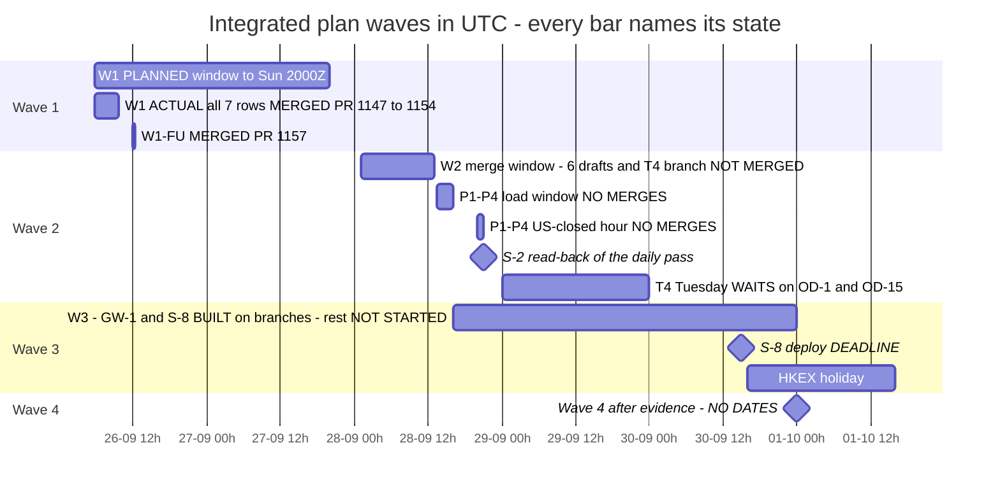

### 4.5 V3-SEQUENCE, and the new `docs/v3-sequence-2026-09-25.md`

- **What it is.** The implementing session's own V3 build plan, "V3 merged build plan: one PR queue across P0–P8": the 41-item queue, per-PR detail with reviewer corrections, "built and tested" versus "accepted" per group, the human inputs (H-ids) and what each blocks, the calendar evidence, the risks, the owner's 25-09 21:30 SGT decisions and the X1 window record. Written 25-09 09:35Z on base `f1d9223`, last edited 25-09 22:35Z. 800 lines, 84,331 bytes.
- **Why it is committed now.** The integrated plan, the roadmap and code comments on `main` cite it by line number (`V3-SEQUENCE:426`, `:540`, `:623`, `:688`, `:729`, `:768`, `:791`, `:793`; "V3-SEQUENCE §1 items 29–30"; `agent/services/p1p4-grade.js:9`), but it lived only in the session's scratchpad, so every citation dangled. It is committed on 27-09 as `docs/v3-sequence-2026-09-25.md`, **byte-for-byte, with no header added**, so every cited line number resolves (checked with `cmp`).
- **It is not** `docs/v3-acceptance-sequence-2026-09-23.md`, Codex's 116-line evidence record with a similar name.
- **Read it as a working file, frozen at 25-09 22:35Z.** Its statuses are those of that evening. One line is known wrong: `:729` says the daily momentum pass runs "on weekdays"; it also runs Friday 21:05Z inside quiet hours (integrated plan :67). It quotes full account ids; each already appears in 20 or more files on `main`, so the copy adds no new exposure. It also quotes non-secret configuration settings at `:790-799` (for example the tick spool caps set through `TICK_SPOOL_CAP_BYTES`, 20 GiB on cpp-exec and 5 GiB on cpp-acct, which `docs/tick-momentum/option-2-observation-rollout.md:56` already states on `main`). A search for tokens, secrets and bearer values found only variable names.
- **Still not committed:** `SEQUENCE.md` (plan 1's PR-1 … PR-11 and runbook), `LIFECYCLE-SPEC.md`, `reply-9440.md` and the roadmap v2.2 inputs (`items-v2.2.json`, `refresh-v2.2.json`, `data.py`). Citations to those still dangle (§9.11).

### 4.6 The decision register (OD-0 to OD-43, 45 rows)

- **Answered (16):** OD-0 (plan approved), OD-41 (pre-build yes); the recommended answers to OD-2, OD-3, OD-6, OD-7, OD-10, OD-11, OD-12, OD-14, OD-22 (26-09 about 18:05 SGT); OD-4 as proposed; OD-17, OD-18, OD-19 and OD-21 by the approval, as UI defaults (OD-17's question about what the owner's phone shows is still unanswered).
- **Answered outside the plan documents:** C8's live change "yes" (26-09 about 22:18 SGT), recorded in GitHub as a #1161 PR comment posted 14:19:05Z whose text says "22:2x SGT"; it says C8 ships as built and that its three sub-questions stay open as follow-ups, so they do not block. The `/health` hotfix "(b) sooner" (27-09 about 05:4x SGT) is **first-hand** only; it departs from OD-43's recommendation "keep it public until GW-1" (**inference**).
- **Open (29):**

| Id | Question (short) | Recommendation (short) | Blocks |
|---|---|---|---|
| **OD-1** | Resume momentum entries after T4? | (a) market orders yes; open-market HTF limits yes after OD-15, on the Trade-armed accounts; (b) closed-market limits no until PO-M1–M3; widening to 7 accounts is a separate yes | **T4** |
| **OD-5** | Restore fib, rsi2, donchian: (A) half risk, (B) score the shadow first, (C) withdraw? | fib (B); rsi2 and donchian (C) | S-6, C7, C11, S-4 |
| **OD-8** | Which hours source gates entries? | The account calendar, for every entry | **S-8**; C7 |
| **OD-9** | Score refused strategies; fold standing stops? | Score the PO-M1 levels; fold the stops, keeping sums | **S-4**, PO-M1 |
| OD-13 | Trace rule and thresholds | Yes, as proposed | the website merge gate |
| **OD-15** | Do resting orders count toward caps and margin? | Yes, values unchanged | **T4**, PO-B |
| **OD-16** | Autopilot and watchdog flip the shared list? | Stop | **S-5** |
| **OD-20** | Picker location and order routing | Picker under TRADING; orders keep going to the trading account | **UI-8** |
| OD-22b | Trade page snapshot interval | Keep 5 s while visible | none |
| **OD-23** | Equity-stop push per side | The V3 default | **C5** |
| **OD-24** | Research path (includes plan 1's D4–D7) | Pooled replay; stages S0–S5; holdout declared by 28-09; three 30-day windows | **Q2**; stage A |
| OD-25 | Later research inputs | Keep segments and regime rows; slippage from measured fills | later P6/P7 |
| OD-26 | Retire fib_618_fade and ema_pullback; cancels | Retire fib_618_fade now; ema_pullback after the overlap measure | D14; PO-M1 |
| OD-27 | vwap anchors and va/vp sessions | Fix, then review | S-7 |
| OD-28 | Bar store, backfill, compaction | Phase 0 now; the store only past a measured threshold | HIST-1, HIST-2 |
| OD-29 | 16 symbols armed only on unscanned timeframes | Show as unreachable now | S-6 |
| OD-30 | Tick switch and ownership | Fix the label now; tick stays blocked under the owner's thresholds | UI-4; the auto switch |
| OD-31 | Roster wording | The owner's wording needed | P2 |
| OD-32 | Goal semantics, REC start and bar | Unrecoverable rows shown separately, not counted | P5b, REC |
| OD-33 | Close records with no reason | Label the unrecoverable ones; refuse reasonless approvals | REC |
| OD-34 | The owner's logged-in session, 30–60 min | After Wave 1 | WEB, P5b |
| OD-35 | Broker-only positions | Report only, labelled | W15 |
| OD-36 | Calendar bound; money-contract closure | Keep the bound; move money items to P5b | P2 closure |
| OD-37 | Small record switches | I3-R7 off; I3-N7 yes; conversion fee out; … | small follow-ups |
| OD-38 | Storage and hosts | Keep 50 GB; weekly backups; one durable host | P8 T3–T5; M3 host |
| OD-39 | Positions and orders outside the rules | Leave …0949's 12 to their stops; the owner's 3 manual orders stay the owner's | none |
| OD-40 | Leftovers | The owner's wording needed | none |
| OD-42 | NOT_EXECUTED terminal; the trigger check | Keep | none |
| OD-43 | Gateway `/health` after Monday | Keep it public until GW-1 (overtaken by the owner's "(b) sooner", first-hand) | GW-1 |

Bold = named by the integrated plan as blocking dated work, plus OD-5.

---

## 5. Everything merged

All 71 PRs, by number. Times are GitHub `merged_at`. "Plan item" is as the PR or commit states it ("V3-SEQ item N" is the row in `docs/v3-sequence-2026-09-25.md` §1). Services are **inferred** from paths: **N** Node agent + website; **G** both gateways; **V** cpp-verify; **S** both scanners (no scanner `watchPatterns` until #1112). Every file of every PR is in the appendix, Appendix A.

| PR | Merged (UTC) | Merged (SGT) | What it did (short) | Plan item | Files A/M/D | + / − | Services |
|---|---|---|---|---|:-:|---:|:-:|
| [#1085](handover-2026-09-27-appendix.md#pr-1085) | 25-09 08:21 | 25-09 16:21 | Dual admission: time + tick on one account (WP-A) + takeover record | dual-env plan P0 (WP-A); group P5c | 3/30/0 | +1,326 / −183 | N S |
| [#1086](handover-2026-09-27-appendix.md#pr-1086) | 25-09 09:22 | 25-09 17:22 | Performance by entry basis with intervals; tick-shadow counterfactual | dual-env plan P1/P2 | 7/14/0 | +1,633 / −59 | N S |
| [#1087](handover-2026-09-27-appendix.md#pr-1087) | 25-09 08:52 | 25-09 16:52 | WP-A checker nits 1–9 | follow-up to #1085 | 0/13/0 | +198 / −34 | N S |
| [#1088](handover-2026-09-27-appendix.md#pr-1088) | 25-09 10:04 | 25-09 18:04 | Scanner bridge: boot-started, rebuild-on-exit, bounded retention, auth before parse | C3 = SEQUENCE PR-3 (V3-SEQ item 2, P5c) | 6/10/0 | +888 / −54 | N S |
| [#1089](handover-2026-09-27-appendix.md#pr-1089) | 25-09 10:43 | 25-09 18:43 | Report-worker failures answer 503; /prices and /storage honest | V3 M2 (V3-SEQ item 4, P1/P4) | 5/6/0 | +486 / −35 | N S |
| [#1090](handover-2026-09-27-appendix.md#pr-1090) | 25-09 10:56 | 25-09 18:56 | Agent tests clean their temp dirs; CI fails on any leak | V3 A1 (V3-SEQ item 1, P8a) | 3/42/0 | +393 / −65 | N S |
| [#1091](handover-2026-09-27-appendix.md#pr-1091) | 25-09 11:34 | 25-09 19:34 | Momentum plan/bind arithmetic in ticks and integers; fresh timed quote | V3 T1 (V3-SEQ item 6, P0/P3) | 1/16/0 | +641 / −52 | N S |
| [#1092](handover-2026-09-27-appendix.md#pr-1092) | 25-09 11:42 | 25-09 19:42 | Tick replay honesty: leak fix, opening ledger, provenance, parity, actor | V3 Q1 (V3-SEQ item 12, P6/P7) | 5/13/0 | +1,632 / −76 | N S |
| [#1093](handover-2026-09-27-appendix.md#pr-1093) | 25-09 11:48 | 25-09 19:48 | Account history summarises the whole window | V3 B3 (V3-SEQ item 14, P5d-1) | 2/7/0 | +455 / −41 | N S |
| [#1094](handover-2026-09-27-appendix.md#pr-1094) | 25-09 12:00 | 25-09 20:00 | Bar-side qualification report in R with intervals (report only) | V3 Q4b (V3-SEQ item 21, P6/P7) | 4/8/0 | +1,218 / −47 | N S |
| [#1095](handover-2026-09-27-appendix.md#pr-1095) | 25-09 13:09 | 25-09 21:09 | Order-lifecycle report: 35 versioned rules, GET /state/order-lifecycle | V3 L1 (owner order 25-09 16:50 SGT); REC; merged by the owner at 13:09Z with its three checker blockers open, fixed by #1097 (`CLAUDE.md` ledger) | 5/16/0 | +2,578 / −17 | N S |
| [#1096](handover-2026-09-27-appendix.md#pr-1096) | 25-09 13:36 | 25-09 21:36 | Q1 checker blockers: parity indexes, one consulted rule, blocks fixed | V3 Q1b, follow-up to #1092 | 0/10/0 | +454 / −70 | N S |
| [#1097](handover-2026-09-27-appendix.md#pr-1097) | 25-09 13:36 | 25-09 21:36 | L1 checker blockers: stuck findings by persistence, partial stages, heartbeat STK-11 | V3 L1b, follow-up to #1095 | 0/7/0 | +738 / −106 | N S |
| [#1098](handover-2026-09-27-appendix.md#pr-1098) | 25-09 14:50 | 25-09 22:50 | Boot record, lag tap, named startup phases, route status codes | V3 M1 (V3-SEQ item 3, P1/P4) | 4/16/0 | +1,897 / −37 | N S |
| [#1099](handover-2026-09-27-appendix.md#pr-1099) | 25-09 14:56 | 25-09 22:56 | Tick entry receipt, tick refusals in blocker report, report off the loop | V3 C4 = SEQUENCE PR-4 (V3-SEQ item 9, P5c) | 6/20/0 | +1,542 / −89 | N S |
| [#1100](handover-2026-09-27-appendix.md#pr-1100) | 25-09 14:51 | 25-09 22:51 | Session buckets from real exchange hours and DST | V3 WEB-6; 8,989-A row 6 | 2/6/0 | +408 / −58 | N S |
| [#1101](handover-2026-09-27-appendix.md#pr-1101) | 25-09 14:56 | 25-09 22:56 | pnl_reconcile cannot stall on one trade; truthful heartbeat | V3 I1; REC | 1/6/0 | +978 / −62 | N S |
| [#1102](handover-2026-09-27-appendix.md#pr-1102) | 25-09 14:58 | 25-09 22:58 | Account cards show the enforced daily stop and loss-cap used | V3 WEB-2; 8,989-A row 4 | 4/6/0 | +749 / −39 | N S |
| [#1103](handover-2026-09-27-appendix.md#pr-1103) | 25-09 15:19 | 25-09 23:19 | Data-feed card: measured latency, fees/swap, quote freshness, enforced cap | V3 WEB-9; 8,989-A row 11 | 6/5/0 | +1,191 / −24 | N S |
| [#1104](handover-2026-09-27-appendix.md#pr-1104) | 25-09 14:59 | 25-09 22:59 | Partial money marked; gradients per currency; true 'unavailable' reasons | V3 WEB-7; 8,989-A rows 7–9 | 3/7/0 | +570 / −81 | N S |
| [#1105](handover-2026-09-27-appendix.md#pr-1105) | 25-09 14:59 | 25-09 22:59 | P&L chart: unpriced closes as labelled gaps; drawable default account | V3 WEB-10; 8,989-A row 13 | 2/3/0 | +359 / −40 | N S |
| [#1106](handover-2026-09-27-appendix.md#pr-1106) | 25-09 15:33 | 25-09 23:33 | better-sqlite3 12.8.0 (SQLite 3.51.3) before a second writer | V3 DEP-SQLITE (P5c) | 3/6/0 | +382 / −13 | N S |
| [#1107](handover-2026-09-27-appendix.md#pr-1107) | 25-09 21:54 | 26-09 05:54 | Truthful controllers: autopilot cadence, dormant verdict, position-history scope | V3 I2; REC | 4/8/0 | +541 / −66 | N S |
| [#1108](handover-2026-09-27-appendix.md#pr-1108) | 25-09 22:08 | 26-09 06:08 | Stuck-record resolver: settle from evidence or terminal write-off | V3 I3; REC | 3/6/0 | +1,665 / −36 | N S |
| [#1109](handover-2026-09-27-appendix.md#pr-1109) | 25-09 22:35 | 26-09 06:35 | Every account's closes captured and verified; silent accounts visible | V3 V1 (incl. LIFECYCLE-SPEC W11); REC | 3/14/0 | +1,763 / −113 | N |
| [#1110](handover-2026-09-27-appendix.md#pr-1110) | 25-09 21:55 | 26-09 05:55 | Off-grid planned stops refused before send; tick comparisons pinned | V3 T1b (P0/P3) | 0/9/0 | +480 / −10 | N S |
| [#1111](handover-2026-09-27-appendix.md#pr-1111) | 25-09 22:18 | 26-09 06:18 | Tick spool cap/reserve settable from env (defaults unchanged) | V3 GW-CAP (P8) | 0/11/0 | +807 / −16 | N G |
| [#1112](handover-2026-09-27-appendix.md#pr-1112) | 25-09 22:11 | 26-09 06:11 | Scanner + cpp-verify relay; epoch-free stream keys; scanner watchPatterns | V3 CV-1 = SEQUENCE PR-6 (V3-SEQ item 25, P5c) | 5/31/0 | +1,199 / −88 | N V S |
| [#1113](handover-2026-09-27-appendix.md#pr-1113) | 25-09 22:25 | 26-09 06:25 | X1: resting-order intents settle ACCEPTED, then on broker evidence | V3 X1 (LIFECYCLE-SPEC W4 + W2 + W3); REC | 4/15/0 | +1,401 / −27 | N G |
| [#1114](handover-2026-09-27-appendix.md#pr-1114) | 25-09 23:14 | 26-09 07:14 | L2a: order writers record intent lineage, approval, plan failures, write-ahead | V3 L2a (LIFECYCLE-SPEC W1, W5–W9, W14); REC | 1/16/0 | +1,145 / −166 | N |
| [#1115](handover-2026-09-27-appendix.md#pr-1115) | 25-09 22:45 | 26-09 06:45 | Stops attributed to their own account; roster-wide stops separate | V3 WEB-1; 8,989-A row 2 | 0/9/0 | +368 / −46 | N |
| [#1116](handover-2026-09-27-appendix.md#pr-1116) | 25-09 22:53 | 26-09 06:53 | B1: money only from a complete lifecycle; partials carry own volume | V3 B1 (V3-SEQ item 5, P5b) | 3/16/0 | +1,368 / −207 | N |
| [#1117](handover-2026-09-27-appendix.md#pr-1117) | 25-09 22:59 | 26-09 06:59 | L2b: close writers record the cause they can prove | V3 L2b (LIFECYCLE-SPEC W10, W12, W13, W16, W17); REC | 1/14/0 | +951 / −38 | N |
| [#1118](handover-2026-09-27-appendix.md#pr-1118) | 25-09 23:06 | 26-09 07:06 | Server reads every account from the broker once a minute | V3 WEB-4; 8,989-A rows 1, 5 | 6/9/0 | +647 / −42 | N |
| [#1119](handover-2026-09-27-appendix.md#pr-1119) | 25-09 22:27 | 26-09 06:27 | Balance, carry and floating per recorded deposit currency | V3 WEB-3; 8,989-A rows 5, 7 | 7/9/0 | +1,207 / −70 | N |
| [#1120](handover-2026-09-27-appendix.md#pr-1120) | 25-09 22:07 | 26-09 06:07 | veto-boundary fixture inside the current FX day (CI failed 21–23 UTC) | not stated (CI fixture fix) | 0/1/0 | +5 / −2 | N S |
| [#1121](handover-2026-09-27-appendix.md#pr-1121) | 25-09 23:03 | 26-09 07:03 | Money per currency, never summed across currencies | V3 WEB-5; 8,989-A rows 5, 7 | 3/7/0 | +932 / −40 | N |
| [#1122](handover-2026-09-27-appendix.md#pr-1122) | 25-09 22:42 | 26-09 06:42 | Data-feed card: measured bar receipts and broker-timestamped latency | V3 WEB-9b; 8,989-A row 11 | 6/13/0 | +1,251 / −22 | N |
| [#1123](handover-2026-09-27-appendix.md#pr-1123) | 25-09 23:05 | 26-09 07:05 | Report follow-ups from the M2 check | V3 M2b (follow-up to M2 #1089 / A1 #1090) | 3/17/0 | +1,154 / −147 | N |
| [#1124](handover-2026-09-27-appendix.md#pr-1124) | 25-09 22:35 | 26-09 06:35 | Momentum close recovery from deal history | V3 T2 — V3-SEQ item 7 (P0/P3) | 3/13/0 | +2,062 / −97 | N |
| [#1125](handover-2026-09-27-appendix.md#pr-1125) | 25-09 22:27 | 26-09 06:27 | Stuck headline counts unattributed rows and controllers | V3 L1c (follow-up to L1/L1b) | 0/2/0 | +266 / −25 | N |
| [#1126](handover-2026-09-27-appendix.md#pr-1126) | 25-09 23:26 | 26-09 07:26 | Goal rows "proposed" + read-only P1/P4 harness | V3 M3 — V3-SEQ item 17 (P1/P4) | 4/6/0 | +3,191 / −13 | N |
| [#1127](handover-2026-09-27-appendix.md#pr-1127) | 25-09 23:26 | 26-09 07:26 | Shadow restart-loss count can fire | V3 Q0 — V3-SEQ item 10 (P6/P7) | 1/2/0 | +273 / −6 | N |
| [#1128](handover-2026-09-27-appendix.md#pr-1128) | 25-09 23:27 | 26-09 07:27 | Tick replayer models the four live entry filters | V3 Q3 — V3-SEQ item 20 (P6/P7) | 1/8/0 | +1,436 / −54 | N |
| [#1129](handover-2026-09-27-appendix.md#pr-1129) | 25-09 23:31 | 26-09 07:31 | Calendar coverage per account, tiered demand | V3 K1 — V3-SEQ item 11 (P2) | 2/12/0 | +1,135 / −70 | N |
| [#1130](handover-2026-09-27-appendix.md#pr-1130) | 25-09 23:31 | 26-09 07:31 | Tick segment manifest + per-side durability policy | V3 R1 — V3-SEQ item 16 (P8) | 3/11/0 | +1,171 / −14 | N |
| [#1131](handover-2026-09-27-appendix.md#pr-1131) | 25-09 23:44 | 26-09 07:44 | Tick docs match GW-CAP / cpp-acct volume; ledger | not stated (docs follow-up to GW-CAP #1111) | 0/4/0 | +34 / −6 | N |
| [#1132](handover-2026-09-27-appendix.md#pr-1132) | 25-09 23:44 | 26-09 07:44 | Partial manager every loop, truthful status and UI | V3 T3 — V3-SEQ item 8 (P0/P3) | 4/10/0 | +1,442 / −10 | N |
| [#1133](handover-2026-09-27-appendix.md#pr-1133) | 25-09 23:48 | 26-09 07:48 | Per-account symbol map read daily | V3 K2 — V3-SEQ item 19 (P2) | 2/6/0 | +682 / −12 | N |
| [#1134](handover-2026-09-27-appendix.md#pr-1134) | 26-09 00:02 | 26-09 08:02 | Outbox held by a setting named, not stuck | V3 STK-08v2 (P5a per plan §2) | 1/5/0 | +486 / −11 | N |
| [#1135](handover-2026-09-27-appendix.md#pr-1135) | 26-09 00:11 | 26-09 08:11 | Broker lifecycle verdicts + per-currency reconciliation | V3 B2 — V3-SEQ item 13 (P5b) | 6/13/0 | +1,954 / −59 | N |
| [#1136](handover-2026-09-27-appendix.md#pr-1136) | 26-09 00:08 | 26-09 08:08 | Amend round-trip time and lateness | V3 M5 — V3-SEQ item 18 (P1/P4) | 3/21/0 | +1,345 / −26 | N |
| [#1137](handover-2026-09-27-appendix.md#pr-1137) | 26-09 00:29 | 26-09 08:29 | Acceptance evaluators + recorder soak driver | V3 R2 — V3-SEQ item 22 (P8) | 6/2/0 | +3,020 / −1 | N |
| [#1138](handover-2026-09-27-appendix.md#pr-1138) | 26-09 00:45 | 26-09 08:45 | Expired holiday rows no longer make a calendar unknown | V3 K1b (follow-up to K1 #1129) | 0/7/0 | +315 / −34 | N |
| [#1139](handover-2026-09-27-appendix.md#pr-1139) | 26-09 01:02 | 26-09 09:02 | Older ledger edges carry the stored deal balance | V3 WEB-8 ("8,989-A row 7, NEW-L3") | 2/15/0 | +1,378 / −36 | N |
| [#1140](handover-2026-09-27-appendix.md#pr-1140) | 26-09 01:08 | 26-09 09:08 | Completeness goals name what cannot be recovered | V3 B4 — V3-SEQ item 15 (P5b) | 2/8/0 | +1,061 / −45 | N |
| [#1141](handover-2026-09-27-appendix.md#pr-1141) | 26-09 01:31 | 26-09 09:31 | Show which part of the calendar export was cut | V3 K1c (follow-up to K1b #1138) | 0/8/0 | +244 / −11 | N |
| [#1142](handover-2026-09-27-appendix.md#pr-1142) | 26-09 02:54 | 26-09 10:54 | "(deals unread)" on the ledger cell | V3 WEB-8b (follow-up to WEB-8 #1139) | 0/4/0 | +123 / −10 | N |
| [#1143](handover-2026-09-27-appendix.md#pr-1143) | 26-09 04:46 | 26-09 12:46 | Plan for owner requests 1 and 2 + perf-trace harness | owner requests 1 and 2 (+ PERF-0) | 7/0/0 | +1,627 / −0 | N |
| [#1144](handover-2026-09-27-appendix.md#pr-1144) | 26-09 04:01 | 26-09 12:01 | Close goal row names each CLS-04/CLS-03 record | V3 B4b (B4 #1140 checker nit 5) | 0/6/0 | +564 / −8 | N |
| [#1145](handover-2026-09-27-appendix.md#pr-1145) | 26-09 04:11 | 26-09 12:11 | Adopted bot trades get their reason back | V3 B4c | 2/8/0 | +1,247 / −51 | N |
| [#1147](handover-2026-09-27-appendix.md#pr-1147) | 26-09 07:16 | 26-09 15:16 | Synthetic trace tabs; order confirm names account; checked plan | Integrated plan Wave 1 row 1.1 (NEW-1, SAFE-0a) | 7/12/0 | +6,734 / −384 | N |
| [#1148](handover-2026-09-27-appendix.md#pr-1148) | 26-09 07:34 | 26-09 15:34 | Card collapse standard; layout-jump fixes | Wave 1 row 1.2 (UI-1, PERF-1, PERF-2) | 6/10/0 | +540 / −37 | N |
| [#1149](handover-2026-09-27-appendix.md#pr-1149) | 26-09 08:00 | 26-09 16:00 | Honest arming records; bar path depth + counters | Wave 1 row 1.6 (S-1, S-3) | 5/21/0 | +1,680 / −164 | N |
| [#1150](handover-2026-09-27-appendix.md#pr-1150) | 26-09 08:12 | 26-09 16:12 | Honest sidebar readiness; build commit; AI page | Wave 1 row 1.4 (UI-4, UI-7) | 8/32/0 | +1,280 / −255 | N |
| [#1151](handover-2026-09-27-appendix.md#pr-1151) | 26-09 08:33 | 26-09 16:33 | Closers defer; tick-feeder stall alarm; N6; PRE spread | Wave 1 row 1.7 (F1, F4, F5-N6, PO-M3) | 5/15/0 | +1,134 / −39 | N |
| [#1152](handover-2026-09-27-appendix.md#pr-1152) | 26-09 08:54 | 26-09 16:54 | Weekly count-cut answer not read as history end | follow-up to #1149 (W1.6 S-3) | 0/5/0 | +128 / −16 | N |
| [#1153](handover-2026-09-27-appendix.md#pr-1153) | 26-09 09:21 | 26-09 17:21 | Shared DataTable; Blockers grouped by day | Wave 1 row 1.3 (UI-2, UI-3) | 8/11/0 | +2,152 / −49 | N |
| [#1154](handover-2026-09-27-appendix.md#pr-1154) | 26-09 09:34 | 26-09 17:34 | Reasons reordered; daily-stop line says realised only | Wave 1 row 1.5 (UI-6, F3) + ledger | 0/10/0 | +452 / −138 | N |
| [#1157](handover-2026-09-27-appendix.md#pr-1157) | 26-09 12:21 | 26-09 20:21 | W1-FU: Reasons cards, lazy mount, 72 h groups, warm-up | W1-FU (Wave 1 read-back gaps) | 1/12/0 | +390 / −57 | N |
| [#1160](handover-2026-09-27-appendix.md#pr-1160) | 26-09 13:11 | 26-09 21:11 | Plan and roadmap at 21:30 SGT; on-track verdict | owner order 26-09 20:54 SGT (docs) | 0/2/0 | +373 / −168 | N |
| **71** | | | | | **210/773/0** | **+77,519 / −4,324** | |

GitHub `merged_by` reads `ang-kl` on all 71; because the implementing session acts through the owner's credential, it cannot tell the owner's merge from the session's (§9.13). Documents name the owner as the merger for #1085, #1095 and #1143. For #1095 (L1), the `CLAUDE.md` ledger on `main` says the owner merged it at 13:09Z with its three checker blockers open; #1097 fixed them.

### 5.1 Day batch: 25-09 08:21–15:33Z, 22 PRs (#1085–#1106)

- **Plan 1's plumbing.** #1085 lets one account admit bar and tick together through the full acknowledgement protocol ("Time + tick"), takes the basis from the registered producer, and removes hard-coded `'bar'` defaults; #1087 fixes the checker's nits (a 500 turned into the named refusal `tick_admitted`, visible `ACK_REFUSED` records). #1086 adds `GET /state/basis-performance` (per account and basis: Wilson interval, PF in R, expectancy lower bound, definition `r-net-v1`) and `GET /state/tick-shadow-counterfactual`. **Why:** the owner's bar is "a sustainable rise in win factor and win ratio", which needs a per-basis measurement before anything is judged.
- **Scanners (C3, C4).** #1088 starts one scanner bridge at boot with rebuild-on-exit and authentication before parsing; #1099 gives tick-mode accounts `entry_activity`, adds tick refusals to the blocker report and moves the report off the event loop. **Why:** the owner's "parallel scanners … active now".
- **Load and recovery (M1, M2).** #1098 adds a boot record, event-loop lag tap, named startup phases and first-protection stamps; #1089 makes report failures an explicit HTTP 503 and stops `/prices` and `/storage` answering falsely. **Why:** P1/P4 acceptance needs measured startup and recovery, and a false 200 hides failures.
- **Momentum targets (T1).** #1091 does plan and bind arithmetic in ticks and integers, not floats.
- **Research honesty (Q1, Q1b, Q4b).** #1092 and #1096 stop the tick replay leaking the test block, record every test-block opening and refuse a second opening; #1094 adds a report-only bar-side qualification in R with intervals.
- **Accounting (B3).** #1093 makes account history summarise the whole window, not the returned page.
- **Order lifecycle (L1, L1b; owner order 25-09 16:50 SGT).** #1095 adds 35 versioned rules (PRE, ORD, CLS, STK) behind `GET /state/order-lifecycle`; #1097 judges stuck findings by persistence.
- **Truthful records (I1).** #1101 ends a reconcile stall reproduced in production (1,776 consecutive failures since 21-09 on two rows of …3489): refusals now count as attempts, and after 6 the row is written off as "unresolved: no broker evidence".
- **Website fixes from the owner's 8,989-A website-defect list.** #1100 session buckets from real exchange hours and DST; #1102 the daily stop in force and loss-cap used; #1103 measured data-feed latency, fees and swap; #1104 partial money marked, per-currency gradients; #1105 unpriced closes drawn as labelled gaps. **Why:** principle 6, "The website shows no fake result".
- **Test hygiene (A1).** #1090 makes agent tests remove their temp directories and fails CI on any leak.
- **DEP-SQLITE.** #1106 moves better-sqlite3 to ^12.8.0 (SQLite 3.51.3, which fixes the WAL-reset bug) and refuses to build the scanner bridge's second writer on an unfixed runtime.

### 5.2 Overnight run and the X1 window: 25-09 21:54Z – 26-09 02:54Z, 36 PRs (#1107–#1142)

Ordered by the owner at 25-09 21:30 SGT: "no false or falsified records, no still-stuck records, no stalled controllers, no fake results on the website" by 08:00 SGT.

- **Gateways, verifier and scanners (the X1 window, 21:00–22:35Z).** A `/data` volume was attached to cpp-acct (Railway created 50 GB against the approved 10 GB; flagged to the owner). #1111 GW-CAP makes the tick spool cap and reserve settable from the environment (defaults unchanged; production set to 20 GiB on cpp-exec and 5 GiB on cpp-acct); #1113 X1 settles resting-order intents as ACCEPTED, then on broker evidence (cTrader's ORDER_ACCEPTED had made every resting intent read FILLED at placement: 25 rows with no fill evidence at 25-09 15:00Z); #1112 CV-1 gives the scanners epoch-free stream keys (a Node restart had admitted 0 of 690 cells) and adds the scanner and cpp-verify relay. #1111 and #1113 redeployed both gateways; #1112 redeployed cpp-verify and the scanners. Then the runbook: 796 profiles registered, bridge on, `orderAuthority` false.
- **Integrity.** #1107 I2 judges the autopilot's heartbeat against its own cadence (two readings had disagreed); #1108 I3 settles stuck records from broker evidence or writes them off, never deleting; #1109 V1 captures every account's closes so a silent account cannot read healthy; #1134 STK-08v2 names an outbox held by a setting instead of counting it stuck.
- **Record writers (L1c, L2a, L2b).** #1125 counts unattributed rows and stalled controllers in the stuck headline; #1114 makes order writers record intent lineage and write-ahead states; #1117 makes close writers record only the cause they can prove.
- **Accounting (B1, B2, B4).** #1116 writes money only from a complete, unique broker lifecycle; #1135 records one of 14 broker lifecycle verdicts per position and adds a per-currency reconciliation report; #1140 names what cannot be recovered in the completeness goals.
- **Partial take-profit (T1b, T2, T3).** #1110 refuses off-grid planned stops before send; #1124 recovers momentum partial and rank-exit closes from deal history instead of stopping at AMBIGUOUS; #1132 runs the partial manager every loop with a truthful status.
- **Load and acceptance (M2b, M3, M5, R1, R2).** #1123 finishes M2's follow-ups; #1126 marks the P1/P4 goal rows "proposed" until the owner confirms the limits and adds a read-only acceptance harness; #1136 measures amend round-trip and lateness on all ten amend paths; #1130 adds a tick segment manifest and a per-side durability policy; #1137 adds offline acceptance evaluators and a recorder soak driver.
- **Research (Q0, Q3).** #1127 makes the shadow's restart-loss count able to fire (the "resets ≤ 20 %" check could never fail before); #1128 makes the tick replayer model the four live entry filters.
- **Calendars (K1, K1b, K1c, K2).** #1129 tiers calendar demand per account; #1138 stops expired 0/0 holiday rows from making 101 of 136 demanded calendars UNKNOWN; #1141 shows which part of the calendar export was cut; #1133 reads each account's own symbol map daily.
- **Website (the owner's 8,989-A website-defect list).** #1115 stops attributed to their own account; #1119 balance, carry and floating per deposit currency; #1121 money never summed across currencies; #1118 the server reads every account once a minute so pages stop polling; #1122 bar receipts measured, not assumed; #1139 and #1142 older ledger edges carry each stored deal's balance, and an unread balance is marked in words.
- **CI and docs.** #1120 moves a fixture inside the current FX day (CI had failed every night 21:00–23:00Z); #1131 brings the tick docs in line with GW-CAP and the cpp-acct volume.

### 5.3 Saturday morning: 26-09 04:01–04:47Z, 3 PRs

- #1144 B4b names each refused and unattributed close record in the close goal row.
- #1145 B4c gives adopted bot trades their reason back from evidence, and keeps it at adoption from now on.
- #1143 adds the new plan for owner requests 1 and 2 and the DevTools performance-trace harness (PERF-0). Merged by the owner.

### 5.4 Wave 1 and its follow-ups: 26-09 07:16–13:11Z, 10 PRs

- #1147 (1.1): trace loads stop counting as the owner's tabs (NEW-1); the manual-order confirm names the destination account (SAFE-0a); the checked integrated plan and roadmap page.
- #1148 (1.2): every card collapses the same way and remembers it (UI-1); layout-jump fixes (PERF-1, PERF-2).
- #1149 (1.6): honest arming records appended, never updated; the picker ranks by the accounts' armed strategies (S-1); the bar path fetches the depth it needs and counts itself (S-3). #1152 corrects a false "end of broker history" reading that #1149 exposed.
- #1150 (1.4): the sidebar asks readiness for the whole roster; the build commit is real (every image had been stamped `dev`); one AI page (UI-4, UI-7).
- #1151 (1.7): protective closers defer to an in-flight momentum close (F1); a tick-feeder stall alarm (F4); the lifecycle rule on every pass (F5-N6); the spread at a limit's fill recorded (PO-M3).
- #1153 (1.3): one shared table with sticky headers and day groups; the Blockers card grouped by day in the viewer's zone (UI-2, UI-3).
- #1154 (1.5): the Reasons page reordered on the shared table (UI-6); the daily-stop line says it counts realised P&L only (F3).
- #1157 (W1-FU): lazy collapsed Reasons cards, 72 h blocker day groups under 512 KB, a trace warm-up.
- #1160: the plan and roadmap brought up to date at 21:30 SGT, with the Wave 2 pre-build status and the on-track verdict.

---

## 6. Files

### 6.1 Totals

| Measure | Value |
|---|---|
| Distinct files changed, `83c94e6..b414a06` | **572** |
| Added / modified / **deleted** | 210 / 362 / **0** |
| Renamed or copied | 0 |
| Lines | +76,028 / −2,833 |
| File changes summed over the 71 PRs | **983** (A 210 · M 773 · D 0), +77,519 / −4,324 |
| Files changed by more than one PR | 172 (583 of the 983 changes) |
| Test files among the 572 | 269 (117 added), +33,177 lines |

**Why 983 and 572 differ:** many files were touched by several PRs, so the per-PR sum counts them again each time. The most-touched: `agent/routes/state.js` (22 PRs), `agent/loop.js` (20), `agent/db.js` (13), `docs/ui-control-inventory.md` (12), `src/pages/Performance.jsx` (12), `agent/services/heartbeat.js` (11), `agent/routes/actions.js`, `agent/index.js` and `agent/services/order-lifecycle.js` (10 each).

### 6.2 By area

Grouping, first match wins: tests; config; the named source folders; agent root + `agent/shared`; `cpp-*`; scripts; docs; other. A source area's count excludes its tests.

| Area | Files | A | M | D | + lines | − lines |
|---|---:|---:|---:|---:|---:|---:|
| agent/services | 129 | 36 | 93 | 0 | +22,297 | −1,176 |
| agent/lib | 27 | 11 | 16 | 0 | +2,310 | −85 |
| agent/routes | 3 | 1 | 2 | 0 | +750 | −152 |
| agent root + agent/shared | 7 | 2 | 5 | 0 | +1,197 | −189 |
| src/pages | 7 | 1 | 6 | 0 | +857 | −356 |
| src/components | 22 | 4 | 18 | 0 | +1,101 | −168 |
| src/lib | 29 | 14 | 15 | 0 | +2,013 | −125 |
| cpp-* | 17 | 2 | 15 | 0 | +855 | −63 |
| scripts | 18 | 13 | 5 | 0 | +1,967 | −33 |
| docs | 27 | 7 | 20 | 0 | +9,283 | −137 |
| tests | 269 | 117 | 152 | 0 | +33,177 | −328 |
| config | 12 | 2 | 10 | 0 | +77 | −20 |
| other | 5 | 0 | 5 | 0 | +144 | −1 |
| **Total** | **572** | **210** | **362** | **0** | **+76,028** | **−2,833** |

Tests by where they live:

| Location | Test files | A | M | + lines | − lines |
|---|---:|---:|---:|---:|---:|
| agent/services | 162 | 55 | 107 | +23,916 | −241 |
| src/lib | 25 | 18 | 7 | +2,125 | −5 |
| src/components | 20 | 12 | 8 | +1,669 | −8 |
| agent/lib | 18 | 9 | 9 | +1,595 | −9 |
| agent/routes | 15 | 9 | 6 | +1,256 | −7 |
| agent root + agent/shared (9 + 1) | 10 | 4 | 6 | +725 | −10 |
| scripts | 5 | 4 | 1 | +668 | −1 |
| cpp-verify | 4 | 2 | 2 | +207 | −1 |
| src/pages | 4 | 2 | 2 | +214 | −25 |
| agent/test-support | 3 | 2 | 1 | +286 | −16 |
| cpp-exec | 1 | 0 | 1 | +306 | −2 |
| cpp-scan-tick | 1 | 0 | 1 | +91 | −2 |
| cpp-scan-timeframe | 1 | 0 | 1 | +119 | −1 |

### 6.3 The 25 most-changed files (lines added + removed)

| # | File | St | + | − |
|---:|---|:-:|---:|---:|
| 1 | `docs/v3-integrated-roadmap-2026-09-26.html` | A | 6,077 | 0 |
| 2 | `agent/services/order-lifecycle.js` | A | 1,973 | 0 |
| 3 | `agent/services/order-lifecycle.test.js` | A | 1,788 | 0 |
| 4 | `agent/services/p1p4-grade.js` | A | 1,100 | 0 |
| 5 | `agent/services/final-acceptance.js` | A | 1,088 | 0 |
| 6 | `docs/plan-ui-and-strategy-review-2026-09-26.md` | A | 918 | 0 |
| 7 | `agent/services/p1p4-grade.test.js` | A | 898 | 0 |
| 8 | `agent/services/final-acceptance.test.js` | A | 885 | 0 |
| 9 | `agent/services/stuck-resolver.js` | A | 754 | 0 |
| 10 | `agent/services/blocker-report.js` | M | 681 | 37 |
| 11 | `agent/services/position-capture-accounts.test.js` | A | 713 | 0 |
| 12 | `agent/services/tick-research-run.js` | M | 611 | 43 |
| 13 | `agent/services/blocker-report.test.js` | M | 610 | 4 |
| 14 | `agent/services/position-capture-accounts.js` | A | 613 | 0 |
| 15 | `agent/services/momentum-close-recovery.test.js` | A | 609 | 0 |
| 16 | `agent/services/stuck-resolver.test.js` | A | 584 | 0 |
| 17 | `agent/services/adopted-reasons.js` | A | 559 | 0 |
| 18 | `src/pages/Performance.jsx` | M | 378 | 165 |
| 19 | `scripts/tick-recorder-soak-driver.cpp` | A | 541 | 0 |
| 20 | `agent/services/balance-edges.test.js` | A | 535 | 0 |
| 21 | `agent/services/calendar-coverage.test.js` | A | 530 | 0 |
| 22 | `agent/services/order-writers-l2a.test.js` | A | 526 | 0 |
| 23 | `agent/services/pnl-lifecycle-guard.test.js` | A | 525 | 0 |
| 24 | `agent/services/strategy-qualification.js` | A | 522 | 0 |
| 25 | `agent/services/close-writers-l2b.test.js` | A | 516 | 0 |

**Every file** is listed by area, with how many PRs changed it, in Appendix B. The open branches' files are in Appendix C.

---

## 7. Open work at the cutoff

### 7.1 Every open item

"Head" is the branch head on the remote at 22:00Z. "CI passed" = the `test` job (and `build-test` where a C++ workflow runs) succeeded on that head. The `review` job also reports success, but it skips because `ANTHROPIC_API_KEY` is not set (§16), so it is not counted. Restarts are what a merge redeploys.

| # | Item (plan row) | PR · branch | Head | Latest verdict at the cutoff (first-hand) | Owner decision | Restarts |
|---|---|---|---|---|---|---|
| 1 | **2.1 S-2 + F2 + F6**: momentum book out of the scan branch; hours-aware daily exit; `momentum_book` heartbeat | #1158 · `claude/w2-s2-book` | `5d1f4a4` | ✔ adversarial MERGE; ◐ small round running. CI passed | OD-2 answered; sub-questions open | Node + website |
| 2 | **2.4 K3 + SAFE-0b**: a 0/0 holiday row closes the local day; Re-Risk apply guard | #1156 · `claude/w2-k3-safe0b` | `44e1d41` | ✖ FIX FIRST. CI passed on the old base; conflicts with `main` | OD-7, OD-14 answered | Node + website |
| 3 | **2.3 CV-2**: cpp-verify delivery muted through a 24 h soak | #1155 · `claude/w2-cv2` | `88d3dd8` | ✖ FIX FIRST; ◐ fix round running. CI passed | OD-10 answered | **cpp-verify** + Node + website; the soak starts at this deploy |
| 4 | **2.5 M7**: parallel broker probes under a cap | #1159 · `claude/w2-m7` | `a73efbb` | ✖ FIX FIRST, 5 reproduced blockers; ◐ redesign. CI passed | OD-22 answered; socket pacing open | Node + website |
| 5 | **2.2 C8 → C9**: the book cap reads `side`; tick combined risk (dormant) | #1161 · `claude/w2-c8-c9` | `e1f9263` | ✖ FIX FIRST; ◐ fix round 2. CI passed | OD-6 answered; **C8 live change: yes**; sub-questions open as follow-ups, not blocking | Node + website |
| 6 | **2.6 B2b + UI-5**: named corrections as a dry run; accounting fixes | #1162 · `claude/w2-b2b-ui5` | `a9ec8e6` | ✔ MERGE after 3 fix rounds. CI passed; `mergeable_state` clean | OD-11, OD-12 answered; **the apply is a production write**: the owner sees the dry-run list first | Node + website |
| 7 | **2.7 T4**: momentum entries carry the partial-TP1 plan; switch ships OFF | no PR · `claude/w2-t4` | `d3b01c8` | MERGE-WHEN-ANSWERED | **OD-1, OD-15 open**; OD-3 answered | Node + website |
| 8 | **3.2 S-8 + WEB-6b**: holidays on the entry path (K3 inside); broker-listed holidays in the session report | no PR · `claude/w3-s8-web6b` | `8b98ad3` | re-check MERGE with nits; ◐ round 3 | OD-7 answered; **OD-8 open** (built on the recommended default) | Node + website |
| 9 | **3.1 GW-1**: the gateway release | no PR · `claude/w3-gw1` | `532f64d` | ◐ round-2 re-check running | OD-6 answered; **needs an owner window** | **both gateways** + Node + website |
| 10 | **Gateway `/health` id-leak hotfix** (not a plan row) | no PR · `claude/gw-health-ids` | not on the remote | ◐ being built | "(b) sooner" (first-hand); **restart window open** | both gateways + Node + website |

### 7.2 The five money-path PRs: what the adversarial pass found

The integrated plan's Wave 2 table (written 21:30 SGT) and the bodies of #1155, #1156, #1158 and #1159 say "ready" or "MERGE". They predate the adversarial "prove it wrong" pass of 26-09 about 22:45 SGT, which merged all six drafts in Monday order and attacked the five money-path PRs. It reproduced blockers in four (first-hand; git corroborates it for #1156, whose fix round was pushed as `afe84d9`):

- **#1156 (K3 + SAFE-0b): FIX FIRST.**
  - It conflicts with current `main` in `docs/ui-control-inventory.md` (confirmed by `git merge-tree`; GitHub said `dirty`).
  - The "Cancel stops apply" UI test could not fail.
  - It needed recurring and DST projection tests, and `Object.hasOwn` on PROPOSABLE.
  - The fix round was committed 21:43–21:53Z and **pushed after the cutoff** (`caee268` merges `main` and regenerates the inventory; `afe84d9`): Cancel is proven to post nothing; own-key proposals only; projection tests for recurring and DST rows.
- **#1155 (CV-2): FIX FIRST.** The soak's would-send counter over-counts: about 35,760 per hour against at most 149 real. Fix round running; nothing pushed at the cutoff. It must also merge **after #1158** with the controller-groups union (§7.4).
- **#1159 (M7): FIX FIRST, five reproduced blockers (M7 blockers B1–B5):**
  1. a stale quote inside the batch: HOLD on a 12 s-old quote where `main` exits;
  2. a failed probe suspends the spike rule for 60 s;
  3. the cadence is stamped for positions that were not probed;
  4. cap lateness is hidden from V3 M5;
  5. the pricing record is overstated.
  - Redesign in progress: results used on the next pass, at most 10 s fresh. **It may move out of Monday.**
- **#1161 (C8 → C9): FIX FIRST.** Ended (written-off) in-flight trades counted as book-cap holders forever (a missing `inflightLiveSql`). Fix round 2 pushed after the cutoff as `e7aa9ae`.
- **#1158 (S-2 + F2 + F6): MERGE.** A small round: the book must still run if an earlier cycle phase throws; reset `exit_refusals` on a closed-market deferral; less log noise. Pushed after the cutoff as `b6288c8`.
- **#1162 (B2b + UI-5)** has no adversarial verdict in the session notes; it read MERGE after three fix rounds. Merging applies nothing; the route is a dry run by default. The corrections a later named apply would write (from its PR body): trade #1253: 864 → 1368.5; trade #714: 2.91 → 202.71; trade #471: 70 → 37.5; trade #466: 115.8 → 39.3; trade #309: 435.5 → 351; trade #47 removed from the list.

Blockers the checks found in the other open items (first-hand): T4's swap assumptions (a missing rate is refused; a missing `swapCalculationType` is read as PIPS); S-8's entry-path broker reads grew from 12 s to 96 s/192 s per pass before being bounded to about 10 s, then a gate/`autoTrade` symbol-id mismatch in round 3; GW-1's first rounds still leaked account ids on the open `/health` (GW-1 checker blockers B1, B1b), fixed in `532f64d`.

> **Since the cutoff** (26-09 22:00Z → 27-09 00:30Z = 08:30 SGT). Recorded here, not counted in the snapshot above. Everything is **first-hand** from the implementing session unless it cites git or GitHub.
>
> - **Merged by the owner**, by the owner's own choice, on Sunday morning SGT, ahead of the Monday window:
>   - #1156 (K3 + SAFE-0b) at 22:41:40Z as `9a846d7`, and #1162 (B2b + UI-5) at 22:42:00Z as `4d269d4` (git). Read back at 22:44Z: health ok, 0 errors, 26 positions; 136 calendars with 0 UNKNOWN and 0 gate disagreements; SAFE-0b now refuses the stored 58-day-old Re-Risk proposal made for …7342; trade consistency on …9908 reads 82 of 82 agree.
>   - #1158 (S-2 + F2 + F6) at 22:49:57Z as `580308e` (git). Live at 22:51:23Z; the `momentum_book` heartbeat read ok with a fresh record by 22:53Z.
>   - The owner had asked "can I merge them" at about 06:40 SGT. The answer then was: yes for #1156 and #1162 (their checks said MERGE and CI had passed); no for #1155 and #1159 (reproduced defects); wait for #1158 and #1161 (re-checks running); no for #1163.
> - **#1161 (C8 → C9)** was merged by the owner at 23:39:04Z as `584237b` (**first-hand**; GitHub `merged_by` reads `ang-kl`, which cannot tell the owner from the session). Before that: fix round 2 `e7aa9ae` (22:07:31Z; the phantom-holder fix, 10 files, +198 / −22) was re-checked **MERGE** (nits only); the branch was updated with `main` as `6fa6774`; CI (the `test` job) passed; mergeable clean; it was waiting on the owner as a live-trading change the owner had approved. From its deploy, C8's book cap of 2 per symbol and side binds on the bar, book, limit and manual routes (the #1161 comment). Read back (**first-hand**): live 23:40:32Z; `/health` commit `584237b`, status ok, 0 errors, 26 open positions; every controller heartbeat ok except `pending_orders`, retired by design. CI's `test` job on the merge commit passed at 23:46:27Z (GitHub).
> - **`main` is now `584237b`: 75 merged since the takeover** (git, read 23:43Z).
> - **#1159 (M7):** round 3 `8db7f5a` (22:48:18Z), a fire-and-forget redesign that closes M7 blockers B1–B5, went to an adversarial re-check, which returned **FIX FIRST** with five new reproduced blockers, named here M7 round-3 blockers 1–5:
>   1. a broker-priced position can never exit when the work ahead of it exceeds about 10 s per pass;
>   2. the spike window re-prices only every 10 s;
>   3. a failed probe arms the backoff, because `wsGetSpotOnce` returns null on failure;
>   4. lateness counts no-quote time;
>   5. M7's `R3` grade (not revision 3) passes positions that were never re-evaluated.
>   - It is out of Monday's merges (the session's rule). Round 4 is a tests-first redesign with a differential harness against `main`.
> - **#1155 (CV-2):** the counter fix `c8b55bb` (22:58:42Z; 147 against 147 in the production shape) went to a re-check, which returned **FIX FIRST**:
>   - CV-2 re-check blocker B1: the counter over-counts once more than one message per probe cycle is due, because it counts demand while the verifier releases one message per 15 s cycle;
>   - CV-2 re-check blocker B2: a mute answered `state_not_durable` is lost on restart, and delivery then reopens with no unmute;
>   - also: the stale-backlog unmute wedge is permanent until a dispose route exists, and no owner-facing surface says so.
>   - Fix round 3 is next. Its `git merge origin/main` (for the controller-groups union, count 41) was **blocked by the permission system**; the owner was asked for a yes.
> - **#1163 (S-8 + WEB-6b)**, a draft opened 22:36:05Z (GitHub):
>   - round 3 `41927bf` (22:25:36Z): the gate judges the symbol id `autoTrade` actually places; after a failed bounded read it refuses with the named reason `symbol_id_fallback`; the measured worst case is about 10 s per pass;
>   - round 4 `8bcf1f1` (22:42:10Z): a stale or undated own map takes the same bounded read as a missing one;
>   - `main` merged in as `fa2708c` (22:49:19Z; 12 conflicted hunks in 8 files, K3 and SAFE-0b taken from `main`), then a comment follow-up `a8d5513` (22:53:32Z), then `main` again as `4da52d6` (22:55:23Z), the head;
>   - re-check **MERGE**; CI (the `test` job) passed. It waits on **OD-8**.
> - **The gateway `/health` hotfix:** `88b839b` on `claude/gw-health-ids`, opened as draft **PR #1164** (23:37:16Z, GitHub). Independent check **MERGE**: 0 of 10 ids on every untrusted read, 10 of 10 on the trusted read, and mutants leak (so the tests can fail). Its merge waits on the owner's restart window (both gateways + Node).
> - **GW-1** (`532f64d`): the round-2 re-check returned **MERGE** at 22:31Z. The built binary was probed six ways: unauthenticated and wrong-bearer `/health` reads carried none of 8 pushed fake account and symbol ids; the bearer read carried all 8. The nit that matters: no test pinned the two `main.cpp` call sites that apply the view; reverting them left every test passing while the binary leaked again. That pin, and turning `health_view::shadowSim` into an allowlist, went into the hotfix. GW-1 will rebase onto `main` after #1164 merges and take its `health_view`.
> - **cpp-verify's open `/health` also lists account ids** (`cpp-verify/src/main.cpp:183-186`, the accounts of each broker session). Confirmed from the code; not fixed; the owner was asked.
> - **Broker holidays.** The owner asked (27-09 about 06:5x SGT) whether the broker-holiday check is repeated. It was a one-off. The bot re-reads each broker calendar every 12 h, and every 30-minute report to the owner now lists the broker holidays in the next 14 days. At 22:44Z and again at 23:17Z there was no broker holiday in the next 14 days on any of the 136 demanded calendars (at 23:17Z: collector receipt 30 s old, oldest calendar observation 11.7 h). So **the HKEX 01-10 date behind S-8's deadline is inferred from the exchange calendar, not from a broker row** (`docs/v3-sequence-2026-09-25.md:736`).
> - **A placeholder git identity, `integ <x@x>`,** was set in the shared clone's `.git/config` from about 14:30Z 26-09. Branch commits made since then carry it, and the squash commits of #1156, #1158, #1162 and #1161 list it as a co-author (git). The override was removed at 23:0xZ 26-09.
> - **An undated "disk I/O error"** (a SQLite fault) sits as `last_error` on the `main_loop` heartbeat. It is not current: 0 consecutive failures, 67,120 runs, and it is absent from the last 20 recorded errors. When it happened is **Not Verifiable**.
> - **#1164's CI passed** on `88b839b`: `test` and `build-test` succeeded; the `review` job skipped (its annotation: "ANTHROPIC_API_KEY is not set — Claude review skipped (this is not a failure)"); `mergeable_state` clean (GitHub API).
> - **#1155's head `c8b55bb` has no check-runs** (read 00:10Z 27-09). **Inference:** the PR conflicts with `main` (the controller-groups union is not yet merged in), so GitHub builds no merge ref and the `pull_request` workflows do not run.
> - **Still running at the time of writing** (00:30Z): M7's round 4 and CV-2's fix round 3; neither head had moved (`8db7f5a`, `c8b55bb`).
> - **Container restart, about 00:1xZ:** it stopped the third vetter, M7's round-4 maker and CV-2's round-3 maker. Their work survived on disk (M7 as an unpushed commit, CV-2 as uncommitted edits) and was resumed at 00:30Z. M7's round 4 was pushed as `c99fc0a` (differential harness vs `main`: 41 of 41 green, 36 red on `8db7f5a`) and is under an independent adversarial re-check; CV-2's round 3 is still running. The third vet's findings are applied in this version.
> - **The owner's order at about 08:00 SGT 27-09** (00:00Z): add a TL;DR at the top, the six stages, models and effort, agent skills, system-integration skills and the CI / CR / CD approach, and upload the handover to the docs folder. This round of the document answers it; the implementing session commits it after the vetter's check.
> - **The count is now 81:** 75 merged, 4 open drafts (#1155, #1159, #1163, #1164) and 2 pushed branches without a PR (T4, GW-1).

### 7.3 The Monday merge plan

**Rules.**

- Merges run **Mon 28-09 01:00–13:00Z** (09:00–21:00 SGT), **one at a time, each read back** (`/health` commit and errors, the item's own route, `/state/heartbeats`, all positions protected).
- **Nothing inside the P1/P4 window:** Mon 13:30–16:00Z (21:30–00:00 SGT) plus a US-closed hour about 20:00Z (04:00 SGT Tue). No merges and no traces.
- **Order:** the plan's 2.1 → 2.4 → 2.3 (IP:298), that is #1158 → #1156 → #1155, then #1159 → #1161 → #1162 (the session's order for "the rest", **first-hand**; the plan does not fix it, so that it holds is **inference**).
- **The 12:00Z cut-off is the session's rule** (**first-hand**, not in the plan): #1159 moves out of Monday if its redesign is not re-checked by then.
- Every step needs: the latest independent re-check says MERGE on the current head; CI (the `test` job) passed on that head; the previous merge read back clean.
- **Restarts:** every merge restarts Node and the website (the root `railway.json` has no `watchPatterns`). With all six, that is 6 Node restarts plus 1 cpp-verify restart (#1155). No Wave 2 PR touches the gateways.
- **T4** follows on Tue 29-09, after S-2's first read-back and only with answers to OD-1 and OD-15, outside the P1/P4 window. The plan dated that read-back Mon 21:05Z. Since #1158 merged on Sat 22:49Z and the daily pass has no weekday test (IP:67), the first read-back is probably Sun 27-09 21:05Z (**inference**).
- **Since the cutoff:** #1156, #1162 and #1158 were merged by the owner (22:41–22:50Z), and #1161 by the owner at 23:39:04Z (**first-hand**; GitHub `merged_by` cannot tell the owner from the session). Of Monday's six, only #1155 (in a fix round) and #1159 (out of Monday by the session's rule) remain. The plan and the diagram below are the cutoff snapshot.

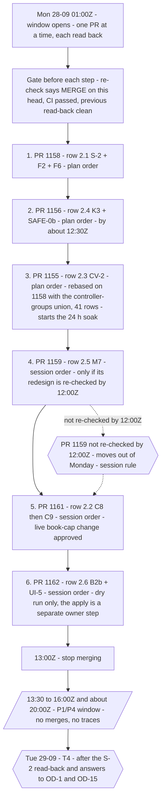

**Conflict simulation** (`git merge-tree`, applying each PR in order onto `b414a06`; a step that conflicts is **skipped**, and the later steps are applied without it; re-run by this document's writer after the cutoff with the same result):

| Step | PR | Cutoff heads | Heads at 22:09Z | Before it can merge |
|---|---|---|---|---|
| 1 | #1158 | clean | clean | the small round `b6288c8` re-checked, CI passed |
| 2 | #1156 | **conflict** in `docs/ui-control-inventory.md` (skipped) | clean (`afe84d9` merged `main` and regenerated the inventory) | re-check done (MERGE) |
| 3 | #1155 | **conflict** in `agent/shared/controller-groups.js` and `agent/services/controller-groups.test.js` (skipped) | **conflict**, same files (skipped) | **the union** (§7.4) and the counter fix |
| 4 | #1159 | clean | clean | the redesign re-checked, or moved out |
| 5 | #1161 | clean | clean | `e7aa9ae` re-checked |
| 6 | #1162 | clean | clean | nothing more; the apply is a separate owner step |
| Tue | T4 `d3b01c8` | clean on the simulated tree (#1156 and #1155 skipped) | clean (#1155 skipped) | OD-1 and OD-15. It already contains #1158 up to `5d1f4a4` and merges cleanly over `b6288c8` |
| Wave 3 | S-8 `8b98ad3` | **conflict** in `agent/loop.js` only (with T4) | **conflict** in `agent/loop.js` and `docs/ui-control-inventory.md`; the inventory conflict comes only from #1156's post-cutoff head `afe84d9` | `loop.js` conflicts with **T4** (semantic, §7.4); the inventory must be regenerated, not hand-merged |
| Wave 3 | GW-1 `532f64d` | clean | clean | an owner window; since the cutoff, it will rebase onto `main` after the `/health` hotfix merges |

CI caveat: CI on #1155, #1156, #1158 and #1159 ran against older bases; only #1161 and #1162 have `b414a06` as their GitHub base. No CI has run on the six combined. The implementing session's verification workflow merged all six in Monday order locally (first-hand).

### 7.4 Two conflicts that need a decision, not a text merge

- **#1155 after #1158: the controller-groups union.** `main` registers 39 controllers (`agent/services/controller-groups.test.js:12` asserts 39). #1158 adds `momentum_book` (40 on its branch) and #1155 adds `verify_watchdog` (40 on its branch). #1155 must merge after #1158 with **both names** in `agent/shared/controller-groups.js`, and its test must assert **41**.
- **S-8 against T4 in `autoTrade`'s market gate** (`agent/loop.js:386-392`). T4 adds a named closed-market momentum refusal on `isSymbolOpenCached`; S-8 replaces `isSymbolOpenCached` with `resolveEntryMarketGate` (the account calendar; UNKNOWN never reads open). Whichever merges second must keep T4's refusal **on S-8's gate**. S-8 also conflicts with #1156's post-cutoff head `afe84d9` in the generated inventory, which must be regenerated, not hand-merged (at the cutoff heads the inventory merged cleanly).

### 7.5 Found after the cutoff: the loop's breaker can never trigger

- **Finding (confirmed on `main`, first reported by the implementing session at 27-09 about 06:32 SGT).** The main loop's self-healing backoff (at 5 consecutive errors) and its circuit breaker (at 10, `MAX_CONSECUTIVE_ERRORS`, `agent/loop.js:102`, checked at `:2817`) can never trigger.
- **Mechanism.** On an errored cycle the `catch` block runs `consecutiveErrors++` (`agent/loop.js:5789`) and returns only when the count has reached 5. Below 5 it falls through to the unconditional `consecutiveErrors = 0` (`:5808`). So the count is reset after every errored cycle and never exceeds 1. Verified by reading `b414a06` (Passed).
- **The fix** is one line: reset only when the cycle did not error. It is **ask-first**, because it switches on a breaker that halts the loop. The owner was asked at 06:32 SGT; no answer is recorded.
- This is the shape `CLAUDE.md` calls recurring failure mode 3: a guard that is on, configured, and out of reach of what it guards.

---

## 8. What needs to be done

### 8.1 In order, with dates

**Now: the current next actions** (27-09 08:30 SGT = 00:30Z, after the cutoff; the events behind them are in the box in §7.2):

1. **The owner decides:**
   - OD-8, which S-8 (#1163) waits on;
   - the `/health` restart window for #1164, and whether cpp-verify's own `/health` leak rides with it;
   - yes or no to #1155's merge of `main` (the permission system blocked it);
   - switching on the loop's backoff and circuit breaker (§7.5);
   - the named-corrections dry run (B2b; the apply after it is a production write).
   - OD-24 (the research path), by 28-09, for stage A and the holdout;
2. Watch for C8's first book-cap refusals in the Reasons list (weekend: crypto only; FX from Monday's open). The read-back of #1161's deploy is done (**first-hand**): live 23:40:32Z; `/health` commit `584237b`, status ok, 0 errors, 26 open positions; every controller heartbeat ok except `pending_orders`, retired by design.
3. Fix round 3 for #1155 (CV-2), then a re-check.
4. #1159 (M7) round 4, then an adversarial re-check. It is out of Monday's merges (the session's rule).
5. S-8 (#1163) merges after OD-8, before 30-09 about 15:00Z.
6. GW-1 rebases after #1164 merges.
7. T4 after OD-1 and OD-15.

**The dated sequence at the cutoff.** Rows marked "superseded" were overtaken by the events in §7.2's box; the calendar rows still stand.

| When | What | Gate |
|---|---|---|
| **Before Mon 28-09 01:00Z** (superseded) | Re-check #1158 `b6288c8` and #1161 `e7aa9ae`; push and re-check #1155's counter fix with the controller-groups union; push and re-check #1159's redesign; finish S-8 round 3's re-check; build and check the `/health` hotfix (with GW-1's call-site pin and the `shadowSim` allowlist) | independent re-checks; CI |
| Before Mon 01:00Z (superseded) | Ask the owner: C8's sub-questions (not blocking); the `/health` restart window; OD-1 and OD-15 for Tuesday; OD-8 for S-8 | owner |
| **Mon 28-09 01:00–13:00Z** (superseded: four of the six merged early) | Wave 2 merges: the plan's 2.1 → 2.4 → 2.3 (IP:298), then #1159 → #1161 → #1162 (the session's order, **first-hand**), each read back; #1159 out if not re-checked by 12:00Z (the session's rule, **first-hand**) | §7.3 rules |
| After #1155's deploy | CV-2's 24 h muted soak starts; W3 cannot start before it ends | — |
| Mon 13:30–16:00Z, about 20:00Z | P1/P4 load window: the M3 harness runs; no merges, no traces | OD-4 answered |
| 21:05Z, daily | S-2's first read-back: the daily momentum pass outside the scan branch. The plan said Mon 21:05Z; since #1158 merged Sat 22:49Z and the pass has no weekday test (IP:67), probably Sun 27-09 21:05Z (**inference**) | — |
| **Tue 29-09** | T4 (switch OFF) if OD-1 and OD-15 are answered. B2b's named apply only on the owner's word after the dry-run list; that it falls on Tuesday is **inference** | owner |
| Tue 29-09 17:30Z | P5d 7-day adjusted windows | calendar |
| **Mon 16:00Z → Wed 30-09 (Wave 3)** | 3.1 GW-1 in an owner window (after the hotfix); **3.2 S-8 + WEB-6b deployed before 30-09 about 15:00Z**; 3.3 S-4 → S-5; 3.4 W3 after the soak; 3.5 C5, UI-8, B5; 3.6 Q2; 3.7 PO-M2 | OD-8, OD-9, OD-16, OD-20, OD-23, OD-24; the owner's window |
| As soon as the owner picks a window | The gateway `/health` hotfix, now draft #1164 (options as the session framed them: this weekend, Monday before 01:00Z, or a time the owner chooses; **inference**) | owner |
| 30-09 16:00Z → 01-10 | HKEX holiday: P2's first real holiday test (the date is inferred from HKEX's calendar; no broker row existed at 23:17Z) | calendar |
| 30-09 → 02-10 | P6/P7 stage A research, if OD-24 is answered by 28-09 | OD-24 |
| 02–05-10 | P2 weekend: Friday close, Sunday reopen, Monday open with no false incident | calendar |
| 22-10 17:30Z | P5d 30-day adjusted windows | calendar |
| 25-10 and 01-11 | EU and US clock changes: P2's DST evidence | calendar |
| about 25-10 → 01-11 | P8 T2 live first retire | calendar |
| 19-12 | Momentum trial checkpoint | calendar |
| not before late January 2027 | P8 T2 demo first retire | calendar |
| **Wave 4, no dates** | S-6 (restores, supersedes C11), C7 re-scoped, PO-M1 → PO-B, HIST-1, HIST-2, S-7 then walk-forward, the D14 sweep, M4, M6, Q5, GW-2 | evidence; OD-5, OD-26–OD-29 |

**V3 acceptance:** none of the eight groups is accepted. "Built and tested" for all eight is reachable in Wave 3 if the answers arrive; "accepted" is set by the calendar above.

### 8.2 Every owner decision needed, and what it blocks

| Decision | Blocks | Needed by | Recommendation on record |
|---|---|---|---|
| **OD-1** resume momentum entries after T4 | T4 | before T4, Tue 29-09 | (a) market orders yes; open-market HTF limits after OD-15, on the Trade-armed accounts (…0058); (b) closed-market limits no |
| **OD-15** resting orders count toward caps and margin | T4, PO-B | before T4, Tue 29-09 | yes, values unchanged |
| **OD-8** hours source for entries | S-8 (#1163) | before S-8's deploy, 30-09 about 15:00Z | the account calendar, for every entry |
| **OD-9** score refused strategies; fold standing stops | S-4 | Wave 3 (Mon 16:00Z → Wed 30-09) | score the PO-M1 levels; fold the stops |
| **OD-16** autopilot and watchdog flip the shared list | S-5 | Wave 3 | stop |
| **OD-20** picker location and order routing | UI-8 | Wave 3 | picker under TRADING; orders to the trading account |
| **OD-23** equity-stop push per side | C5 | Wave 3 | the V3 default |
| **OD-24** research path | Q2; stage A | by 28-09, for stage A and the holdout | pooled replay; stages S0–S5; holdout declared by 28-09 |
| **OD-5** restore fib, rsi2, donchian | S-6, C7, S-4 | Wave 3 for S-4; Wave 4 (no date) for S-6 and C7 | fib (B); rsi2 and donchian (C) |
| The `/health` hotfix restart window (#1164) | the hotfix; then GW-1 | before GW-1 | — |
| Whether cpp-verify's open `/health` leak rides with #1164 (found after the cutoff) | the cpp-verify fix | with the #1164 window | — |
| GW-1's gateway window | GW-1 | after #1164 merges | a weekday window outside P1/P4; demo first |
| Yes or no to #1155's `git merge origin/main` (after the cutoff; blocked by the permission system) | #1155's fix round 3 | before #1155 can merge | — |
| C8 sub-questions: exempt `cross_sectional_book`? rotate the two slots? is the 2R/7 sizing intended? should the tick R take the bar drawdown de-risk? restart-hold clock from the sidecar's `startedAtMs`? | nothing: **not blocking**, C8 ships as built and these are follow-ups (#1161 comment) | no date | — |
| B2b's named apply, after the owner sees the dry-run list (a production write) | the corrections themselves | no date | — |
| Switch on the loop's backoff and circuit breaker (reset the error count only on a clean cycle; found after the cutoff, §7.5) | the loop's self-healing and its halt at 10 errors | no date; ask-first | the one-line fix; asked 06:32 SGT |

**New questions raised by the checks, not yet answered** (first-hand):

- **M7:** should up to 8 authenticated sockets per pass be paced?
- **B2b / UI-5:** should the fee/swap exoneration reach the stored `pnl_price_mismatch` flag (a write path)? Order-link stamping (V3-SEQ item 35 / H-P5b-4) on the existing `limit_link` mechanism?
- **S-8:** UNKNOWN = refuse, or treat as closed? Are manual routes gated? Should `tradingMode` refuse?
- **GW-1:** `drainingSeconds` 10; DISCONNECTED read as ambiguous in Node's entry ledger; the commit on the public `/health`; the host-overlay 70 % refusal; demo first (pause cpp-acct's auto-deploy).
- **CV-2:** unmute before handoff; the stale backlog; does delivery stay muted after the soak until an explicit unmute?
- **K3:** what does an omitted holiday bound mean? Does "another account" mean the traded account?
- **S-2:** should the ranking also leave the scan branch? Should exits and the trail run for tsmom-unarmed accounts (…0949's 10 rows)? Does OD-2 cover F2 on the 3 live accounts?
- **T4:** the swap assumptions.

### 8.3 The gateway `/health` id leak, stated precisely

- **What leaks.** The gateways' `GET /health` answers without a bearer. On that open response:
  - `guard.entryEpochs` is keyed by **account id**, set outside the `if (trusted)` block (`cpp-exec/src/main.cpp:693-696`). **Live since #881** (`5ebe0dc`, 11-09).
  - `tick.shadowSim.costs.symbolClass` is keyed by **symbol id** (`main.cpp:725` → `cpp-exec/src/tick_shadow.cpp:56-58`). **Live since #914** (`81a4bb3`, 17-09).
  - Both verified with `git log -S` (Passed).
- **The fix.** GW-1 `532f64d` already removes both, and its round-2 re-check (after the cutoff, 22:31Z) proved it on the built binary. The owner chose "(b) sooner": a separate hotfix branch, `claude/gw-health-ids`, that lands before GW-1. Either one restarts both gateways, so it needs a window. The restart-window question is open.
- **Since the cutoff:** the hotfix is draft PR #1164 (`88b839b`), checked MERGE (0 of 10 ids on every untrusted read). And **cpp-verify's own open `/health` lists account ids too** (`cpp-verify/src/main.cpp:183-186`); that is not fixed, and the owner was asked whether it rides with #1164.
- **Context the owner has not yet been told** (**first-hand**):
  - The repository is **public** (GitHub API `visibility: public`, read 27-09).
  - The full account ids already appear in files on `main`: the id of …0058 alone in 168 files at `b414a06`, and at least one of the seven account ids in 233 files (`git grep -l`).
  - So the hotfix closes one exposure. **It does not make the ids private.**
- **Not Verifiable from the repo:** whether the gateways have public domains, and so whether the open `/health` is reachable from the internet at all.

---

## 9. Challenges

Each challenge with its evidence, what it cost, and what mitigates it.

1. **The test environment does not match production.**
   - Evidence: this container's better-sqlite3 is 11.10.0 against the `^12.8.0` pin (SQLite 3.49.2, below the 3.51.3 WAL fix) (`agent/package.json:11`; Passed). Every full local run has 14–16 environmental test failures.
   - Cost: the local gate is never clean, so each run's failures must be compared by name against the known set.
   - Mitigation: CI on the PR is the real gate; nothing merges without it.
2. **Serial numbers and transcripts** (**first-hand**).
   - Evidence: the container holds only part of the transcript corpus, so the reply serial is carried by count; stamps were corrected several times, and one stamp used a guessed time (22:23 against about 22:18). The `CLAUDE.md` ledger records every correction.
   - Cost: owner confusion; ledger write-backs in PRs.
   - Mitigation: `CLAUDE.md` §1's write-back rule; count by replies, not stamps.
3. **Container restarts** (**first-hand**).
   - Evidence: subagent hand-backs lost after a restart (recovered from task output files); the local proxy port changed, so traces failed until `TRACE_PROXY` was set to the current `$HTTPS_PROXY`; a 6 h session pause, 26-09 23:33 → 27-09 05:34 SGT, with no reports.
   - Cost: lost hours and a silent night.
   - Mitigation: durable output files; re-reading state from git and the GitHub API, never from memory.
4. **Parallel agents interfere** (**first-hand**).
   - Evidence: one agent's `pkill -f` killed another agent's waiter process; a maker re-sent the same report three times.
   - Mitigation: kill only by PID; one owner per process.
5. **Parallel branches conflict at merge time** (**first-hand**; the conflicts themselves are confirmed with `git merge-tree`).
   - Evidence: the controller-groups registry needs a union (39 → 41); `docs/ui-control-inventory.md` was changed by 12 PRs and conflicts again; S-8 against T4 in `loop.js` is semantic (§7.4).
   - Mitigation: `git merge-tree` simulation of the whole Monday order; generated files regenerated, never hand-merged.
6. **Defects found by the checks before merge (none reached production)** (first-hand):
   - B2b's re-stamp fix was put in the wrong function and regressed the settle path;
   - S-2's MARKET_CLOSED retry could park an owed exit for about 151 h;
   - M7: stale quotes, starvation, a cap of 0, then M7 blockers B1–B5 (§7.2);
   - C8/C9: phantom holders;
   - CV-2: the would-send counter;
   - K3: a cancel test that could not fail;
   - S-8: entry-path broker reads of 12 s growing to 96 s/192 s per pass before being bounded to about 10 s;
   - GW-1: the `/health` id leak in its first rounds;
   - B2b: an evidence string used an import date as the read date (fixed in `a9ec8e6`).
   - Cost: fix rounds on almost every item. Mitigation: the adversarial pass is now part of the method for money-path PRs.
7. **The performance proof still fails on Reasons.** CLS 0.53 / 0.46 against ≤ 0.25; LCP rose on all four page/profile pairs; the cause is not attributed. Mitigation: the trace rule (OD-13, open) would make a trace regression block the website's auto-merge.
8. **Communication** (**first-hand**). The 21:14 SGT report on 26-09 was delivered 16 minutes early and then buried under status lines; the owner could not find it at 21:30. Mitigation: one report per order, stamped and findable; status lines kept short.
9. **Domain complexity.**
   - Broker market calendars: 0/0 holiday rows (101 of 136 demanded calendars read UNKNOWN before #1138), recurring rows, DST, early closes.
   - Broker history limits: BTCUSD monthly history starts July 2010; a "weekly starts 2018" reading was a false positive, fixed in #1152.
   - Broker rate limits (a shared 4 per second bucket) and slow symbol-list reads (at most 3 per account per day since #1133).
   - Tick versus bar dual admission; record integrity (X1: 25 resting intents recorded FILLED with no fill evidence).
10. **An owner-gated, calendar-bound chain.** Wave 3's dates depend on eight open decisions. V3 acceptance is set by the market calendar (P2 weekends 02–05-10, DST weekends 25-10 and 01-11, the P5a soak, P8 live retire about 25-10 → 01-11, demo retire not before late January 2027, momentum checkpoint 19-12).
11. **Dangling citations.** Documents and code on `main` cite files that were never committed: V3-SEQUENCE (committed now as `docs/v3-sequence-2026-09-25.md`), `LIFECYCLE-SPEC.md`, the owner's "8,989-A" website-defect list, `SEQUENCE.md`, `reply-9440.md`, and the roadmap v2.2 inputs. Cost: a reader cannot check the cited line. Mitigation: commit working files the plans rely on, verbatim; this handover starts with V3-SEQUENCE.
12. **Stale records in the repository.** The integrated plan's Wave 2 table and the bodies of #1155, #1156, #1158 and #1159 say "ready" or "MERGE" after the adversarial pass overturned four of them; the closure register has not been updated since #1081; DE:100-101 and DE:170-171 call merged branches "not merged". Cost: a model trusting the repo text would merge a blocked PR. Mitigation: §7 of this document; update the PR bodies before Monday.
13. **`merged_by` cannot tell who merged.** It reads `ang-kl` on all 71, because the session acts through the owner's credential. Documents name the owner as the merger only for #1085, #1095 and #1143.
14. **PR bodies that disagree with their own diff.** #1113's body says "no gateway restart"; its commit body and the watch patterns say both gateways restart (`agent/lib/exec-engine.js` matches `agent/lib/exec-engine.*`). #1121's body names a helper `reportCurrencies` that does not occur in the squash commit's diff. Mitigation: read the diff, not the body.
15. **Stale PR branches.** `claude/handover-outstanding-file-1ktjs7` is the head branch of #1131 and #1143; its tip `025b342` is #1143's head, and that content landed as `5389a83`. The six suffixed refs are the head branches of #514–#519, merged 30-07-2026 (GitHub API). They can be deleted with the owner's OK.
16. **Guards that can never fire.** Found after the cutoff: the main loop's backoff and circuit breaker cannot trigger, because the error count is reset after every errored cycle (§7.5). Cost: a loop failing every cycle keeps running at full cadence and never halts. Mitigation: the one-line fix, ask-first; and the standing question from `CLAUDE.md`, "what input would make this fire, and has that input ever arrived?"
17. **The automated review never reviewed in this window.** Evidence: the `review` check skips because `ANTHROPIC_API_KEY` is not set, yet reports success (the annotation on `88b839b`; §16.2). Cost: a passing "review" check could be read as a review. Mitigation: this document counts only the `test` and `build-test` jobs as CI; review is the session's checker agents, the adversarial refuters on money paths, and the owner's merge decision.

---

## 10. How the work is done

### 10.1 The pipeline, per item

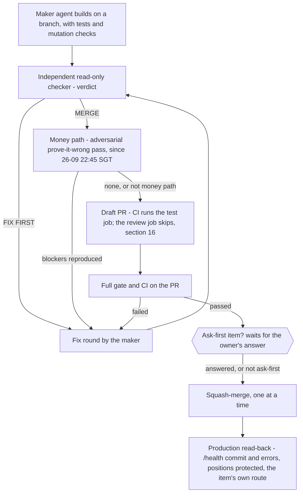

- Maker → independent read-only checker → fix round(s) → re-check → draft PR → CI → merge → production read-back (`/health` commit and errors, positions protected, the item's own route).
- From 26-09 about 22:45 SGT (the owner's "ultracode" request), money-path PRs also get an adversarial pass that merges the whole day's set in order and tries to prove each one wrong.

### 10.2 The mutation rule (`CLAUDE.md`, recurring failure mode 1)

A test proves a guard only if removing the guard makes it fail. For every mutation:

1. `grep -c` the target text: it must be **present** before the edit.
2. Apply the mutation; `grep -c` again: the target must be **absent**. A mutation that did not apply proves nothing.
3. Run the named test: it must **fail**.
4. Restore the file and `cmp` it against the original.

Also: strip comments before asserting on source (a test once passed by matching its own comment), and pin wiring with a test (a repair nothing calls is dead).

### 10.3 The merge policy and the full gate (`CLAUDE.md`, owner 2026-07-22)

Auto-merge on a passing gate is standing approval, **but the schedule overrides it**: no Wave 2 merge outside Mon 28-09 01:00–13:00Z, nothing merged or traced inside the P1/P4 window, one merge at a time with a read-back, and ask-first items wait (§10.4). The schedule is the owner's to override, and the owner has since merged Wave 2 PRs on Sunday morning by the owner's own choice (§7.2). The gate:

```
shopt -s globstar; node --test agent/**/*.test.js
npx eslint .
npx vitest run
npm run build
npm run check:no-green
CI on the PR itself passed / mergeable_state: clean
```

Here "CI on the PR itself passed" means the `test` job (and `build-test` where a C++ workflow runs). The `review` job's success is a skip, because `ANTHROPIC_API_KEY` is not set (§16).

Then: undraft, squash-merge, unsubscribe from the PR's activity, and clear its check-in wakeup.

### 10.4 Ask-first: never without the owner's word

- risk limits, caps, thresholds, and TP1 policy values;
- account credentials; live-versus-demo mode;
- strategy enablement (including the 3 live accounts);
- gateway restarts outside an owner window;
- SAFE-0b, the Re-Risk apply guard (its rule was answered as OD-14; its open sub-questions stay ask-first);
- the UI-5 / B2b corrections apply (a production write);
- realigning …0058's 39 extra pins;
- F5-N7 (B1's nit N7: the lesson tuner reading rejected rows' postmortems; OD-37);
- widening momentum entries to all 7 accounts;
- production settings: Railway variables, volumes, service configuration;
- force-pushes beyond the branch-restart pattern (re-basing the working branch on `main` after a squash-merge);
- messages to third parties;
- calling W3's handoff route;
- switching on the loop's backoff and circuit breaker (§7.5);
- anything the owner flags for manual review in a PR body.

### 10.5 Security and presentation rules

- Never print a secret, token or credential value. Environment variable **names** are fine; values never.
- Production is read with GET only, with the read bearer. `/actions/...` is never called to "check".
- Account ids in prose are last-4 (…0058).
- **The owner is red/green colourblind.** Status is shown by words and shapes (✔ ✖ ◐ ?), never by colour. `npm run check:no-green` enforces part of this on the website.

---

## 11. Disagreements between the documents and git

Where sources disagreed, the one citing git or the GitHub API is preferred.

1. **"V3-SEQUENCE" is not `docs/v3-acceptance-sequence-2026-09-23.md`.** Every cited line matches the scratchpad file, now committed as `docs/v3-sequence-2026-09-25.md`.
2. **DE:100-101** says WP-A is "built, not merged" on `claude/pr1-dual-admission`. Git: #1085 from that branch merged 25-09 08:21:25Z. The line was written in the PR that merged it.
3. **DE:170-171** says `claude/v3-q1-replay-honesty` is "not yet merged". Git: #1096 from that branch merged 25-09 13:36:30Z.
4. **The roadmap** (RM:5435, RM:5401) says PR-1 has "no PR number … in any source" and leaves #1086 unmapped. Git: #1086's commit body says "Plan P1/P2 of docs/dual-environment-plan", and V3-SEQUENCE:24 says "PR-1 (measurement) = #1086".
5. **The closure register** was last edited by #1081 (25-09 07:13 SGT); none of the 71 merges is written into it.
6. **The integrated plan :80** omits M3 (#1126) from P1/P4's "Merged" cell.
7. **The integrated plan's Wave 2 table (:300-308)** is stale at the cutoff: #1161 and #1162 now exist; heads moved (`f9e566e` → `e1f9263`, `3367b0f` → `a9ec8e6`, `699aace` → `d3b01c8`, each old head an ancestor of the new; #1156's head was still `44e1d41` at 22:00Z and moved to `afe84d9` only after the cutoff); "Ready? Yes" for 2.3, 2.4 and 2.5 is overturned by the adversarial pass. The PR bodies of #1155, #1156, #1158 and #1159 also still end at "MERGE".
8. **The integrated plan :428** ("Wave 3 Not started") and **:91** ("no branch exists" for the owner-gated items) are overtaken by `claude/w3-gw1` and `claude/w3-s8-web6b`.
9. **The answered-decision count:** 12 ids answered by the owner's words, 16 counting the four UI defaults answered by the approval (integrated plan :5; RM:5462). This document uses 16.
10. **Restart count:** the plan budgeted "up to 7 more Node restarts" for Wave 1 (:40) and recorded nine (:264).
11. **Id collision:** bare D1–D7 in DE and the takeover record mean the dual-environment decisions; bare D1–D22 in the new plan mean different questions. The integrated plan (:458) says a bare D-n is always the new plan's; DE and the takeover record still carry the other meaning.
12. **A takeover question with no home:** "the 24-hour browser disconnection" has no OD id.
13. **Owner answers outside the plan documents.** C8's live change "yes" is in GitHub, as a #1161 PR comment posted 14:19:05Z; it says C8 ships as built, with its three sub-questions as follow-ups (not blocking). Only the `/health` hotfix "(b) sooner" is **first-hand** alone, in no git or GitHub record.
14. **V3-SEQUENCE:729** ("weekdays") is wrong, per the integrated plan :67.
15. **#1113's PR body** says no gateway restart; its commit body and the watch patterns say both gateways restart. The files confirm the commit body.
16. **#1121's PR body** names a helper `reportCurrencies` that does not occur in the squash commit's diff.
17. **GitHub titles differ from squash-commit subjects** on #1100, #1102, #1103, #1104, #1105, #1114, #1120, #1130, #1148 and #1160. Appendix A shows both.
18. **Line counts for #1108, #1111 and #1112** differ between GitHub and the squash commits by exactly #1120's change (+5 / −2 in one test file): #1120 merged first, so their squash commits do not contain it. This document uses the squash commits.
19. **Session notes said "#1146 absent".** GitHub: #1146 exists; it was closed without merging 83 s after it opened.
20. **Session notes said the `/health` leak is "live since #881".** `git log -S`: the account ids arrived with #881 (11-09), the symbol ids with #914 (17-09). This document uses both dates.
21. **Session notes said about 81 items.** The remote at the cutoff holds 80; the 81st is the hotfix branch, not yet pushed.
22. **The time of C8's "yes".** The session notes say about 22:18 SGT; the #1161 comment recording it was posted 14:19:05Z (22:19 SGT) and its own text says "22:2x SGT".
23. **Branch bases.** One fact sheet gives #1158's and #1159's base as `e751b15` (GitHub's recorded base, the tip of `main` when they were opened); another says their CI ran against `8531db5` (where the branches fork, `git merge-base`). Both are true readings of different things; neither is `b414a06`, and no CI has run on the six combined.
24. **GitHub `mergeable_state` varied between reads** (for example #1155 read `clean` in one read and `unknown` in another, after `main` moved). The `git merge-tree` simulations in §7.3 are the authority.
25. **The id count.** The brief quoted "168 files on main" for the full account ids; that is …0058's id alone. Counting all seven account ids, 233 files.
26. **The `claude/handover-outstanding-file-1ktjs7*` branches.** A fact sheet called them of unknown origin, on base `025b342`. GitHub: the unsuffixed branch is the head branch of #1131 and #1143 (its tip `025b342` is #1143's head, landed as `5389a83`), and the six suffixed ones are the head branches of #514–#519, merged 30-07-2026 (§9, item 15).
27. **The Monday order after step 3.** The plan fixes only "2.1 → 2.4 → 2.3 → the rest" (IP:298). The order #1159 → #1161 → #1162 and the 12:00Z cut-off for #1159 are the session's (**first-hand**), not the plan's.
28. **S-8's conflicts in the simulation.** The open-work fact sheet listed an inventory conflict for S-8 at the cutoff heads. A re-run shows S-8 conflicts only in `agent/loop.js` at the cutoff heads; the inventory conflict appears only against #1156's post-cutoff head `afe84d9` (§7.3).

---

## 12. Glossary

**Places and systems**

- **Node / the agent** — `agent/`: the trading loop, risk gates, protection, records, API; built with the website.
- **cpp-exec / cpp-acct** — the C++ broker gateways, demo and live; one binary, restart together (**inference**, §2.1).
- **sidecar** — Node's word for a C++ gateway process (cpp-exec or cpp-acct); a "sidecar restart" is a gateway restart.
- **cpp-verify** — the read-only C++ verifier and service watchdog.
- **cpp-scan-timeframe / cpp-scan-tick** — the C++ scanner mirrors; `orderAuthority:false`.
- **`/health`, `/state/…`, `/actions/…`** — health, read and write routes. `/actions` is never called to check anything.
- **SGT / Z** — UTC+8 / UTC.
- **…0058, …0949** — accounts by their last four digits.
- **tsmom_long (tsmom)** — the momentum book's strategy; the only strategy still allowed to trade, on trial on …0058 until 19-12 (`docs/v3-integrated-plan-2026-09-26.md:14`).
- **HTF limit** — a resting limit for a 4h-or-longer signal in an open market, resting until the next bar close; it is labelled PRE too (IP:13). **PRE** is a pre-order placed while the market is shut.
- **PF, R** — PF is profit factor; R is profit in units of the risk taken (IP:10). "PF in R" is PF computed on R multiples.
- **CLS, LCP** — Cumulative Layout Shift and Largest Contentful Paint, the browser performance measures in the DevTools traces.
- **armed, Trade-armed** — a strategy cell is armed for an account when its "Auto Trade & Open" stage is on; the Trade-armed accounts are those where the strategy is armed to trade (#1149's `rosterArmedTradeKeys`).

**The three plans and their parts**

- **DE** — `docs/dual-environment-plan-2026-09-25.md`, plan 1.
- **CL** — `docs/v3-closure-2026-09-24.md`, the frozen closure register (plan 2's acceptance bar).
- **TK** — `docs/claude-takeover-2026-09-25.md`, the takeover record.
- **P0–P8 (plan 1)** — the dual-environment phases (§4.2). **P0–P8 (V3)** — revision 3's phases; the same labels, a different programme.
- **D1–D7** — plan 1's decisions (win factor, win rate, "sustainable", veto trade-off, shadow = live, pooled replay, gateway redeploy).
- **PR-1 … PR-11** — plan 1's build sequence in `SEQUENCE.md` (scratchpad only); PR-3 … PR-11 became C3, C4, C5, CV-1, C7, C8, C9, GW-1, C11.
- **runbook R0–R6** — plan 1's runbook (runbook R2–R5 applied 25-09; runbook R6 open). Not V3's R1/R2 items, and not R3 (revision 3).
- **WP-A** — dual admission (#1085).
- **R3 / revision 3** — V3's root plan (22-09).
- **The eight frozen groups** — P0/P3, P1/P4, P2, P5a, P5b/P5d, P5c, P6/P7, P8 (§4.3).
- **V3-SEQUENCE / V3-SEQ item N** — the 41-item queue, now `docs/v3-sequence-2026-09-25.md`.
- **IP / the integrated plan** — `docs/v3-integrated-plan-2026-09-26.md`, plan 3. **RM** — its roadmap page.
- **NP / the new plan** — `docs/plan-ui-and-strategy-review-2026-09-26.md` (owner requests 1 and 2); its D1–D22 were renamed OD-n.
- **W1.x / 1.1–1.7, 2.1–2.7, 3.1–3.7** — the integrated plan's wave rows (§4.4).
- **W1-FU** — the Wave 1 follow-up, #1157.
- **OD-0 … OD-43, OD-22b** — the integrated plan's decision register (§4.6).
- **H-P… ids** — V3's human-input ids, renamed into OD-n.
- **E0** — the research path's first step, parity: S0 on a window without a boot change, before stage A (`v3-sequence-2026-09-25.md:672`, `:746`).
- **research stages S0–S5** — the research path's stages and stop rules (S0 parity, S1 pooled stage A on train/validation, …; S5 removes live tick when an account's own tick closes breach PF or 8R) (`v3-sequence-2026-09-25.md:672`, `:708`).
- **W15** — the LIFECYCLE-SPEC writer item that OD-35 decides: broker-only positions (**inference** from OD-35's row; the spec is not committed).
- **I3-R7, I3-N7**: two items from I3 (#1108). **I3-R7** is the stuck resolver's rule for positions with no take profit. It writes a recovered target to `trades.tp_price`, and target-restore then amends the live TP. Since #1108's fix round it runs only when `stuck_resolver_target_write` is `'true'` (default off). **I3-N7** is the I3 checker's nit 7: a duplicate stuck row is ended but not merged into the adopted row. OD-37 recommends R7 off and N7 yes.
- **P8a** — the first part of V3's P8: agent tests remove their temp directories (A1, #1090).
- **STK-11** — the order-lifecycle stuck rule that judges every controller through its heartbeat (version 2 in #1097).
- **NEW-L3** — the owner's 8,989-A list's id for the ledger-edge balance defect (row 7), fixed as WEB-8 (#1139).
- **8,989-A** — the owner's website-defect list behind the WEB items (not committed).
- **REC** — record completeness (L1, L1b, L1c, L2a, L2b, X1).
- **X1** — resting-order intents recorded FILLED at acceptance; the fix (#1113) and its window (25-09 21:00–22:35Z).
- **"ultracode"** — the owner's 26-09 request for accuracy that started the adversarial pass.
- **Money-path PR** — a PR that changes which orders are placed, sized, protected or closed, or how the alerts on open positions are delivered. The five adversarially checked: #1155 (alert delivery), #1156, #1158, #1159, #1161. #1162 was not in the set.
- **Colliding ids** (write the prefix every time):
  - **B1**, **B2** the V3 accounting items vs **M7 blockers B1–B5**, **GW-1 checker blockers B1, B1b** and **CV-2 re-check blockers B1, B2**;
  - **W1–W17** (LIFECYCLE-SPEC writer items, for example **LIFECYCLE-SPEC W4 + W2 + W3** in X1) vs **W1.x** (Wave 1 rows), **W3** (the V3 watchdog handoff item) and **W1-FU**;
  - **P5a drills D1–D4** vs plan 1's **D1–D7** vs the new plan's **D1–D22**;
  - **P8 T0–T5** (final-acceptance tests) vs V3 queue items **T1–T4**;
  - **runbook R0–R6** vs V3 items **R1, R2** vs **R3** (revision 3);
  - **research stages S0–S5** vs the new plan's **S-1 … S-8** vs **SB1–SB3**;
  - plan 1's **P0–P8** vs V3's **P0–P8**;
  - plan 1's **PR-1 … PR-11** vs GitHub PR numbers; **V3-SEQ item 35** vs GitHub #35; **trade #1253** (a trade row id) vs GitHub #1253;
  - **CLS** the layout-shift metric vs the close rules **CLS-01 … CLS-09**;
  - **A1** the V3 test-hygiene item vs the new plan's A1 (the AI page, renamed UI-7);
  - **N7:** **I3-N7** and **F5-N7** (B1's nit) are different nits.

**V3 queue and added items**

- **A1** — agent tests remove their temp directories (#1090).
- **B1** — money only from a complete lifecycle (#1116). **B2** — lifecycle verdicts and per-currency reconciliation (#1135). **B2b** — write-off needs a broker verdict; named corrections, dry run then apply (#1162, draft). **B3** — account history over the whole window (#1093). **B4 / B4b / B4c** — completeness goals name what cannot be recovered; the close goal row names each record; adopted trades get their reason back (#1140, #1144, #1145). **B5** — ledger corrections and never-filled rejections (Wave 3).
- **C3** — scanner bridge (#1088). **C4** — tick receipt and diagnostics (#1099). **C5** — equity-stop push per side (open, OD-23). **C7** — scanner timeframe order handoff (blocked). **C8** — the book cap reads `side` (#1161). **C9** — tick combined risk, Node side (#1161). **C11** — pins restore (superseded by S-6).
- **CV-1** — scanner and cpp-verify relay, scanner watch patterns (#1112). **CV-2** — cpp-verify delivery muted through a 24 h soak (#1155).
- **DEP-SQLITE** — better-sqlite3 12.8.0 (#1106).
- **F1–F9** — V3 follow-ups (F1 closers defer; F2 hours-aware daily exit; F3 daily-stop wording; F4 tick-feeder stall alarm; F5 N6/N7; F6 book heartbeat; F7 inexact multi-deal closes; F8 bracket anchoring; F9 a host for the M3 harness).
- **GW-1** — the gateway release (branch `claude/w3-gw1`). **GW-2** — runtime profile and shadow = live (conditional). **GW-CAP** — tick spool cap from the environment (#1111).
- **I1** — reconcile cannot stall (#1101). **I2** — truthful controllers (#1107). **I3** — stuck-record resolver (#1108).
- **K1 / K1b / K1c** — calendar coverage per account; expired holiday rows; the cut export (#1129, #1138, #1141). **K2** — each account's own symbol map daily (#1133). **K3** — a 0/0 holiday row closes the local day (#1156).
- **L1 / L1b / L1c** — the order-lifecycle report and its follow-ups (#1095, #1097, #1125). **L2a / L2b** — truthful order and close writers (#1114, #1117).
- **M1** — boot record and startup phases (#1098). **M2 / M2b** — explicit 503s (#1089, #1123). **M3** — proposed goal rows and the P1/P4 harness (#1126). **M4, M6** — conditional. **M5** — amend round-trip (#1136). **M7** — parallel broker probes (#1159).
- **Q0** — shadow restart-loss count (#1127). **Q1 / Q1b** — replay honesty (#1092, #1096). **Q2** — research path (OD-24). **Q3** — replayer models the live filters (#1128). **Q4b** — bar-side qualification (#1094). **Q5** — conditional.
- **R1** — tick segment manifest (#1130). **R2** — acceptance evaluators (#1137).
- **STK-08v2** — an outbox held by a setting is named (#1134).
- **T1 / T1b** — plan arithmetic in ticks; off-grid stops (#1091, #1110). **T2** — close recovery (#1124). **T3** — partial manager every loop (#1132). **T4** — momentum entries with the partial-TP1 plan (branch `claude/w2-t4`).
- **V1** — every account's closes captured (#1109).
- **W3** — the owner handoff route for watchdog delivery, with a lease and truthful Controllers (after CV-2's soak).
- **WEB-1 … WEB-10, WEB-8b, WEB-9b** — the 8,989-A website fixes (§5). **WEB-6b** — broker-listed holidays in the session report (with S-8).
- **T0–T5 (P8)** — the final-acceptance tests: freeze, recorder drill, retention, capacity, end-to-end trace, report.

**The new plan's items**

- **NEW-1** — synthetic trace tabs do not count as the owner's (#1147).
- **SAFE-0a** — the manual-order confirm names the account (#1147). **SAFE-0b** — the Re-Risk apply guard (#1156).
- **UI-1** card collapse standard · **UI-2** the shared table · **UI-3** the Blockers card by day · **UI-4** sidebar readiness and build commit · **UI-5** Reasons data fixes · **UI-6** Reasons restructure · **UI-7** the AI page · **UI-8** the account picker move.
- **PERF-0** the trace harness (#1143) · **PERF-1** layout-jump fixes · **PERF-2** the Performance digit tree.
- **S-1** honest arming records · **S-2** the momentum book out of the scan branch · **S-3** bar-path depth and counters · **S-4** enablement first, the shadow scored · **S-5** arming writers · **S-6** restore per strategy · **S-7** strategy logic fixes · **S-8** holidays on the entry path.
- **HIST-1, HIST-2** — the bar store and the history review.
- **PO-1 … PO-9** — rules if pre-orders are ever built. **PO-M1 … PO-M3** — measure-first items. **PO-B** — pre-orders on, only on an explicit owner order.
- **SB1–SB3** — the new plan's sidebar items S1–S3, renamed.
- **Trace rule** — before-and-after performance traces on every website PR (OD-13 open).

---

## 13. Models and effort per model use (measured)

Model names are withheld from the repository under the implementing session's operating rules; the owner holds the key. The labels below are Model 1, Model 2 and Model 3. This document does not say which model is which, and it does not describe what any model can do.

The measurement below is reproduced verbatim from the implementing session's measurement file. It was measured by a script over the session's transcripts on disk, not estimated.

### Measured model and effort use (tier labels only; the key is withheld from the repository)

Window: 2026-09-25 03:40Z (takeover) to 2026-09-27 00:02Z. Source: this session's transcripts on disk (`~/.claude/projects/<project>/<session>.jsonl` for the main loop; `<session>/subagents/agent-*.jsonl` for helper agents; `<session>/workflows/wf_*.json` for workflow labels). Method: assistant messages de-duplicated on `message.id` (the transcript repeats a message's usage on every content block); model = `message.model`; effort = the `effort` field recorded on each message; tokens in = input + cache-creation + cache-read tokens; tokens out = output tokens.

#### Main loop (the implementing session itself)

Covered only from 2026-09-26T07:46:56.609Z to 2026-09-27T00:01:59.821Z: the main transcript on disk holds no earlier entries in the window, so 25-09 03:40Z to 26-09 07:46Z is **Not Verifiable** for the main loop.

| Model | Effort | Messages | Tokens in | Tokens out |
|---|---|---:|---:|---:|
| Model 1 | xhigh | 273 | 103,741,407 | 159,388 |
| Model 1 | medium | 224 | 105,597,325 | 154,144 |
| Model 1 | max | 198 | 98,367,606 | 176,187 |

#### Helper agents: 417 agents started or ran in the window

Agents per model by the model most of their messages used: Model 1 372, Model 2 32, Model 3 8, no model (harness placeholder) 5.

**Correction after vetting:** the first measurement read only `subagents/agent-*.jsonl` and gave 411. Six agents stored only under `subagents/workflows/` (the six `wave2-merge-verify` agents: 1 integration merge, 5 refuters) were missing. The script now reads both places and de-duplicates by agent id (351 of the 357 workflow files are copies of top-level ones). The six add 517 messages, 122,870,723 tokens in and 9,633 out, all Model 1. The table below is the corrected measurement.

| Model | Effort | Agents using it | Messages | Tokens in | Tokens out |
|---|---|---:|---:|---:|---:|
| Model 1 | xhigh | 288 | 20,887 | 4,649,784,756 | 1,004,372 |
| Model 1 | medium | 54 | 2,465 | 468,809,818 | 74,882 |
| Model 1 | max | 27 | 2,241 | 705,480,438 | 55,916 |
| Model 2 | high | 19 | 1,662 | 437,734,046 | 23,764 |
| Model 2 | medium | 13 | 1,537 | 484,704,075 | 15,898 |
| Model 1 | high | 23 | 726 | 149,167,288 | 12,813 |
| Model 2 | xhigh | 1 | 202 | 69,836,223 | 2,231 |
| Model 2 | max | 2 | 88 | 44,608,211 | 830 |
| Model 3 | ? | 8 | 45 | 3,051,522 | 129 |
| no model (harness placeholder) | xhigh | 7 | 7 | 0 | 0 |
| **Total** | | 417 | 29,860 | 7,013,176,377 | 1,190,835 |

### Reading the numbers

- "Tokens in" is dominated by cache reads: the same context is re-read on each turn (**inference**: the table does not split the three input fields).
- Effort is the setting recorded on each message. It changed during the session (the owner's settings), so one agent can carry several efforts.
- "Agents using it" counts an agent once per model and effort it used, so that column sums to more than 417 (442).
- Model 3's effort is not recorded ("?").
- The "no model" entries are harness placeholders: 7 messages from 7 agents, 5 of which have no other model as their main one.

### How models were assigned by role

From the workflow records and the agent labels (**first-hand**):

- `w1-build-lanes` (Wave 1, 17 agents): make ×3 on Model 1 and ×4 on Model 2; check ×5 on Model 1 and ×1 on Model 2; fix ×2 on Model 1 and ×2 on Model 2.
- `w1-build-lanes-v2` (Wave 1, 19 agents): make ×2 on Model 1 and ×5 on Model 2; check ×4 on Model 1 and ×3 on Model 2; fix ×2 on Model 1 and ×3 on Model 2.
- `wave2-merge-verify` (6 agents, all Model 1): 1 integration merge and 5 refuters.

### The Wave 2 and Wave 3 build, by agent

| Row | Maker | First checker | Later rounds | Outcome |
|---|---|---|---|---|
| 2.1 S-2 | Model 1, medium | Model 1, medium | adversarial MERGE; round re-check Model 1, xhigh: MERGE | merged by the owner 22:49:57Z |
| 2.2 C8/C9 | Model 1, medium | Model 1, medium | adversarial FIX FIRST; fix-round-2 re-check Model 1, xhigh: MERGE | merged by the owner 23:39:04Z |
| 2.3 CV-2 | Model 1, medium | Model 1, medium | adversarial FIX FIRST; fixer Model 1, max; re-check Model 1, max: FIX FIRST | open, fix round 3 |
| 2.4 K3 + SAFE-0b | Model 1, medium | Model 1, medium | adversarial FIX FIRST; fixer Model 1, max; re-check Model 1, xhigh: MERGE | merged by the owner 22:41:40Z |
| 2.5 M7 | Model 2 (rounds 1–3; mostly medium) | Model 1, medium | adversarial FIX FIRST; round-3 adversarial re-check Model 1, max: FIX FIRST (5 blockers) | open; round 4 on Model 1, max; out of Monday |
| 2.6 B2b + UI-5 | Model 2, medium | Model 1, medium | 3 fix rounds; MERGE | merged by the owner 22:42:00Z |
| 2.7 T4 | Model 1, medium | Model 1, medium | MERGE-WHEN-ANSWERED | branch, waits OD-1/OD-15 |
| 3.1 GW-1 | Model 1, medium | Model 1, medium | round-2 re-check MERGE | branch, waits for a window |
| 3.2 S-8 | Model 1 (medium, max, xhigh) | Model 1, medium | re-checks Model 1, xhigh and max: MERGE | #1163 waits OD-8 |
| `/health` hotfix | Model 1 (max, xhigh) | Model 1 | MERGE | #1164 waits for a window |

### What the data does and does not show (**inference**)

- Both models' makers needed fix rounds.
- The two Model 2 makers on money-path or accounting rows (M7, B2b) needed three rounds each, and M7 still failed.
- The sample is too small, and the rows too different, to attribute the difference to the model.
- The session's practice since 26-09 about 22:45 SGT is Model 1 at xhigh or max for money-path fix rounds and re-checks.

---

## 14. Agent skills: what qualifies for this project, and what does not

### 14.1 Roles that work here

- **The maker.** It builds on its own worktree, with tests and a mutation check per fix.
- **The independent read-only checker.** It works in its own detached worktree, runs the tests and does its own mutations.
- **The adversarial refuter.** It tries to prove the PR wrong with a reproduced scenario. It found blockers in 4 of the 5 money-path PRs that single checks had passed (§7.2).
- **The fact gatherers, the writer and the vetter** used for this document. The vetter found about 20 errors in the first draft, then 7 more on the re-vet (**first-hand**).

### 14.2 Capabilities an agent must have on this repo

- Node ESM with `node:test`; SQLite through better-sqlite3 (WAL mode; version pin `^12.8.0`).
- React and Vite, with vitest and eslint at zero warnings.
- C++17 with g++ 13, `make` and ThreadSanitizer, for the gateways, cpp-verify and the scanners.
- The cTrader Open API: WebSocket sessions, token refresh, rate limits, symbol lists, calendars and holidays, deal history.
- Trading arithmetic: ticks, lots against volume, R multiples, per-account scoping.
- Time zones and DST.
- Browser performance tracing.

### 14.3 Behaviour that qualifies

- The mutation rule: `grep -c` before and after, the named test fails, restore, `cmp` (§10.2).
- Labelling first-hand facts apart from inference.
- Production GET only; never printing a secret.
- No force-push except the branch-restart pattern; no local git identity.
- Killing only its own processes, by PID.
- Stopping and reporting when the permission system refuses something; never routing around it.
- Never weakening a test to make it pass.

### 14.4 What does not qualify, with evidence from this session

- **Read-only search agents.** The Explore type reads excerpts and runs no tests or builds. It is fine for locating code, but not qualified as a checker of behaviour.
- **Planning-only agents.** Fine for design; not for implementation or verification.
- **A single checker on money-path code.** Not enough: the adversarial pass overturned 4 of 5.
- **Behaviour seen in this session that disqualifies** (**first-hand**):
  - pattern kills (`pkill -f`) that killed other agents' processes, twice;
  - a placeholder git identity written into the shared clone;
  - a maker re-sending the same report three times;
  - a test weakened or rewritten into a state production never reaches (M7 round 3's rewritten tests, found by the re-check);
  - a mutation whose replacement contained its own target, so it could not apply (caught by the rule).

### 14.5 Claude Code skills and commands in use

- **The repo's own commands** in `.claude/commands/`: `understanding`, `gaps`, `delta`, `invariants`. They are the owner's handles on the session's reasoning (`CLAUDE.md`, "Custom commands").
- **The Workflow tool** (multi-agent orchestration) was used for fan-out when the owner opted in (**first-hand**).
- **No custom agent types.** The repo defines none: `.claude/agents/` does not exist on `main` (`.claude/` holds `commands/` and `settings.json`).

---

## 15. System-integration skills an agent needs

- **GitHub, through its MCP tools.**
  - There is no `gh` CLI in the container.
  - The public check-runs API reads CI state.
  - PR activity subscriptions deliver events.
  - Squash-merge passes the full 40-character expected head SHA (**first-hand**).
- **Railway.**
  - Services: Node, cpp-exec, cpp-acct, cpp-verify and the two scanners.
  - `watchPatterns`: the root has none, so every merge restarts Node (§2.1).
  - Volumes: the `/data` spool on the gateways.
  - Settings and variables are ask-first (§10.4).
- **The egress proxy.** `HTTPS_PROXY` and the CA bundle at `/root/.ccr/ca-bundle.crt`. Traces need `TRACE_PROXY=$HTTPS_PROXY`, and the proxy's port changes after a container restart (**first-hand**).
- **The production API.**
  - Bearer tiers: a read token (`AGENT_SECRET_READ`) and a full token (`AGENT_SECRET`). The read tier authorises GET only; every other method needs the full tier (`agent/lib/auth-tiers.js:22-43`).
  - Production reads stay GET only, on `/health` and `/state/...`. The `/actions/...` routes change things and are ask-first.
- **The gateways.**
  - The `EXEC_SECRET` bearer on every route except `/health`.
  - `POST /config` changes only the fields present.
  - `/trail-config` is a full replace.
  - Binary probes run under `env -i` with fake ids (**first-hand**).
- **cpp-verify:** read-only at the broker; the watchdog and its Telegram delivery, which is gated by `WATCHDOG_*` variables (`cpp-verify/src/watchdog.cpp:149-152`) and kept muted by design until CV-2 and W3 (**first-hand**).
- **The cTrader Open API:** as in §14.2.
- **SQLite:**
  - WAL mode; migrations in `agent/db.js` must be idempotent;
  - the WAL-reset bug range, which includes the container's 3.49.2 and is fixed in 3.51.3 (#1106);
  - an undated "disk I/O error" on the main-loop heartbeat, still to investigate (§7.2).
- **The test and lint gate:**
  - `node scripts/run-agent-tests.mjs` (CI) or `node --test agent/**/*.test.js` (`CLAUDE.md`);
  - `npx vitest run`; `npx eslint . --max-warnings 0`; `npm run build`; `scripts/check-no-green.sh` (run as `npm run check:no-green`);
  - `node scripts/ui-control-inventory.mjs --check`: the inventory is generated, never hand-merged.
- **git:**
  - a detached worktree per agent;
  - `git merge-tree --write-tree` to simulate a merge order (§7.3);
  - plain merges of `main` into branches; no rebase on shared branches.
- **Scheduling:** `send_later` and triggers for the owner's 30-minute reports (**first-hand**).
- **Performance traces:** the harness `scripts/perf-trace/run-traces.sh`, with `TRACE_OUT` (read by `trace.mjs`), `TRACE_PROXY` and the certificate pin (`certpin.mjs`); Playwright's Chromium at `/opt/pw-browsers`.

---

## 16. CI, code review (CR) and delivery (CD): how they work here

Facts read from the repository's workflow files on `main` and from the GitHub check-runs API.

### 16.1 CI (GitHub Actions)

- **`.github/workflows/ci.yml`** runs on every pull request and every push to `main`, as the job `test`:
  - `npm ci` (root and `agent/`);
  - `npx eslint . --max-warnings 0`;
  - the agent test suite, `node scripts/run-agent-tests.mjs`;
  - `npx vitest run`;
  - `npm run build`;
  - the no-green colour gate, `scripts/check-no-green.sh`;
  - `node --check` on 8 entry points.
- **`cpp-exec.yml`**, job `build-test`, on the paths `cpp-exec/**` and `agent/lib/exec-engine.*`: `make` unit tests, ThreadSanitizer, and the Node delegator tests.
- **`cpp-verify.yml`**: build and unit tests, and a step named "The binary links no order-writing code".
- **`cpp-scanners.yml`**: build and exercise both mirrors; ThreadSanitizer on tick-stream turnover; "No broker or order authority in scanner binaries"; a real HTTP feed plus a JavaScript-reference integration test.
- **Manual-only workflows:**
  - `daily-scan.yml`: its schedule was disabled 08-07: it parsed the pre-fib scan response shape and its `AGENT_URL`/`AGENT_SECRET` repo secrets went stale;
  - `trade-now.yml`: a manual burst of risk-gated demo trades through `POST /actions/trade-now`, an owner action;
  - `verify-observer.yml`: a manual acceptance probe.
- **Runner notes** (annotations on the `88b839b` runs, 27-09): `ubuntu-latest` moves to Ubuntu 26 from 19-10-2026; `actions/checkout@v4` and `actions/setup-node@v4` target Node.js 20, which is deprecated and forced onto Node.js 24.
- **What "CI passed" means in this document:** the `test` job (and `build-test` where a C++ workflow runs) succeeded on that head. The `review` job is not counted (§16.2).

### 16.2 CR (code review)

- **`claude-review.yml`** would run an automated second-opinion review on each PR. It is `continue-on-error`, so it can never block a merge, and it **skips cleanly when `ANTHROPIC_API_KEY` is not set**.
  - On `88b839b` (#1164, 27-09) its annotation reads: "ANTHROPIC_API_KEY is not set — Claude review skipped (this is not a failure)." (GitHub check-runs API.)
  - So **a passing "review" check is not a review.** The file's header says the job "SKIPS cleanly" without the key and still reports success, and its own warning step tells readers not to take a passing "review" check as "this diff was reviewed".
  - Its prompt weights unit and scope errors, money paths, account scoping and diagnostics that lie.
  - The file notes that a reviewer from the same family as the author is worth much less.
  - The file's header also names a second-vendor review bot as the earlier reviewer, out of review credits. On the PRs whose comments were read (#1123, #1147) that bot posted only a usage-limit notice.
- **The review that actually runs:**
  - the session's independent checker agents (read-only, own worktree, own mutations);
  - for money-path PRs since 26-09 about 22:45 SGT, adversarial refuters;
  - then the merge: by the owner, or by the session under the standing auto-merge policy (§10.3); GitHub cannot tell which (§9.13).
- **Limitation (inference):** the checker and the maker come from the same model family, which the workflow header itself calls a weaker review.

### 16.3 CD (continuous delivery on Railway)

- **Every push to `main` redeploys each Railway service whose `watchPatterns` match:**
  - Node and the website: always, because the root `railway.json` has none;
  - both gateways: on `cpp-exec/**` and `agent/lib/exec-engine.*`;
  - cpp-verify: on `cpp-verify/**` and on `cpp-exec/src/ws_client.*` and `cpp-exec/src/http_server.*`, so those gateway files restart it too (neither #1164 nor GW-1 touches them);
  - the scanners: on their own directories.
- **There is no staging environment.** The demo accounts are the proving ground, and the demo and live gateways run the same image and restart together (**inference**, §2.1).
- **Deploy verification** is the production read-back after each merge: the `/health` commit and errors, `/state/heartbeats`, the item's own route, all positions protected.
- **There is no automated rollback in the repository.** The path back is a revert PR and its redeploy (**inference**).
- **Merge policy:** auto-merge on the full gate is standing approval (`CLAUDE.md`, owner 22-07), but the schedule and the ask-first list override it (§10.3, §10.4).
- **Draft PR convention:** every PR opens as a draft and is undrafted only to merge (**first-hand**).
