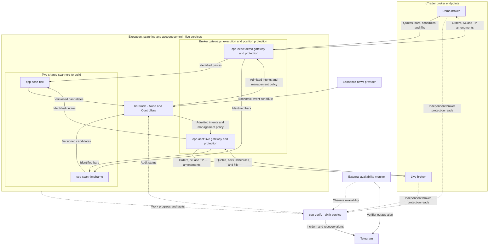

# Performance, protection and scanner implementation plan - revision 3

22 September 2026 · Approved direction, staged implementation · Supersedes revision 2 as the working plan

## 1. Scope and authority

This separate third revision consolidates the architecture, controller review, account-capacity discussion, monitoring frequencies and watchdog requirements agreed during the preceding review. Preserve the [original reassessment](performance-cards-reassessment-2026-09-22.md) and [revision 2](performance-cards-reassessment-2026-09-22-revision-2.md) as historical records. This file is the single working implementation plan; the P0-P8 identifiers remain stable.

**Owner direction, 22 September 2026:** "Good. I approved. Create a revised plan based on your past 1+ hours responses and upload to the doc folder. Then we build." Publish this revision first, then proceed in the scoped build sequence below. The earlier general implementation hold is superseded for the approved work. Approval of the architecture is not a claim that its services, protection guarantees or alert delivery already exist.

Routine branch pushes, PRs and qualifying merges follow the existing repository policy. Use its full merge gate. Preserve numerical risk limits, mandatory TP1, manual ownership and validation thresholds. Specific live-position amendments, credentials, unapproved strategy changes and runtime activation decisions retain their existing scope requirements. Prepare concrete changes and acceptance evidence before any remaining decision; do not repeatedly ask for approval already supplied.

Baseline checked for this revision: main `2964f7adf5e45e5e3662c81d9dcafa92cbac3ab0`, containing #1003 and #1004; no open PRs were returned at the start of this update. The previous revision's working additions are consolidated here. Historical runtime observations retain their actual timestamps and are not continuously current.

Sources include the [coverage backlog](tick-momentum/coverage-followup-2026-09-21.md), repository source at that main revision, dated Railway runtime logs, and the primary references in sections 12 and 16.

**Build entry point:** P0 read-only protection refresh, then P2a account-snapshot identity/read model. P1 is merged. Resolve P0's target exceptions through a position-specific approved policy; an unresolved exception must stay visible without preventing unrelated correctness work. The independent watchdog and controller work follow their contract dependencies and precede scanner activation.

## 2. Agreed design decisions

1. Protect existing positions and correct account identity before increasing trading or scan capacity.
2. Keep the mandatory TP1 requirement. Resolve the momentum strategy's null-target proposal explicitly; do not bypass the entry guard or automatically remove existing targets.
3. Build toward two shared C++ scanners: tick and timeframe, making six application services in total (five C++ plus Node). Reuse the existing tick workers and broker gateway connections. Preserve existing timeframe strategy semantics and prove parity before replacing JavaScript calculations. Additional demo execution services are not justified by account count alone.
4. Correct reporting and accounting independently of strategy promotion. Sparse valid data, missing data and stopped trading are different states.
5. Validate already-implemented research corrections against real inputs. Do not repeat #985 or treat empty replay trials as evidence of losses.
6. Preserve existing priority identifiers. Use dependencies and smaller work packages instead of renumbering the backlog or combining unrelated changes in one large PR.
7. Consolidate 34 heartbeat entries into six operator-facing groups, with the retired entry in history. Retain eight management profiles and distinct safety rules. Show actual completed work, account coverage and effective settings.
8. Extend cpp-verify with independent, market-aware service/work monitoring and Telegram incident delivery. Separate liveness, scan completion, position management and order activity. No orders is not automatically a fault.
9. Evaluate existing-position protection from valid quotes, with strategy-appropriate trend/ATR context. Preserve mandatory protection regardless of volume. Separate tick entry research from tick position management.
10. Keep demo/live separation at broker routing. Account eligibility follows verified balance, tradability, configuration and evidence. Reconcile the intended five-demo/one-live roster against the observed four-demo/three-live connections before changing the roster.

## 3. Corrections to the original reassessment

| Original premise or proposal | Revision after review | Why it matters |
|---|---|---|
| The proposed work is all observability-only. | Account-scoping changes in risk and permit decisions can change which entries pass. Separate them from display changes and preserve thresholds. | A reporting label must not conceal a trading-behaviour change. |
| Sparse cards mean the cards work correctly. | Low close counts explain some empty cells, but do not establish accounting correctness. The hourly opening calculation uses closed trades and can omit still-open trades. | Fix the population and labels, not just the presentation. |
| Historical balances can be inferred from current balance and closed P&L. | Label such values as reconstructed unless reconciled with historical snapshots, cashflows, adjustments and currency. | Deposits and withdrawals are not trading returns. |
| Replace low-sample grids with insufficient evidence. | Retain factual counts and P&L; mark statistical conclusions as insufficient. Distinguish valid zero, small sample and unavailable/stale data. | Low sample size does not make observed activity disappear. |
| Change to 7/30 days because 24 hours is sparse. | Offer longer comparison windows without silently redefining “today” or changing defaults merely to fill the display. | The operator must know exactly what period is shown. |
| Two closes imply 22 empty hourly buckets. | They imply at least 22; both closes could occupy one bucket. | Avoid false precision. |
| Filesystem free space proves no volume is needed. | Verify mount, actual service quota, persistence and retention requirements first. | Host filesystem counters do not establish usable durable allocation. |
| A 2 GiB recorder setting caps total disk usage. | Retention removes eligible sealed segments; active segments, torn files and other files are outside that simple bound. | Total disk protection needs separate evidence. |
| Two recording samples bound future daily volume and retention. | Treat them as dated observations and planning scenarios, not bounds or a 500-symbol benchmark. | Market activity, symbol coverage and overhead vary. |
| RECORDING proves collection is healthy. | Report subscriptions, event progress, source timestamps, gaps, market session and probe errors. A failed disk probe is unknown. | Enabled configuration is not proof of flowing data. |
| More C++ scanners will solve the delays. | Attribute CPU, broker waits, queues and database latency before choosing process count or language. | Process multiplication can duplicate work and worsen shared limits. |

The original forecast of tomorrow's close count is removed. No activity target should encourage trading to populate a dashboard.

## 4. Dated baseline and remaining uncertainty

The independent audit at **08:47 SGT**, on production `a82740d` (#1001), reported 39 positions across seven accounts, zero missing SL and two missing TP1: one on account suffix 9908 and one on 0949. This is a historical audit, not confirmation that those same positions remain open now. Refresh the detailed broker audit before proposing any amendment. Recorded targets behind the market must not be replaced with arbitrary prices to make coverage green.

Recording and shadow observation were previously verified on both services. The last verified entry mode was TIME_BASED, tick entry readiness was zero, and tick trailing remained disabled. A merged protection patch does not prove tick management is active.

Disconnected Controllers views were verified to show UNVERIFIED. Authenticated account switching and management views remain unverified after the browser session was lost. Deployment success does not close this acceptance gap.

Two sampled scan profiles around 08:59–09:00 SGT took approximately 11.2 and 14.6 seconds, with 63–67% classified idle. Sampled monitor profiles took about 12.1 seconds with 69–83% idle. These observations justify investigating waits and scheduling; they neither locate every bottleneck nor establish percentile latency or a one-second monitoring guarantee.

Later read-only evidence: broker checks relayed through Railway at 11:31 SGT reported 38 open positions on four demo accounts and one on the funded live account. The other two connected live accounts had no open positions. No SL was missing; one TP1 remained missing on each of demo suffixes 9908 and 0949. The owner's intended five-demo/one-live roster still requires reconciliation with this connected four-demo/three-live inventory. These checks prove recent observation, not complete dynamic-management performance. At 11:32 SGT the decision audit reported 1,835 upstream stops, predominantly `stage_matrix:strategy`, with none reaching the risk gate. Low balance is therefore not an established explanation for all entry inactivity.

A further read-only broker check at **12:03:25-26 SGT**, relayed in Railway logs, again reported 39 positions across the same seven accounts: zero missing SL, two missing TP1 on suffixes 9908 and 0949. A preceding Node audit/read timeout at 11:59 SGT was followed by successful independent reads. This establishes a real latency/recovery scenario for P4/P5a, not a permanent outage or continuous protection guarantee. No target was amended in this review.

| Account suffix | Connected route | Open positions at 12:03 SGT | Missing SL | Missing TP1 |
|---|---|---:|---:|---:|
| 7342 | Demo | 7 | 0 | 0 |
| 0058 | Demo | 8 | 0 | 0 |
| 9908 | Demo | 9 | 0 | 1 |
| 0949 | Demo | 14 | 0 | 1 |
| 3489 | Live | 1 | 0 | 0 |
| 2148 | Live | 0 | 0 | 0 |
| 9009 | Live | 0 | 0 | 0 |

All four connected demo accounts held positions; none can be labelled dormant merely because it has fewer recent orders. The logged margin figures were internal estimates, not verified balances/free margin. Account 7342 was estimated exhausted and 9908 had limited estimated headroom; P2 must establish account-specific broker truth before attributing inactivity to balance. Account 3489 was also constrained in the estimate. No open positions on 2148/9009 does not establish their balances, enabled state or intended use.

## 5. Priority order and dependencies

P0–P8 retain their meanings from the existing coverage plan. Substeps organise work without creating a second numbering system. The table is an impact order, not a requirement to block all read-only diagnosis behind one unresolved policy decision.

| Priority | Work and impact | Dependency / completion evidence |
|---|---|---|
| **P0 — Existing protection** | Refresh all-account broker coverage; identify each missing/invalid SL or TP1 and its owner. Resolve exceptions through the approved target policy. Direct effect on open-position protection. | Fresh position-level evidence; broker-confirmed amendments where authorised; explicit unresolved exceptions. Preserve valid stops and human ownership. |
| **P1 — Protection transaction capacity** | #1003 is merged and included in the reviewed main. Reuse its reserve for prerequisite and confirmation reads; do not rebuild it. | Retain its regression coverage and collect runtime acceptance evidence under ordinary-read throttling. A merged correction alone does not prove the remaining P4 latency/ownership requirements. |
| **P2 — Account identity** | Define one account-specific snapshot contract, then fix risk/permit consumers and their reporting consumers in separate reviewable changes. Can change entry eligibility. | Correct account/feed identity, currency and freshness; cross-account contamination checks; explicit missing/stale-data policy. No fallback to another account or silent risk-limit change. |
| **P3 — TP1 policy and entry blockers** | Resolve momentum proposals with null TP1 against the mandatory-target rule. Show ordered blockers for each account, including upstream caps that mask later failures. Changes strategy/entry behaviour. | Agreed TP1 semantics, preserving SL and optional TP2 policy; valid proposals pass existing guards and invalid ones remain blocked. No automatic removal of existing caps. |
| **P4 — Tick protection readiness** | Verify account-scoped configuration, feed identity, quote/configuration age, writer ownership and read-back. Assess recorder/storage truth separately from activation. | P1 and applicable P2 contracts; bounded protection latency and failure behaviour; scoped readiness evidence for each service/account. Tick-entry activation has a separate research gate. |
| **P5 — Verification, reporting and runtime** | P5a: Controllers consolidation and independent market-aware alerts (sections 12-13). P5b: correct performance populations/accounting and blocker explanations. P5c: shared scanner extraction, strategy parity and frequency accounting (sections 14-15). P5d: useful account equity/protection history. | Reuse P2 identity and P4 protection contracts. Watchdog coverage precedes scanner activation. UI grouping must preserve permissions; a scanner port must preserve strategy semantics. Each substep gets separate acceptance and a reviewable change. |
| **P6 — Research evidence** | Validate merged simulation/statistics/empty-replay corrections on current datasets; compare identical profile hashes and attributable inputs. No strategy change. | Explain warm-up, purge capacity, rejected events and actual decision opportunities. Report empty/insufficient separately from losing. Preserve validation thresholds and label candidate statistics. |
| **P7 — Strategy/configuration decisions** | Publish effective configuration and strategy/blocker matrix; propose sunset or promotion from valid evidence. Changes require their own review. | P3 policy clarity and P6 evidence. Distinguish deliberate retirement, invalid configuration, unavailable data and statistical rejection. |
| **P8 — Symbol capacity** | Stage expansion toward an eligible account universe; 500 symbols is a capacity goal to test, not an unconditional account setting. | P0–P5 applicable safety/identity gates, scanner load evidence, broker budgets and per-account tradability. Halt expansion if protection freshness degrades. |
| **Maintenance — Storage verification** | Verify production disk trend, mount/quota/persistence and recorder retention behaviour. Reuse merged fixture cleanup. | Evidence covers active/sealed/torn segments, logs, database/WAL and temporary files. If actual disk pressure threatens protection, elevate the incident to P0. |

### Execution sequence following the owner's approval

1. Refresh protection evidence, resolve outstanding exceptions through approved policy, and establish the account identity contract. Reuse the merged protection correction. Read-only profiling and blocker discovery may proceed alongside these tasks.
2. Resolve account-risk consumers and TP policy. Correct reporting with the same contract, without bundling UI work into consequential risk changes.
3. Demonstrate tick-protection prerequisites and authenticated UI truth. Validate existing research outputs in parallel; tick SL management does not require proof of profitable tick entries.
4. Implement the approved scanner boundary in stages, retaining existing strategy calculations until parity is demonstrated. Run candidate comparison and peak-load evaluation before promotion. Expand symbols only after acceptable protection behaviour under load.
5. Consider strategy promotion and tick entries through their own evidence gates. Neither scanner deployment nor a green dashboard constitutes that evidence.

An exception on one account must remain visible and receive appropriate handling. It must not automatically disable valid existing protection elsewhere. Define activation scope and failure handling explicitly rather than introducing a blanket account lockout in a reporting change.

## 6. Work inventory: reuse, do not rebuild

| Work | Review baseline | Next action proposed |
|---|---|---|
| #985 and research follow-ups | Simulation, MTM, candidate block bootstrap, profile attribution and empty-replay diagnostics merged. | Validate datasets/results under P6; do not implement the same machinery again. |
| #992 / #993 | Target-refusal visibility and account-scoped broker positions/history/cache merged. | Reuse these; #993 does not close remaining global risk-snapshot reads. |
| #994–#1001 | Independent protection reads, broker-target preservation, bounded book reads, honest unknown states, verifier/calendar fixes and tick amendment read-back landed. | Verify runtime acceptance and remaining edge cases; avoid repeating completed fixes. |
| #1003 / #1004 | Protection-budget correction and revision 2 are included in reviewed main `2964f7a`. | Reuse the correction; revision 3 consolidates the later design decisions. |
| #1002 | The original reassessment is present on reviewed main. | Preserve its historical text and use this revision for the current build order. |
| Temporary fixture cleanup | Cleanup for the two large fixture producers already merged. | Verify production disk behaviour; broader deletion is not part of this plan. |
| Existing bar cache and tick workers | Shared bar fetching/cache and C++ symbol-sharded workers already exist. | Extend or isolate existing mechanisms only where measured need warrants. |

## 7. Scanner architecture decision

**Approved target: two shared scanner services, one for ticks and one for timeframe strategies.** Build the service boundary in stages and verify it before routing accepted trading decisions through it. The review does not establish that C++ CPU capacity is the cause of current inactivity. A timeframe C++ port is a strategy-parity project; it must not be disguised as a simple move of existing JavaScript into a different process.

| Responsibility | Target boundary | Authority |
|---|---|---|
| Timeframe scanning | Shared worker triggered by strategy-defined bar boundaries/incremental updates. Preserve the existing JavaScript implementation as the comparison baseline for the proposed C++ worker. | Emits timestamped, versioned candidates; cannot place orders. |
| Tick scanning | Extract the existing incremental C++ symbol workers with per-feed ordering, bounded queues and gap recovery. | Emits candidates and health evidence; cannot bypass account risk. |
| Account coordination | Apply account eligibility, effective strategy configuration, risk, sizing and entry permission to candidates. | Owns admission and duplicate-intent prevention. |
| Execution and protection | Maintain independent priority for fills, reconciliation and SL/TP transactions. | Retains explicit per-position management ownership. |
| Independent verification | Continue cpp-verify broker checks and visible stale/error states. | Reports broker truth without relying solely on the writer's success message. |

Before extraction, measure p95/p99 protection latency, scan coverage/age, queue age, drops, data gaps, broker/auth wait, database time, event-loop delay, CPU and memory. Agree latency/freshness limits from the actual protection requirement; the sampled durations above are not acceptance thresholds.

Reuse shared market data only when broker, environment/feed, instrument identity, timeframe and relevant configuration match. The existing bar cache uses symbol ID and period; a shared worker needs a stronger identity contract. Do not assume matching ticker names across accounts imply identical instruments or feeds. Keep account-specific eligibility and risk downstream.

Avoid duplicate scanning per account when inputs genuinely match. Preserve session calendars, warm-up and explicit partial-bar semantics. Use actual pooled-connection configuration and measured broker limits; do not infer connection behaviour from an old source comment or create unrestricted scanner sessions.

Candidates require source time, expiry, configuration/strategy version and stable identity. Retries must not duplicate orders. Scanner failure, queue saturation or a stalled synchronous database must not block protection. Recovering from a data gap requires the appropriate re-warm before declaring a signal valid.

The extraction must demonstrate candidate parity on frozen inputs, bounded resources and protection latency under peak load, plus safe shutdown/restart and rollback. These are implementation acceptance checks, not tests run merely by publishing this revision. If the timeframe C++ port cannot establish parity, retain the existing implementation in an isolated worker and report the target as incomplete; do not substitute a simpler strategy merely to claim that all scanners are C++.

## 8. Performance and operational reporting

Use three distinct states: **verified zero activity**, **valid but statistically small sample**, and **unavailable/stale/unverified**. Keep observed counts and P&L visible in the first two. Do not report unavailable values as zero.

Correct hourly opening counts to include the intended population, including still-open trades where the label means all openings. Specify time zone, session boundaries and date window consistently. Explain realised P&L separately from floating P&L, and balance separately from equity.

If minute history is needed, first inventory existing snapshots/events. A proposed account series should retain account/feed identity, broker/source timestamps, balance, equity, floating P&L, exposure, currency, cashflows, protection coverage and freshness. It is not a substitute for closed-trade outcomes or independent additional research observations. One-minute sampled drawdown is not the exact intra-minute maximum.

Keep fills and SL/TP amendment events separate from periodic snapshots. Historical returns need cashflow-aware accounting; reconstructed balances must be labelled until reconciled.

Controllers should show recording, shadow evaluation, tick protection and tick entries as four separate statuses per applicable service/account. Show last successful observation and failure reason. “Enabled”, “ready” and “observed active” must not be interchangeable.

The blocker view should reuse existing refusal/health evidence. Report the observed first blocker and label deeper diagnostics as evaluated or not evaluated. Do not claim a downstream gate passed just because an upstream gate stopped the request.

## 9. Recorder and storage acceptance

Verify actual service storage allocation and persistence before concluding that a volume is required or unnecessary. Include retention requirements and restart recovery. Account for all relevant disk users, not only recorded payload bytes.

Report configured state, subscribed symbols, event progress/age, segment generation, gaps and disk-probe validity separately. Zero events during a closed market differs from zero subscriptions during an expected active session. Failed probes remain unknown; stale observations retain their timestamps.

Use dated recording samples for explicit scenarios with stated assumptions. Do not extrapolate 53-symbol observations into a guaranteed 500-symbol rate or promise retention days without measuring eligible traffic and overhead.

## 10. Original proposal crosswalk and change boundaries

| Original #1002 priority | Revised destination | Boundary preventing duplication or confusion |
|---|---|---|
| P1 — performance cards | P5b | Correct populations/accounting and preserve valid sparse information before cosmetic simplification. |
| P2 — account scope | P2, consumed by P5 | One shared identity contract; separate risk integration from UI integration. |
| P3 — why nothing traded | P3 and P5b | Diagnose ordered blockers without relaxing guards or conflating blocked with unprofitable. |
| P4 — recorder truth | P4 diagnostics and Maintenance | Reporting truth is separate from activating tick protection or entries. |
| P5 — runbook | Maintenance and each relevant work package | Update operational instructions with verified behaviour; remove unsupported storage and activity claims. |

Do not combine account-risk changes, TP policy, dashboard accounting, scanner extraction and storage migration into one implementation PR. They have different trading consequences and rollback needs. Share contracts and evidence instead of duplicating code across separate changes.

## 11. Remaining decisions and bounded assumptions

- **TP1 meaning:** distinguish a broker target that closes the remaining position from an application-managed partial TP1 and optional TP2. Define the momentum policy consistent with mandatory TP1 and existing position ownership; do not invent target prices in a repair.
- **Missing account evidence:** document intended stale/missing-snapshot behaviour in risk consumers before replacing global reads. Preserve thresholds and explicitly review any fail-open/fail-closed change.
- **Freshness and load:** agree protection latency, candidate expiry and quote/configuration age limits, then benchmark the proposed scanner boundary against them.
- **Volume confirmation:** if used, identify whether the feed provides traded volume or tick activity. They are not interchangeable. Validate any new entry filter separately; do not introduce it through a scanner refactor.
- **Storage:** decide required retention and restart durability from measured allocation and traffic, not host free-space alone.
- **Research:** retain current acceptance thresholds. Adopting a new statistical validation method or promoting a strategy is a separate decision from exposing candidate statistics.

**Build boundary:** protection first, account correctness next, explicit TP policy before expanded entries, honest reporting and measured isolation before capacity growth. The document itself changes no runtime behaviour. Unresolved policy parameters constrain the affected activation, not all implementation work.

## 12. Added requirement: independent service watchdog and Telegram alerts

Required under P5a following the owner's request that cpp-verify supervise all C++ services and promptly report missing monitoring or order activity after a market opens. The approved build includes this requirement. The following values are initial design defaults for implementation and testing; production activation must record the effective values, intended Telegram recipient and actual delivery evidence. Publishing the plan does not activate an alert or recurring task.

### Responsibility and independence

- Extend cpp-verify with bounded, independently scheduled service probes alongside its existing broker protection audit. Cover the configured cpp-exec, cpp-acct and future scanner services, and also Node because it owns account admission and Controllers. An absent configured service is a finding, not a row to omit.
- Observe process reachability, broker/session state, feed progress and completed business work separately. An HTTP 200, keepalive packet or fresh timer tick must not stand in for a completed scan, reconciliation or position-management cycle.
- Keep broker reads structurally read-only. No placing, amending or cancelling orders, weakening guards or manufacturing activity to satisfy the watchdog.
- Services retain responsibility for their own broker keepalives and bounded reconnection. Crash recovery belongs to the deployment supervisor. The watchdog detects and reports failures; it cannot guarantee a dead process stays alive. Any automated restart/remediation needs a separate reviewed policy, with protection preflight and restart-loop prevention.
- Monitor cpp-verify itself from an independent supervisor or heartbeat observer. A process cannot reliably alert about its own total failure; mutual probes alone do not cover a whole-platform outage.
- Reuse the existing registry, heartbeat and protection contracts where sound. Node currently performs sidecar freshness checks; do not retain two independent alerting policies that send duplicate incidents. Define one incident owner while allowing both systems to expose observations.

### Initial monitoring and notification rules

| Condition | Initial design threshold | Expected action |
|---|---|---|
| Configured service unreachable or heartbeat stale | Probe every 15 seconds with a bounded request deadline; alert after 60 seconds without valid fresh evidence | Urgent Telegram incident. Process reachability checks continue at weekends even when trading work is not due. |
| Open positions lack a completed, due management check | 1 minute overdue after the required monitoring cadence | Urgent incident naming affected positions/accounts and last actual management time. Apply during the relevant instrument's trading session; maintain a separate explicit closed-market audit cadence. |
| Missing SL or mandatory TP1 confirmed by the broker | Immediately on detection, without waiting for the market-open activity timer | Urgent protection incident. Distinguish confirmed missing protection from unavailable broker evidence. |
| Expected scanner fails to start or make due progress after opening | 2 minutes after its first scheduled post-open evaluation is due | Alert stalled evaluation. A daily/weekly strategy is not expected to emit a signal every minute. Completed no-signal evaluations count as work. |
| No new orders since the instrument/session opened | 5 minutes after opening, one informational notification per applicable account/session | Report the reason: no qualifying signal, intended pause, news filter, risk block, unavailable inputs or execution fault. Escalate supported faults; never infer a failure solely from zero orders. |
| An admitted entry intent receives no terminal acknowledgement | Its existing order/request deadline | Report the unresolved intent promptly. Do not equate an acknowledged resting limit order with a failed fill, and never resend blindly. |

Thresholds must be configurable by role and relevant account/instrument, with their effective values visible in Controllers. A legitimately idle service is distinct from an unobserved service. Ordinary order flow must not conceal stale management of an existing position, and a successful management cycle does not hide a stuck entry intent.

Start the opening timer from the actual instrument session transition, using a stable session identity. Restarting cpp-verify must not repeatedly reset that timer, resend the same opening notice or grant a fresh unlimited grace period. Intraday breaks, closing transitions and planned maintenance have explicit states. Do not reset the timer at every named forex liquidity session if the broker instrument remained continuously open.

### Market sessions, weekends and the forex news calendar

Use the account's broker/environment/instrument identity to resolve trading hours. Broker trading intervals, their IANA time zone, instrument trading mode and broker holiday exceptions take precedence over generic regional hours. Apply DST, overnight/week boundaries, intraday breaks, early closes and broker maintenance windows. A crypto CFD follows its broker's actual schedule; do not assume every crypto instrument is continuously tradable.

Keep economic events separate from trading hours. The ForexFactory-derived calendar in news-calendar.js describes scheduled news and may explain an enabled news-entry filter. It does not establish that an exchange or instrument is closed. A news blackout can suppress entries while open-position protection continues.

Persist the last verified schedule and its source/version/age independently enough for cpp-verify to diagnose a Node outage. Stale, missing, contradictory or malformed schedule data produces MARKET_STATUS_UNKNOWN and an evidence-quality alert. It must not silently become CLOSED, or be presented as a verified always-open market. Do not introduce a different trading gate through this watchdog change.

Source review found that symbol-hours.js already handles weekly intervals and IANA time conversion, while sessions.js/exchange-regions.js contain approximate fallback hours. The inspected symbol-hours cache does not persist/apply the broker's holiday list and is keyed by symbol name. Extend the shared calendar contract under P2/P5a for account/feed identity, holiday exceptions and freshness; avoid a separate conflicting calendar embedded in the new scanners.

### Telegram delivery and incident behaviour

cpp-verify needs an outbound Telegram path that does not wait for the Node loop or Node database. Use explicitly configured notification credentials and the intended owner's chat; do not add a second Telegram command poller. Existing Telegram infrastructure can inform formatting and policy, but it is not yet an independent sender in cpp-verify.

Send urgent protection/service failures on detection rather than holding them for an hourly digest. Make quiet-hours handling explicit and preserve the owner's master notification setting; any mute must be conspicuous in Controllers. Record a bounded durable incident outbox, Telegram acceptance/message ID, attempts and errors. Handle rate limits and retry_after, limit repeated alerts, escalate material deterioration, and send one recovery notice. Telegram acceptance is not proof that the owner's device displayed or read the alert. Network or Telegram outages prevent any absolute immediate-delivery guarantee.

Each incident includes severity, service, account suffix, instrument/session, expected work, last successful work time and age, broker SL/TP evidence, actual blocker or unknown state, next opening where verified, and an SGT timestamp. Exclude secrets and unneeded account details.

Persist stable incident identities across restarts. Group related failures so a Node outage does not produce an unbounded alert storm. Failed Telegram delivery must neither block broker protection audits nor be represented as successful delivery.

### Required acceptance evidence

Demonstrate a reachable-but-stalled worker, process loss, stale quotes, one overdue account among healthy peers, missing protection, valid no-signal/no-order activity, an acknowledged unfilled limit order, and an unresolved entry intent. Exercise DST changes, Friday/Sunday boundaries, broker holidays/early closes, intraday breaks, crypto maintenance and missing calendar evidence. Verify Node-down alert delivery, Telegram failure/retry/recovery, restart deduplication and an external cpp-verify-down alert. These are implementation checks; none was run as part of this documentation update.

No new scanner should be marked operationally accepted until its independent liveness and work-progress alerts are verified. This supervision requires no additional C++ service merely to increase the service count.

Primary references, inspected 22 September 2026:

- Repository: cpp-verify/src/main.cpp, cpp-verify/src/protection_watch.cpp, agent/services/heartbeat.js, agent/services/symbol-hours.js, agent/services/news-calendar.js and agent/services/telegram-digest.js.
- [Spotware Open API model messages: symbol schedules, time zones and holidays](https://help.ctrader.com/open-api/model-messages/#protooasymbol).
- [Telegram Bot API: sendMessage](https://core.telegram.org/bots/api#sendmessage) and [retry response parameters](https://core.telegram.org/bots/api#responseparameters).

## 13. Controllers review and consolidation

Reviewed against main `2964f7a` on 22 September 2026. A deterministic source inventory finds **34 registered heartbeat entries, including one retired entry**, and **eight asset-class management profiles**. The 33 non-retired entries are not proof that 33 jobs are enabled or running. Most are scheduled functions inside Node; they are not separate deployed services. Authenticated browser behaviour has not been re-verified in this review.

### Findings that affect the operator

1. The Desk combines a controller heartbeat list, runtime service/account tables and a separate Account Engineering panel. Keep the service and account perspectives, but make them views of one status contract instead of competing explanations of whether trading is on.
2. `pending_orders` is explicitly retired. The current Desk dot-rendering branch falls through to its danger colour for a retired status, without showing the retirement explanation beside it. Move retired jobs to history and show their explicit status; do not delete their records.
3. A skipped fast-monitor tick can emit an `ok` heartbeat with `busy: true`. Keep the overlap guard, but distinguish process activity from completed position checks, overdue work and skipped-pass share. A growing run counter does not prove protection was checked.
4. The fast monitor's actual default wake-up is 3 seconds, while its heartbeat expectation is 30 seconds and its per-position due policy normally runs at one, two or three times the configured minute baseline. Several comments and UI descriptions still say 30 seconds or a fixed 5-minute scan. Render effective configuration and actual completion ages rather than these static claims.
5. Trade guards, profit keeper, loss guardian, the position manager, momentum book and session-related exits can affect the same position. Preserve their distinct rules, but require one authorised decision order and one active broker-writing owner per account/position. Grouping the UI does not itself establish this ownership.
6. Eight asset-class profiles are useful rule parameters, not eight independent controllers. Rename their presentation to management profiles, retain existing values and overrides, and show the effective strategy/horizon/account/position policy with provenance. Changing precedence is a separate behaviour change.
7. Tick recording, tick strategy shadow, tick entry permission and tick position management need four explicit statuses. Node's event-driven guardian is also distinct from the C++ trailing engine. Do not interpret C++ trailing being disabled as proof that every Node tick-triggered path is off.
8. Heartbeat registration is not the complete inventory of trading mechanisms. Momentum-book management, VPO, tick workers/permits, independent verification and configuration proposals also need visible owners and evidence. Add their observed status under the relevant group without creating a service or switch for each function.

### Six operator-facing groups and the complete heartbeat crosswalk

All 34 registry entries are mapped below. Consolidate presentation and scheduling ownership, not independent safety evidence. Detailed child rows remain accessible, and failing child jobs remain prominent even if the parent process is healthy.

| Existing heartbeat key | Operator group | Proposed treatment |
|---|---|---|
| `main_loop` | Services and market data | Retain orchestration health; separate it from scanner completion. |
| `cpp_exec` | Services and market data | Label the actual live service `cpp-acct`; retain broker/feed state. |
| `cpp_exec_demo` | Services and market data | Label the actual demo service `cpp-exec`; retain broker/feed state. |
| `hours_refresh` | Services and market data | Retain one shared, account/feed-aware calendar contract. |
| `fx_legs_refresh` | Services and market data | Retain currency-conversion freshness. |
| `atr_refresh` | Services and market data | Retain baseline freshness; distinguish it from current strategy ATR updates. |
| `autopilot` | Scanning and strategies | Retain evidence-based selection; expose effective authority and next due time. |
| `pending_signals` | Scanning and strategies | Retain candidate retry, expiry and admission rules. |
| `edge_watchdog` | Scanning and strategies | Retain evidence monitoring independently of entry activation. |
| `fundable_universe` | Scanning and strategies | Retain account eligibility with unknown/fundable/unfundable distinctions. |
| `adaptive_breaker` | Account risk and admission | Retain its rule; show its place in the ordered blocker chain. |
| `equity_stop` | Account risk and admission | Retain account loss controls and their explicit authority. |
| `performance_breaker` | Account risk and admission | Retain its rule without duplicating a master entry switch. |
| `weekend_loss_flag` | Account risk and admission | Retain warnings with instrument-session context. |
| `fast_monitor` | Execution and position protection | Retain fallback observation until tick-management coverage is accepted; report completed work. |
| `protection_band` | Execution and position protection | Show the scheduler and its deadline separately from child job outcomes. |
| `order_monitor` | Execution and position protection | Retain fill/position reconciliation; use broker events with bounded fallback reads. |
| `trade_guards` | Execution and position protection | Keep rule evaluations; route authorised actions through the position owner. |
| `profit_keeper` | Execution and position protection | Keep profit-protection policy and ownership; remove conflicting duplicate writes only after parity. |
| `loss_guardian` | Execution and position protection | Keep missing-stop repair and declared time-cap policy. |
| `guardian` | Execution and position protection | Reuse price-trigger detection; share identified feeds and the action queue. |
| `weekend_bank` | Execution and position protection | Keep only under the existing explicit strategy/position/session policy. |
| `closed_market_sweep` | Execution and position protection | Retain resting-order lifecycle, expiry and risk checks. |
| `protection_audit` | Verification and account records | Retain independent outcome evidence; distinguish observation from any repair writer. |
| `log_inspector` | Verification and account records | Retain contract checks; group repeated incidents with one notification owner. |
| `decision_audit` | Verification and account records | Retain the observed blocker and unexamined downstream stages. |
| `minute_review` | Verification and account records | Retain manual-ownership and writer-authority auditing. |
| `pnl_reconcile` | Verification and account records | Retain repair progress and overdue-item reporting. |
| `cross_side_equity` | Verification and account records | Retain per-account balance/equity freshness with correct currency. |
| `equity_snapshot` | Verification and account records | Retain historical snapshots; do not confuse them with live protection checks. |
| `burn_in` | Research and reports | Move out of Position Management into explicitly armed research; preserve all existing gates. |
| `weekend_watch` | Research and reports | Keep optional LLM advice outside the protection dependency chain. |
| `daily_report` | Research and reports | Retain scheduled reporting separately from urgent alerts. |
| `pending_orders` | Retired history | Already retired; remove from the default operational list and preserve audit history. |

The eight profiles are `fx`, `metal`, `index`, `crypto`, `commodity`, `soft`, `grain` and `stock`. Preserve their breakeven, partial, runner and bank settings during presentation changes. Review any strategy/horizon conflict under P3/P4; this review does not endorse the current numerical defaults as statistically optimal.

Configuration proposals in `config-controller.js` remain advisory. Existing entry modes, master/account switches, risk limits and strategy gates retain their semantics. A simpler interface must not silently turn on a mode, re-arm a retired strategy, remove a guard, or make a low-balance account cease protecting existing positions.

Each service/group should show: configured mode; effective permission and its source; expected work; next due time; last successful work and age; work coverage; last error; backlog/overruns; and the governing account/strategy. Put urgent exceptions and a compact service/account table first. Keep detailed diagnostics available without requiring 34 equal-priority controls. Show status words and symbols, not colour alone.

## 14. Approved service and market-data layout

The target contains **six application services: five C++ services and one Node service**. Four service names already exist; `cpp-scan-tick` and `cpp-scan-timeframe` are the two planned additions. Existing deployment does not imply that every target responsibility below is implemented. In particular, C++ tick trailing was disabled in the successful health reads at approximately 11:16/11:20 SGT, and the independent Telegram watchdog remains proposed.

**Why gateways appear before scanners:** cpp-exec and cpp-acct each have two roles. They receive broker market data before scanning and execute admitted orders after Node approval. Data flowing through a gateway is not an order. The sequence is broker data -> gateway -> scanner -> Node admission -> the same gateway -> broker. Existing-position protection takes a direct path inside the gateway and does not wait for a new-entry scanner.

Market-data forwarding must be bounded and nonblocking for quote ingestion and protection. Define queue limits, lag/gap signalling, recovery and candidate invalidation; never silently drop data and continue claiming complete tick history. Scanner loss must leave gateway protection running. Gateway loss still affects that environment's feed and execution and must be detected independently.

Broker arrows represent both subscriptions and bounded request/reply traffic; the gateways request historical data and metadata as needed. Scanners do not receive order authority or open an unrestricted broker connection per worker/account. Protection consumes the gateway's quote stream directly, so it does not wait for a scanner candidate, UI refresh or LLM response. Broker-held SL/TP remains effective independently of application scheduling, subject to the broker's execution rules.

Demo/live separation is a connection/routing boundary, not a different strategy policy. Both scanners can process separately identified demo and live streams. Sharing means reusing work only when broker, environment/feed, instrument, timeframe and strategy configuration match; it does not merge the feeds or reuse one account's balance for another. The target does not add an executor merely because another demo account exists.

Node retains account admission, risk/sizing, one-use/deduplicated intents, policy configuration, the UI, records and background research. A scanner produces candidates, not orders. Tick entries remain subject to their current research and per-account activation gates. Timeframe strategies retain their own semantics, including closed-bar versus partial-bar inputs. The tick position manager has a separate acceptance path for existing positions.

Each execution service owns the applicable broker-writing queue and per-position protection state. Retain coalescing, minimum useful stop movement, no unauthorised SL loosening, mandatory TP1 preservation, broker read-back and explicit manual ownership. Node fallback must acquire the same ownership or use an explicit transfer; it must not become a second simultaneous writer. Existing pathways are not removed until their replacement proves coverage and recovery.

The external availability monitor and Telegram are dependencies outside the six application services. Its provider is not selected or provisioned. Broker calendar evidence must remain available to cpp-verify if Node is down; the news-provider arrow is not a market-hours authority. Optional LLM calls remain background advisory/research work within Node, outside protection. Databases, caches and recorder volumes are storage components, not additional application services.

The existing verifier uses independent broker sessions. Preserve its independence while checking the complete application connection/request inventory against broker limits; the diagram does not assert that every existing socket already follows Spotware's connection recommendations. Future scanners must not multiply broker sessions as a shortcut around those limits.

## 15. Frequency, strategy horizon and acceptance

There are five different quantities: **data arrival frequency, evaluation frequency, strategy timeframe/horizon, broker amendment frequency, and UI refresh**. One universal "every second" setting cannot describe them. Faster observation does not itself create a better strategy or change a weeks-horizon position into an intraday position.

### Current source behaviour, not a live-settings guarantee

| Mechanism | Checked source behaviour | Limitation |
|---|---|---|
| Main scan loop | `loop_interval_min`, 1-60 minutes, default 5; actual cycles can overrun. | This is not every symbol's strategy timeframe or guaranteed coverage interval. |
| Node fast-monitor wake-up | `FAST_MONITOR_MS`, default 3 seconds, minimum 1 second. | Busy passes skip later firings; a wake-up need not price a due position. |
| Ordinary per-position checks | `monitor_interval_min`, default 1 minute; RVOL multiplies by 1, 2 or 3; unknown RVOL uses 2. Symbol override has a 15-second floor. | At the default baseline, ordinary checks can be 1/2/3 minutes apart. Spike paths are separate. |
| Node guardian | Quote-triggered significant-move sweep; default 2.5-second cooldown and 30-second subscription maintenance. | The 30-second maintenance heartbeat is not the quote-arrival rate. |
| Protection band | `PROTECTION_BAND_MS`, default 60 seconds, minimum 5 seconds; own overlap guard. | Includes multiple budgeted jobs; read completion time and overruns. |
| C++ trailing | Quote events update pending protection; a worker takes one pending amendment per pass, sleeping 200 ms between passes. | Broker requests add latency. This is not a 200-ms per-position guarantee; fairness, expiry and ownership need P4 evidence. |
| Independent broker protection | Poll all configured accounts, then wait 60 seconds. | The actual period includes the time needed for the preceding pass. |
| Controllers display | Desk polls every 5 seconds with activity, otherwise 20 seconds; local clock updates each second. | Some upstream service observations are approximately two minutes apart. A moving clock does not refresh broker truth. |

### Scheduling model for the target

These are initial design defaults and acceptance targets for the approved build, not claims about current production settings or profitability. Keep scheduling configuration visible and bounded; preserve existing numerical risk/strategy parameters during extraction. An optional preview stays off until implemented and verified.

| Work | Target trigger or adjustable cadence | Guardrail |
|---|---|---|
| Market feed ingestion | Every subscribed broker event while the instrument is open. | Preserve source/receipt timestamps, bid/ask, identity, sequence/gap evidence; no fresh timestamp on an old quote. |
| Tick strategy calculation | Incremental calculation on each valid event; candidate emission follows the strategy's tested trigger/cooldown. | Observation can run in shadow; it does not grant entry permission. |
| Timeframe strategy calculation | Evaluate on the strategy's existing bar-boundary or validated partial-bar schedule, using pushed live bars where supported. | Preserve warm-up, session alignment and look-ahead rules. Do not turn intrabar previews into entries through a refactor. |
| Optional intrabar trend preview | Initially 5-15 seconds for held symbols and a bounded near-trigger shortlist, if enabled. | Preview only for strategies that require closed bars; label provisional data. No full-universe broker refetch every few seconds. |
| Existing-position protective triggers | Each valid quote, with an independent 1-second local overdue/stale-work check. | Local checks are not broker polling or a one-second fill guarantee. Volume must not suspend mandatory protection. |
| Broker SL/TP amendments | On a qualifying policy change; coalesce superseded requests, respect minimum useful movement and protected request budgets. | Priority/fairness per account and position; preserve TP1 and verify outcome. Do not send on every received tick. |
| Trend/ATR management context | Refresh when the strategy's relevant bar closes, plus only separately validated regime triggers. | Retain the holding horizon; no unreviewed tightening of weekly positions based on short-term noise. |
| Broker reconciliation/protection audit | Immediate follow-up to fills/amendments/reconnects, plus a configurable 30-60-second periodic target. | Bounded round-robin account work; report actual coverage age and broker failures. This is distinct from fast local protection. |
| Service watchdog | 15-second probes; incident deadlines remain those in section 12. | Expected work depends on role and per-instrument calendar; no-orders alone is not a malfunction. |
| Controllers state delivery | Prefer event updates or 1-5-second reads of shared status snapshots while active. | UI refresh must not generate a full broker audit per viewer; show upstream observation age. |
| Background evidence/accounting | Existing daily/session or budgeted research schedule; event-driven invalidation where justified. | No long analysis or repair work on the protection thread. |

Examples describe timing, not recommended new strategies: an M5 strategy can consume ticks continuously, preview its developing bar, and make its closed-bar decision every five minutes. H1/H4/D1 strategies retain those decision boundaries. An existing position from any of them can still have quote-triggered protection between boundaries. Candidate expiry, costs, spread and the strategy's entry contract decide whether acting later remains valid.

Relative volume from cTrader trendbars is **tick activity**, not exchange-traded volume. Volume can prioritise compute or inform an already-defined strategy. Adding a mandatory volume-confirmation filter or adapting the trading horizon requires separate evidence and approval. Economic-news pauses affect entry eligibility according to policy; they do not pause existing-position protection.

Use broker schedule time zones, holiday exceptions, session boundaries and actual data availability. During closures, cease expecting ticks while retaining service liveness and a declared reconciliation cadence. Unknown calendars remain unknown. At reopen, do not reuse stale pre-close candidates or claim a complete bar before receiving sufficient data.

Measure per-feed and per-account source time, receipt time, evaluation time, queue delay, broker acknowledgement and confirmed protection time; report p95/p99 and maxima under peak load. Record universe coverage and oldest overdue work so a fast average cannot hide an ignored account. Validate reconnect/gaps, slow broker replies, simultaneous triggers, Node loss, scanner loss and restarts. Lower numeric intervals only after this work establishes bounded behaviour.

Spotware documents a maximum of 50 non-historical requests/second/connection and 5 historical requests/second/connection. These are ceilings, not scan targets. Subscription delivery is distinct from issuing a request per tick. Budget initial history, metadata, account reconciliation and protection prerequisites together; preserve P1's protection reserve and use shared caches/streams.

## 16. Change boundaries and review evidence

| Work package | Existing priority | Boundary |
|---|---|---|
| Group Controllers, correct retired/busy labels and show actual cadence | P5a | Presentation/read-model change; preserve switch semantics and show unavailable readings honestly. |
| Reconcile account roster, feed IDs and snapshots | P2 | Shared contract for scanners, risk, management and UI; no new risk thresholds. |
| Resolve TP1 semantics and consolidate position-writing authority | P3/P4 | Consequential behaviour work, separately reviewed from UI grouping. |
| Add independent market-aware watchdog and Telegram delivery | P5a | Broker-read-only verification; separate from order-writing authority. |
| Extract tick scanner, then compare/port timeframe calculations | P5c | Separate reviewable steps; frozen-input and runtime parity before activation. |
| Change evaluation frequencies or introduce intrabar/volume rules | P4/P5c or P7 as applicable | Scheduling-only changes preserve strategy decisions; changed strategy semantics require their own evidence. |
| Expand symbol capacity | P8 | Only after account coverage and protection latency hold under load. |

Review invariants: complete heartbeat inventory **Passed** (34/34 mapped once); numerical risk/strategy settings unchanged **Passed**; original and revision-2 history preserved **Passed**. Authenticated Controllers interaction, target scanner parity, target latency, independent outbound Telegram delivery and intended 5+1 roster **Not Verifiable** in this review. Mandatory TP1 coverage **Failed** on two positions in the dated audits, including the 12:03 SGT check below. Publication status and any repository gate results belong to the PR record; a passing repository build cannot establish live protection coverage.

Sources inspected on 22 September 2026:

| # | Source | Author/provider | Time/version | Link |
|---|---|---|---|---|
| 1 | Controller registry and status rendering | bot-trade repository | Main `2964f7a` | [heartbeat.js](https://github.com/ang-kl/bot-trade/blob/2964f7adf5e45e5e3662c81d9dcafa92cbac3ab0/agent/services/heartbeat.js), [Desk.jsx](https://github.com/ang-kl/bot-trade/blob/2964f7adf5e45e5e3662c81d9dcafa92cbac3ab0/src/pages/Desk.jsx) |
| 2 | Runtime status, profiles and configuration | bot-trade repository | Same main | [controller-runtime.js](https://github.com/ang-kl/bot-trade/blob/2964f7adf5e45e5e3662c81d9dcafa92cbac3ab0/agent/services/controller-runtime.js), [asset-controllers.js](https://github.com/ang-kl/bot-trade/blob/2964f7adf5e45e5e3662c81d9dcafa92cbac3ab0/agent/services/asset-controllers.js), [Tune.jsx](https://github.com/ang-kl/bot-trade/blob/2964f7adf5e45e5e3662c81d9dcafa92cbac3ab0/src/pages/Tune.jsx) |
| 3 | Scheduling and protection | bot-trade repository | Same main | [fast-monitor.js](https://github.com/ang-kl/bot-trade/blob/2964f7adf5e45e5e3662c81d9dcafa92cbac3ab0/agent/services/fast-monitor.js), [guardian.js](https://github.com/ang-kl/bot-trade/blob/2964f7adf5e45e5e3662c81d9dcafa92cbac3ab0/agent/services/guardian.js), [trail_engine.cpp](https://github.com/ang-kl/bot-trade/blob/2964f7adf5e45e5e3662c81d9dcafa92cbac3ab0/cpp-exec/src/trail_engine.cpp), [protection_watch.cpp](https://github.com/ang-kl/bot-trade/blob/2964f7adf5e45e5e3662c81d9dcafa92cbac3ab0/cpp-verify/src/protection_watch.cpp) |
| 4 | Broker checks and runtime delays | Railway connected runtime logs | 11:31-11:32 SGT observations | Retrieved through the Railway connector; not a public log archive. |
| 5 | Quotes, live bars and tick-volume definition | Spotware | Retrieved 22 September 2026 | [Symbol data](https://help.ctrader.com/open-api/symbol-data/), [Trendbar model](https://help.ctrader.com/open-api/model-messages/#protooatrendbar) |
| 6 | Request limits and connection guidance | Spotware | Retrieved 22 September 2026 | [Open API limits](https://help.ctrader.com/open-api/), [Connections](https://help.ctrader.com/open-api/connection/) |

## 17. PR packages and dependency order

Keep one coherent behaviour or shared contract per PR, normally one to three tightly coupled changes with their tests and runbook. Split when the trading consequence, deployment/rollback path or reviewer evidence differs. These package names refine P0-P8; they do not replace them or prescribe a fixed PR count.

| Order | Package | Combine in this package | Keep separate / exit evidence |
|---|---|---|---|
| First | P0 evidence refresh | All-account broker protection and ownership evidence, exact unresolved exceptions and current timeout/recovery evidence. | No arbitrary TP repair. Position-specific action requires approved semantics and a fresh broker read. Evidence refresh is not itself a code PR. |
| Reuse | P1 acceptance | Retain #1003 and verify the protection request reserve under ordinary-read throttling. | Do not recreate the merged fix. Escalate a newly reproduced capacity defect into its own corrective PR. |
| First code | P2a snapshot contract | One account-specific snapshot reader/validator and a read-only risk/status consumer, with identity/freshness tests. | Wire a real consumer so the helper is not dead code. Preserve existing order decisions until P2b. No global-account fallback. |
| Next | P2b risk and permits | Move account-risk and VPO/permit consumers to the shared contract; test different accounts, currencies and stale/missing snapshots. | Record the intended missing-data behaviour explicitly. No numerical risk-limit changes. |
| Early | P2c feed and calendar identity | Shared feed/instrument/calendar identity, broker holidays, source time, expiry and intended-versus-connected account roster. | No account deletion, balance-based protection shutdown or duplicated scanner calendar. |
| Early | P3 TP and blocker correctness | Implement the agreed TP1/optional TP2 semantics and test momentum/manual/ordinary-entry cases; keep the ordered blocker record attributable. | Separate consequential target-policy changes from UI-only blocker display. Never remove a cap or invent a price as a reporting repair. |
| Safety | P4a protection ownership and freshness | Account/position ownership, fresh quote/config contract, manual handover, stale-work handling and broker-read failure reasons. | Preserve valid broker SL/TP. Reuse #995/#998/#1001 protections; prove actual call sites and stale/reconnect cases. |
| Safety | P4b tick management acceptance | Fair/coalesced request scheduling, completed-work evidence and bounded quote-driven management; prepare scoped activation and rollback. | Tick entry evidence is not an activation gate for existing-position management. Record every account's coverage and runtime flags separately. |
| Before scanner activation | P5a watchdog | Independent service/work probes, market-aware incidents, durable bounded outbound Telegram delivery and verifier-outage observer contract. | Split probe/calendar integration from transport if needed. Test Node-down delivery and avoid a second command poller. |
| After status contract | P5a Controllers | Six groups, retired history, four tick states, real work/deadline/coverage and effective configuration. | Preserve all permissions and safety child outcomes. Authenticated account switching and drill-down need acceptance. |
| Reporting | P5b performance and reasons | Correct activity populations, balance/equity/P&L labels, sparse/zero/unknown distinctions and first-blocker attribution. | Use P2 identity. Do not hide observed activity or change strategy gates to fill cards. |
| Data preparation | P5c identified feed boundary | Bounded gateway-to-scanner streams, candidate identity/version/expiry, ordering/gaps and Node admission contract. | Preserve gateway protection priority. Existing strategy implementation stays the reference. |
| Extraction | P5c tick scanner | Reuse incremental C++ workers in cpp-scan-tick, mirror candidates, test restart/gaps/backpressure. | Switch ownership only after parity and independent observation; prevent duplicate order intents. |
| Port and comparison | P5c timeframe scanner | Build cpp-scan-timeframe against frozen-input JavaScript parity and measured warm-up/session behaviour. | Use separate small strategy ports if necessary. Keep an isolated JavaScript worker if parity fails; do not claim the C++ target complete. |
| History | P5d account records | Cashflow-aware account snapshots, exposure/protection history and retention, reusing existing events. | Separate from live safety status; minute snapshots are not exact intraminute drawdown. |
| Alongside safety work | P6 evidence validation | Run and attribute the merged #985/statistics/empty-replay corrections; separate invalid/empty and losing samples. | No duplicate harness rebuild or threshold changes. Code only for a newly demonstrated defect. |
| After valid evidence | P7 strategy/configuration | Publish effective matrix; propose and implement explicitly supported sunset/promotion and remove proven dead settings. | No promotion based on a service being alive, a fast scan or a green card. Volume/horizon changes are strategy changes. |
| Last expansion | P8 capacity | Increase only account-eligible symbol coverage in measured stages, using shared matching feeds. | 500 is a tested target. Halt/revert expansion when protection latency or coverage regresses. |
| Ongoing | Maintenance | Verify storage mounts, quota/persistence, recorder progress and retention, reusing merged fixture cleanup. | A current disk-pressure incident moves to P0. No broad deletion as a routine cleanup. |

P0 evidence, P1 acceptance, P6 diagnosis and read-only profiling can proceed alongside contract work. P2a -> P2b supplies risk correctness; P2c supplies shared feed/calendar identity. P4 acceptance and P5a supervision precede scanner activation. P5c extraction follows identity and admission contracts. P7 evidence and P8 load gates are independent of simply provisioning the target services.

At each handover update this document's status with the PR number, exact merged commit, tests, runtime observation time, remaining exceptions and rollback owner. Use separate states: planned, implemented, merged, deployed, verified and accepted. Never mark an entire priority complete because one subpackage merged.

## 18. Continuous operation, migration and stop conditions

There is no requirement to stop all services for development, local tests or branch publication. Do not restart trading processes to make a documentation upload visible. Check the actual Railway watch/deployment settings before a merge: a docs-only diff may still trigger a deployment, so do not assume it is runtime-free.

Build new scanner services without order authority, compare their candidates with the existing path, then transfer candidate ownership at a known version/checkpoint. Retain an explicit rollback path to the old scanner while preventing both from admitting duplicate intents. Adding scanner containers does not itself require restarting both broker gateways; any gateway interface change still needs its own controlled rollout.

For a gateway change/restart: take fresh broker protection and ownership evidence, stop new submissions for the affected scope while preserving existing-position handling, resolve in-flight order identities, checkpoint recoverable state, restart one environment at a time where the deployment permits, then verify subscriptions, account roster, pending intents, protection and management resumption. Broker-held stops remain subject to broker execution rules; application-managed trailing can pause during downtime. Do not force-close positions merely to make the book flat for deployment.

Roll back the affected change when identity mismatches, duplicate intents, lost/loosened protection, stale ownership, unbounded queue growth or unacceptable management delay is demonstrated. A lower scan count or absence of qualifying orders is not by itself a rollback condition. Do not disable healthy protection on other accounts to clear a dashboard alarm.

The repository's merge gate remains the one in CLAUDE.md: all Node agent tests, ESLint, Vitest, production build, no-green check and green/clean PR CI. Add behaviour tests for changed protection/identity semantics and C++ checks for changed C++ paths. A gate failure must be diagnosed as related or pre-existing; it cannot be hidden by disabling a test. Code correctness, runtime deployment and live acceptance are separate claims.

## 19. Completion checklist for the programme

- Every intended account is reconciled with connected/enabled/funded state and its own fresh snapshot; open positions remain managed even when new entries are disabled or unfundable.
- All observed SL/mandatory TP1 exceptions have an explicit owner, approved resolution and fresh broker outcome, or remain visibly unresolved. Optional TP2 and momentum runner rules are explicit.
- Quote-driven management is demonstrably active where enabled, has a single writer/ownership contract, preserves broker protection and meets measured coverage/deadline requirements during load and failures.
- Both scanners produce attributable candidates from correctly identified feeds, preserve strategy semantics and cannot bypass Node admission or starve gateway protection.
- cpp-verify exposes real service/work progress, market-aware faults and tested independent Telegram delivery; its own outage is observable externally.
- Controllers show six coherent groups and separate configured/enabled/ready/observed states, with the full child inventory available and no silent account omissions.
- Performance and research evidence distinguish zero, sparse, stale/unknown, empty replay and losses; #985 and subsequent fixes are reused and validated.
- Strategy promotion, volume confirmation and symbol expansion have their own evidence and unchanged owner risk boundaries.
- Production storage, restart recovery, service cost/capacity and rollback are evidenced. Six services is the approved architecture, not proof of throughput or profitability.

## 20. Implementation handover

| Item | Recorded state | Evidence and remaining work |
|---|---|---|
| Revision 3 publication | Merged in [#1005](https://github.com/ang-kl/bot-trade/pull/1005), main `e366effa8b9f74bc1a7f9542b0257592ca1822ae` | GitHub file read-back and PR CI passed. Earlier revisions are preserved. |
| P0 protection | Exceptions unresolved at the dated 12:45 SGT check | 39 positions, zero missing SL, two missing TP1. This code package makes no broker amendment. |
| P2a snapshot read model | Merged in [#1006](https://github.com/ang-kl/bot-trade/pull/1006), main `3a942d0b38d56dd1726d08f1d5f2d4a6376e82bf`; authenticated UI acceptance pending | Shared identity/age/currency validation now feeds `/state/risk-full`; account-specific balance, margin, leverage and route labels no longer borrow global values. Full local and PR gates passed. Railway reports all four deployments successful; that does not establish authenticated UI acceptance. |
| P2b margin and permit inputs | Implemented in the accompanying change; merge/runtime acceptance recorded in its PR | Own-account snapshots now feed risk margin, the margin pool used by tick permits and VPO margin checks. The omitted proposal-account argument is repaired. VPO uses its execution account's balance/configuration and records that identity. Five-minute freshness, existing fallback policy, producer retirement and numeric thresholds are preserved. See [evidence policy](account-risk-inputs-2026-09-22.md). |
| P2 remaining and later packages | Pending | Account edit routing, balance-currency and leverage provenance, shared feed/calendar identity and authenticated UI acceptance remain explicit follow-ups. No entry modes, tick flags or management ownership changed in P2a/P2b. |

P2a uses the existing 15-minute display snapshot limit, rejects future/invalid timestamps, preserves valid zero values and leaves known non-USD amounts out of USD sizing fields. A same-account stored fallback has no invented broker timestamp; its source is visible and its freshness remains unverified. It is not an accepted input for future risk gates merely because this display can show it. Broker snapshot `fetchedAt` remains the existing fetch-completion timestamp, not a new source-event freshness guarantee. P2c/P4 must address deeper feed and work-age contracts.
