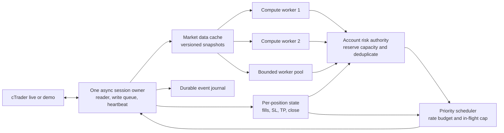

**bot-trade: C++ concurrency, Railway deployment and cTrader API investigation**

Reviewed 10 September 2026, Asia/Singapore. Source: `ang-kl/bot-trade`, commit `a0f6d8bd48794e1c9e81e633311c11045fc64285` (`main` when cloned). This is a proposal and investigation; production code, deployment settings and trading controls were not changed.

**Recommendation: parallelise calculations and independent requests, while keeping account risk and each position's mutations under one authority.** The highest-value change is an event-driven pipeline with bounded concurrency. Increasing Railway replicas or shortening every timer would amplify several existing correctness problems. More CPU can improve coverage and reaction time; it does not supply additional margin or establish a profitable trading edge.

I used the GitHub connector to identify and search the repository, inspected a local clone, checked current official cTrader and Railway sources, ran isolated C++ probes, and read the public Node health endpoint. I could not inspect authenticated Railway service settings, per-container CPU measurements, sidecar deployment SHAs, current feature flags, broker accounts or a current P&L ledger. Consequently, measured production speedups and return forecasts are unavailable.

**The live observation changes the priorities.** At 07:16:21 SGT, the public [Railway Node health endpoint](https://sg-trade.up.railway.app/health) returned HTTP 200, version `0.1.381`, commit `a0f6d8b`, matching the reviewed source. Its cached pipeline snapshot was timestamped 07:15:24.822 SGT and reported:

| Diagnostic | Reported value |
|---|---:|
| Considered | 2,426 |
| Reached risk gate | 2,034 |
| Approved | 49 |
| Vetoed | 1,985 |
| `max_positions` vetoes | 1,673 |
| `portfolio_margin_exhausted` vetoes | 115 |
| `bad_rr` vetoes | 86 |
| `below_min_volume` vetoes | 34 |
| Landed / downstream resolutions / silent drops | 0 / 49 / 0 |

These are pipeline records, potentially repeated proposals, not 2,426 unique investable opportunities. The audit code uses the current FX-day window. Zero landed here does not mean there are no existing positions, no historical trades or no C++ activity outside this lineage. The public projection also omits the reasons for the 49 downstream resolutions. Its prose incorrectly says every proposal was vetoed despite 49 approvals; the structured counts and [verdict implementation](https://github.com/ang-kl/bot-trade/blob/a0f6d8bd48794e1c9e81e633311c11045fc64285/agent/services/decision-audit.js#L271-L309) show why. Resolve that wording and inspect the authenticated resolution details before attributing zero placements to CPU capacity.

**What actually runs today.** The repository describes `cpp-exec` as live and `cpp-acct` as demo instances of the same binary. There is no separate `cpp-acct` source tree or evidence that it is an accounting-only compute service. Each process holds one broker host and can authorise multiple accounts on that host. The README contains outdated warnings about split routing alongside a later two-service deployment checklist; the current [side-aware roster gate](https://github.com/ang-kl/bot-trade/blob/a0f6d8bd48794e1c9e81e633311c11045fc64285/agent/loop.js#L1303-L1321) and host-pin implementation are the stronger evidence. Actual deployed flags still need confirmation. See the [deployment README](https://github.com/ang-kl/bot-trade/blob/a0f6d8bd48794e1c9e81e633311c11045fc64285/cpp-exec/README.md).

| Path | Current source behaviour | Implication |
|---|---|---|
| Main Node loop | Configurable 1–60 minutes; default 5 minutes. Next delay is `max(10s, configured interval − work duration)`. | The user's 1-minute setting is plausible but not exposed publicly. A 90-second pass produces roughly 100 seconds between starts, even at a 1-minute setting. [Scheduling](https://github.com/ang-kl/bot-trade/blob/a0f6d8bd48794e1c9e81e633311c11045fc64285/agent/loop.js#L5338-L5346) |
| Scan | Default concurrency 6, clamped to 12; chunks use `Promise.all`; default rotation batch 15. | Already overlaps network waits. CPU-heavy JavaScript still needs worker threads or another compute process. Each chunk waits for its slowest member. [Scanner](https://github.com/ang-kl/bot-trade/blob/a0f6d8bd48794e1c9e81e633311c11045fc64285/agent/services/fib-strategy.js#L700-L749) |
| Fast monitor / protection band | Separate guarded timers, defaults 3 seconds and 60 seconds. | A one-minute protection pass is not the only price-monitoring path. [Timers](https://github.com/ang-kl/bot-trade/blob/a0f6d8bd48794e1c9e81e633311c11045fc64285/agent/services/fast-monitor.js#L626-L655) |
| VPO feeder | 60-second timer; serial entry fetching; overlap guard; selected account credentials. | Bar and sizing freshness can lag even while ticks stream. [Feeder](https://github.com/ang-kl/bot-trade/blob/a0f6d8bd48794e1c9e81e633311c11045fc64285/agent/services/vpo-feeder.js#L109-L242) |
| VPO recomputation / trigger | One compute thread, default 5 seconds; triggers run on streamed ticks; one fire worker. | Already multithreaded, but both recomputation and submission have serial sections. Feature is off by default. [Dispatcher](https://github.com/ang-kl/bot-trade/blob/a0f6d8bd48794e1c9e81e633311c11045fc64285/cpp-exec/src/vpo_dispatcher.cpp#L57-L138) |
| C++ trailing | Tick updates plus a worker taking one pending amend after a 200 ms sleep. | A slow amend delays other positions; ordered-map first selection can repeatedly favour the same position. [Trailing](https://github.com/ang-kl/bot-trade/blob/a0f6d8bd48794e1c9e81e633311c11045fc64285/cpp-exec/src/trail_engine.cpp#L157-L203) |
| Broker reconciliation | Sweep, then approximately 30 seconds of idle sleep. | Sweep time extends cadence. Orders and reads share the request mutex. [Engine loop](https://github.com/ang-kl/bot-trade/blob/a0f6d8bd48794e1c9e81e633311c11045fc64285/cpp-exec/src/engine.cpp#L545-L619) |

There are already engine, feed, VPO recompute, VPO fire, trailing, peer-probe, telemetry and HTTP-handler threads when the corresponding features are enabled. The operating system can schedule runnable threads on available vCPUs. Merely adding threads does not remove a mutex held over network I/O.

**Findings that should precede faster execution.**

1. **A broker round trip occupies the global execution mutex.** `placeOrder`, amend, close, cancel and reconcile hold `mtx_` while `request()` sends and receives. Timeouts are 20 seconds for new orders/close/cancel, 15 seconds for amend, and 10 seconds for reconcile. A reconcile can therefore delay a protective close even when another CPU is idle. Releasing the lock between accounts helps, but mutex acquisition has no explicit priority or fairness guarantee. The idle loop does not continuously receive, and `handleUnsolicited()` discards execution events instead of updating state. Build a continuously reading session with a pending-request map and explicit event handling. [Request loop](https://github.com/ang-kl/bot-trade/blob/a0f6d8bd48794e1c9e81e633311c11045fc64285/cpp-exec/src/engine.cpp#L284-L357), [write paths](https://github.com/ang-kl/bot-trade/blob/a0f6d8bd48794e1c9e81e633311c11045fc64285/cpp-exec/src/engine.cpp#L453-L543), [unsolicited events](https://github.com/ang-kl/bot-trade/blob/a0f6d8bd48794e1c9e81e633311c11045fc64285/cpp-exec/src/engine.cpp#L163-L189).

2. **VPO can re-arm while a submission is unresolved: locally reproduced.** `tryFire()` uses an `ARMED → FIRED` CAS, but recomputation writes `ARMED` unconditionally. The recompute loop does not exclude pending strategies. With the same valid VWAP fixture, the probe claimed the order, recomputed without completing it, and successfully claimed it again. This proves the state transition permits a second fire; it does not claim a duplicate real broker fill was observed. A slow fire worker makes the interleaving practical. Atomics on individual price/side/SL/TP fields also do not create one coherent setup snapshot. Use one lifecycle owner, immutable setup generations, and an explicit pending/unknown state that recomputation cannot overwrite. [Arming](https://github.com/ang-kl/bot-trade/blob/a0f6d8bd48794e1c9e81e633311c11045fc64285/cpp-exec/src/vpo_strategies.cpp#L53-L64), [recompute and fire](https://github.com/ang-kl/bot-trade/blob/a0f6d8bd48794e1c9e81e633311c11045fc64285/cpp-exec/src/vpo_dispatcher.cpp#L70-L138).

3. **Telemetry has multiple possible producers but an SPSC queue: locally reproduced.** HTTP uses a detached thread per connection; VPO submits independently; guard-refusal logging occurs before the execution mutex. `Telemetry::log()` has no producer lock. Eight synthetic producers accepted 400,000 records, wrote 106,404, and reported zero drops. The single-producer control wrote all 50,000. This is an observability integrity failure, not a production trade-loss measurement. Replace it with a bounded MPSC queue, per-producer SPSC queues, or a short producer mutex; choose the simplest design that meets measured throughput. [HTTP threads](https://github.com/ang-kl/bot-trade/blob/a0f6d8bd48794e1c9e81e633311c11045fc64285/cpp-exec/src/http_server.cpp#L43-L54), [pre-lock logging](https://github.com/ang-kl/bot-trade/blob/a0f6d8bd48794e1c9e81e633311c11045fc64285/cpp-exec/src/engine.cpp#L475-L490), [queue](https://github.com/ang-kl/bot-trade/blob/a0f6d8bd48794e1c9e81e633311c11045fc64285/cpp-exec/src/spsc_ring.hpp#L35-L52).

4. **A queued order can pass an old halt check.** Validation happens before acquiring `mtx_`. A request can validate, wait behind a slow broker call, then submit after `/config` has set a halt. Recheck the current policy epoch and reservation immediately before starting the send. A halt cannot retract an already transmitted order, so the action log must distinguish queued from sent. [Order validation](https://github.com/ang-kl/bot-trade/blob/a0f6d8bd48794e1c9e81e633311c11045fc64285/cpp-exec/src/engine.cpp#L468-L496), [live configuration](https://github.com/ang-kl/bot-trade/blob/a0f6d8bd48794e1c9e81e633311c11045fc64285/cpp-exec/src/main.cpp#L720-L744).

5. **C++ keepalive and rate control need updating.** Both engine and feed wait approximately 25 seconds between idle heartbeats; the Node pool uses 9 seconds. Current Open API connection guidance recommends 10 seconds. This is a guidance mismatch, not proof of the cause of any production disconnect. I found no central C++ request pacer, and `request()` reduces errors to code/description, losing `retryAfter`. Add heartbeat deadlines independent of RPC waits, explicit request classes, and payload-specific throttle state. [Engine heartbeat](https://github.com/ang-kl/bot-trade/blob/a0f6d8bd48794e1c9e81e633311c11045fc64285/cpp-exec/src/engine.cpp#L184-L189), [feed heartbeat](https://github.com/ang-kl/bot-trade/blob/a0f6d8bd48794e1c9e81e633311c11045fc64285/cpp-exec/src/spot_feed.cpp#L245-L262), [Node heartbeat](https://github.com/ang-kl/bot-trade/blob/a0f6d8bd48794e1c9e81e633311c11045fc64285/agent/lib/ctrader-session.js#L60-L72).

6. **VPO sizing and account ownership are insufficient for wider parallel execution.** The feeder precomputes volume from the minimum allowed stop distance; `fireNow()` uses that cached volume with the strategy's actual stop distance. A wider actual stop can therefore imply more monetary risk than that sizing assumption. The cache expires after five minutes, and one atomic account ID belongs to the whole dispatcher. There is no shared per-fire margin/position reservation covering Node and VPO. Queue entries are mutable strategy pointers, so later configuration can change what a queued fire reads. Replace them with immutable intents carrying environment, account, symbol, setup generation, actual bracket, policy version and expiry. Have the existing risk authority size and reserve the concrete trade. [Sizing](https://github.com/ang-kl/bot-trade/blob/a0f6d8bd48794e1c9e81e633311c11045fc64285/agent/services/vpo-feeder.js#L166-L215), [fire payload](https://github.com/ang-kl/bot-trade/blob/a0f6d8bd48794e1c9e81e633311c11045fc64285/cpp-exec/src/vpo_dispatcher.cpp#L142-L207), [account and queue fields](https://github.com/ang-kl/bot-trade/blob/a0f6d8bd48794e1c9e81e633311c11045fc64285/cpp-exec/src/vpo_dispatcher.hpp#L125-L142), [cache expiry](https://github.com/ang-kl/bot-trade/blob/a0f6d8bd48794e1c9e81e633311c11045fc64285/cpp-exec/src/vpo_config_store.hpp#L27-L38).

7. **The Node duplicate lock is local and temporary.** Its 60-second in-memory map is valuable for current burst suppression. It does not survive a restart, coordinate replicas, or cover direct C++ VPO submissions. Existing other lineage checks should be retained, but no cross-process exactly-once guarantee follows from this map. Use a durable intent ledger and a single execution owner; keep uncertain outcomes pending until reconciliation resolves them. [Duplicate lock](https://github.com/ang-kl/bot-trade/blob/a0f6d8bd48794e1c9e81e633311c11045fc64285/agent/lib/exec-engine.js#L608-L694).

8. **Trailing needs one protection-state owner.** The C++ trail sends an SL-only payload and its `TrailSpec` has no TP field, while the Node wrapper explicitly enforces TP-preservation intent. Two independently tightening engines can also send stale stops out of order: a locally tighter value is not necessarily tighter than the broker's latest value. Route all changes to one per-position actor that reads current SL/TP, coalesces changes, and handles close-vs-amend ordering. Verify TP behaviour against a demo broker before enabling faster trailing. [C++ payload](https://github.com/ang-kl/bot-trade/blob/a0f6d8bd48794e1c9e81e633311c11045fc64285/cpp-exec/src/trail_engine.cpp#L170-L188), [Node contract](https://github.com/ang-kl/bot-trade/blob/a0f6d8bd48794e1c9e81e633311c11045fc64285/agent/lib/exec-engine.js#L719-L775).

9. **Cheap implementation improvements exist, but they are secondary.** The Makefile has no release optimisation flag; benchmark `-O2` without `-ffast-math`. Replace unbounded detached HTTP handlers with bounded admission. Index VPO strategies and trailing positions by symbol: current tick handlers iterate the complete collections and filter. Move backtests off the order-serving process. None of these substitutions should be presented as a measured profitability improvement. [Build](https://github.com/ang-kl/bot-trade/blob/a0f6d8bd48794e1c9e81e633311c11045fc64285/cpp-exec/Makefile), [VPO tick loop](https://github.com/ang-kl/bot-trade/blob/a0f6d8bd48794e1c9e81e633311c11045fc64285/cpp-exec/src/vpo_dispatcher.cpp#L253-L258), [trail tick loop](https://github.com/ang-kl/bot-trade/blob/a0f6d8bd48794e1c9e81e633311c11045fc64285/cpp-exec/src/trail_engine.cpp#L97-L104).

**Current cTrader constraints and useful alternatives.** Checked against official documentation on 10 September 2026:

| Constraint | What is documented | Design consequence |
|---|---|---|
| Open API normal traffic | Maximum 50 non-historical requests/second/connection. | Start with a paced aggregate budget below the ceiling; more compute workers do not multiply it. [Open API](https://help.ctrader.com/open-api/) |
| Open API history | Maximum 5 historical requests/second/connection. | Keep the existing conservative 4/s budget initially; reduce historical requests with shared caches and subscriptions. [Open API](https://help.ctrader.com/open-api/) |
| Connections | Best practice: at most two, one demo and one live; each supports multiple accounts. | Consolidate sessions instead of opening one per worker/account. This is published guidance, not a verified hard two-socket enforcement limit. [Connection guide](https://help.ctrader.com/open-api/connection/) |
| Keepalive | Send a heartbeat every 10 seconds. | Schedule at 8–9 seconds with short/nonblocking receive waits. [FAQ](https://help.ctrader.com/open-api/faq/) |
| Throttling | `BLOCKED_PAYLOAD_TYPE` can carry `retryAfter` in seconds. | Preserve it and defer that request class; jitter subsequent recovery without retrying earlier than the server's delay. [Messages](https://help.ctrader.com/open-api/messages/#protooaerrorres) |
| Same-order changes | `CONCURRENT_MODIFICATION` means the order is blocked while another operation is underway. | Parallelise independent positions; sequence mutations of the same position/order. [Error codes](https://help.ctrader.com/open-api/common-model-messages/) |
| Streaming | Spot subscription can contain multiple symbols; live trendbars require spot subscription first. | Stream and distribute locally; process newly closed bars rather than repeatedly requesting whole histories. [Symbol data](https://help.ctrader.com/open-api/symbol-data/) |
| History pagination | Tick history requests cover at most one week; returned tick count is backend-dependent and `hasMore` indicates truncation. | Backfill bounded windows and verify continuity. Do not treat a partial reply as complete history. [Symbol data](https://help.ctrader.com/open-api/symbol-data/) |

The C++ source's approximate “100-modify/min” explanation for virtual pending orders needs qualification. The official **cTrader Algo demo** table lists 100 pending-order amendments/minute, 100 cancellations/minute, 500 new orders/minute, 2,000 position closes/minute, and separate protection-modification limits of 1,000/minute and 5,000/15 minutes. That page concerns Algo demo connections; it does not establish those same thresholds for this Open API deployment. Confirm any additional broker/account limits directly instead of transferring limits between products. [Algo rate limits](https://help.ctrader.com/ctrader-algo/documentation/rate-limits/)

The existing Node history limiter is process-global at 4/s. A comment calls the limit per account, which differs from current Open API wording. Its conservative scope can remain while session ownership is consolidated. Also, its token bucket permits an initial burst plus replenishment; 4/s average alone does not guarantee no rolling one-second interval exceeds 5. Prefer smooth pacing or a small burst cap and a rolling-window test. Replicating the Node process would replicate this local limiter, so any intentionally shared account/application budget must have one owner. [Limiter](https://github.com/ang-kl/bot-trade/blob/a0f6d8bd48794e1c9e81e633311c11045fc64285/agent/lib/ctrader-ws.js#L78-L151)

There is another research trap: GitHub still labels protocol **release 91, published 15 July 2024**, latest. That release announced `ProtoOAv1PnLChangeSubscribeReq` and related events. The default-branch schema subsequently removed those payloads on **6 August 2025**. Therefore a streaming P&L design based only on the latest release notes is not justified. Treat those messages as unavailable until Spotware confirms support. Use current position events, supported P&L reads where available, and the repository's explicitly approximate local mark-to-market fallback with freshness and currency checks. [Release 91](https://github.com/spotware/openapi-proto-messages/releases/tag/91), [removal commit](https://github.com/spotware/openapi-proto-messages/commit/ef1d2b2cc75a7643c9753664be5421534e6d082d)

The practical ways around request pressure are **request avoidance and local computation**: shared entitlement-correct market data; warm history caches; one in-flight fetch per cache key; streamed closes; incremental indicators; and coalesced protection updates. Keep the existing virtual-entry policy during this work. Replacing it with native pending entries would change execution semantics and needs separate evaluation.

FIX is a possible later transport experiment, not an unlimited API entitlement. cTrader FIX supports live market data and trading but lacks account balance/margin information and historical data, so Open API remains necessary. Its FAQ also warns that simultaneous connections can produce duplicate reports. Obtain broker-specific session/throughput terms and benchmark fills, rejects and recovery before considering migration. Rotating accounts, IPs, credentials or reconnecting to evade throttles is not a sound throughput architecture. [FIX limitations](https://help.ctrader.com/fix/limitations/), [FIX FAQ](https://help.ctrader.com/fix/faqs/)

**Proposed architecture.** Keep a live execution owner and a demo execution owner. Within each environment, one asynchronous session owns the TLS/WebSocket state. Its reader never waits for strategy computation, database work or a broker response to another request. A pending map resolves replies by request ID and environment/account validation. Spot, depth and execution events go to the appropriate state handlers. Serialised writes preserve frame integrity, while several independent requests can remain in flight. The protocol defines `clientMsgId` as the request identifier returned in the response. [Common messages](https://help.ctrader.com/open-api/common-messages/#protomessage)



Apply that pattern once per environment, not once per symbol or CPU. Initially the Node coordinator remains the sole authority for the existing risk formulas and durable decisions. All C++ VPO fires must pass through it, or consume an explicitly reserved, versioned grant issued by it. A five-minute-old cached volume is not such a grant. This preserves policy while removing the dependency on the minute timer. Account actors are logical queues, not one operating-system thread per account; cross-account portfolio limits still need coordinated reservation.

Use a fixed worker pool for **pure calculations**: indicator updates, pattern recognition, scoring and scenario evaluation. Existing C++ strategy modules can be partitioned by symbol; existing JS strategies can run in Node `worker_threads` without being ported immediately. Do not run the same strategy through both implementations as independent order producers. Preserve strategy windows, market-session boundaries, price units and rounding. The current scan cache is keyed only by symbol ID/period and expires by age; shared caches should include host/broker/feed entitlement and data generation, and refresh on bar boundaries. Otherwise parallelism can distribute stale or incorrect data faster. [Current cache](https://github.com/ang-kl/bot-trade/blob/a0f6d8bd48794e1c9e81e633311c11045fc64285/agent/services/fib-strategy.js#L111-L120)

An immutable `OrderIntent` should carry at least `(environment, account, symbol, strategy, timeframe, signal identity, setup generation, side, entry condition, actual SL/TP, expiry, policy epoch, reservation ID)`. Signal identity should come from the originating setup/bar event, not the millisecond of a retry. Queueing a pointer to mutable strategy state is insufficient.

The intent lifecycle should distinguish `candidate → reserved → queued → sent → accepted → partially filled/filled/rejected/cancelled`, with `unknown` for an ambiguous timeout/disconnect. An accepted request is not a confirmed fill. `clientOrderId` can help correlation but is not documented here as a server-side exactly-once guarantee. Keep uncertainty until reconciliation resolves it; do not blindly resend or release the reservation because a timeout expired. [Order and execution fields](https://help.ctrader.com/open-api/messages/)

For outgoing work, schedule urgent closes and protective actions ahead of entries, then reconciliation and other reads; maintain a heartbeat deadline independently. Add fairness so sustained entry traffic cannot starve reconciliation or one account. Coalesce unsent SL updates to the strongest valid tightening for a position, preserving its TP intent; cancel obsolete amends when a close is queued. Reserve a portion of request capacity for urgent work rather than allowing entries to consume the entire budget.

All queues need capacities, timestamps and overload policies. Superseded computation can be coalesced by symbol. Tick-sensitive triggers need an ordered feed or a conservative crossing summary; simply retaining the latest quote can miss a level crossed and reversed between samples. Execution events must not be silently dropped. A sequence gap or event-journal failure should stop new risk, preserve exit capability, and force resynchronisation. Avoid busy-spin loops that consume Railway CPU while idle.

**Railway configuration proposal.** Railway supports vertical use of available CPU up to the plan/service limit, and horizontal replicas are independent processes. Its current scaling guide cites up to 24 vCPU per Pro replica, but that does not identify this project's plan or assigned limit. Plan upgrades raise ceilings and do not cure remote API latency. [Scaling](https://docs.railway.com/deployments/scaling), [performance guidance](https://docs.railway.com/deployments/troubleshooting/slow-deployments)

Start by measuring a single execution replica per environment at **2 and 4 vCPU ceilings**, using the same replay and broker simulation. A reasonable four-vCPU candidate is two compute workers plus an event-loop thread, with short control/journal tasks sharing remaining scheduling capacity. These are runnable threads, not guaranteed exclusive physical cores. Let Linux schedule them initially; add affinity only if measurement demonstrates a benefit within the allowed CPU set.

Size the pool from the minimum of configured budget, allowed CPU affinity and effective cgroup quota. For cgroup v2, a finite `cpu.max` quota divided by period gives CPU-time capacity; ancestor limits may also bind. Inspect `cpu.stat` throttling and CPU pressure, not just `hardware_concurrency()`. On a one-vCPU allocation, reduce compute work rather than assuming extra threads add throughput. [Linux cgroup documentation](https://docs.kernel.org/admin-guide/cgroup-v2.html)

Keep the execution owner count at one per environment while ownership is local. Replicating today's sidecar duplicates its VPO, trailing and reconciliation state. `PEER_URL` is a liveness probe, not a leader election or fencing mechanism. Future redundancy needs a durable lease and an execution gateway that rejects stale ownership epochs; a lease alone cannot prevent an isolated old process from continuing to talk to the broker. Scale stateless calculation workers before scaling order owners. [Peer design](https://github.com/ang-kl/bot-trade/blob/a0f6d8bd48794e1c9e81e633311c11045fc64285/cpp-exec/README.md#peer-liveness-pr-b-2026-08-31)

Keep Node and its sidecars in the same Railway region/private network. Measure broker response distributions when evaluating regions: cTrader's public endpoint uses AWS Global Accelerator to choose a nearby proxy, which does not eliminate the rest of the broker execution path. Separate research/backtest compute so it cannot consume the trading process's CPU budget. [cTrader endpoints](https://help.ctrader.com/open-api/proxies-endpoints/)

Use joined worker lifetimes and a drainable shutdown: stop admitting entries, persist unresolved intents, keep risk-reducing work available, close sessions, join workers, then exit. Before enabling entries after restart, restore intents and reconcile broker state. Health must read cached status without acquiring an RPC-duration lock. A Railway HTTP liveness response should not be interpreted as proof of a fresh broker feed or a safe-to-trade account.

**An implementation sequence that produces reviewable changes.** Names below are proposed modules/configuration, not existing features.

| Change | Concrete code work | Required acceptance evidence |
|---|---|---|
| 1. Correctness and measurements | Fix VPO pending lifecycle; coherent setup snapshot; telemetry producer safety; pre-send halt check; TP-preservation contract; 8–9s heartbeat; fix misleading audit wording. Add queue-wait and trigger timestamps. | Regression reproductions no longer fail; simultaneous config/fire tests; no unreported telemetry loss. |
| 2. Async broker session | Replace blocking `request()` internals in `engine.*`/`ws_client.*` with `BrokerSession`, pending map, continuous reader, paced priority writer and bounded in-flight work. Preserve current HTTP contracts during migration. | Simulated delayed/out-of-order/duplicate events, id-less server events, accepted-before-filled, partial fills, auth loss and timeout recovery. |
| 3. Shared account execution authority | Add durable intent/reservation ledger; route Node and VPO through it; per-position sequencing; generation-stamped configuration; event-driven reconciliation updates. | No risk oversubscription across simultaneous signals; unknown outcomes survive process death; no duplicate replay. |
| 4. Shared market-data service | Consolidate history fetches and subscriptions from scan, guardian, VPO and monitoring; stream closed bars; cache by correct feed identity. | Same closed-bar signals as baseline; gaps detected and repaired; actual request count reduced; restart catch-up tested. |
| 5. Bounded compute pools | Add symbol-indexed C++ tasks and JS workers for remaining strategies; rolling task completion instead of chunk barriers; release `-O2`; isolate backtests. | Deterministic replay at 1/2/4 workers; p95/p99 improved without stale results or increased resource throttling. |
| 6. Demo rollout and economics | Shadow calculations, then demo execution with conservative limits, then a separately authorised live canary. | Risk/correctness gates pass; representative sessions and faults covered; net execution outcomes justify compute cost. |

Suggested initial **test values** are two compute workers, up to eight independent broker requests in flight, a smoothly paced 40/s non-historical budget including control traffic, and 4/s history. Account- and operation-specific broker constraints may require lower values. Keep these configurable and discover actual broker behaviour with bounded demo tests. If latency or throttling worsens, reduce concurrency; do not add sockets as compensation.

An illustrative calculation explains the benefit: twenty independent 100 ms RPCs take about two seconds when strictly serial. At 40 evenly spaced sends/second, the last of twenty leaves around 475 ms; with 100 ms responses, completion can be around 575 ms if the broker supports that concurrency. This is a queueing example, not a bot-trade benchmark or a promise. Eight in-flight slots would be sufficient for that example. Extra cores address computation; pipelining addresses remote wait time.

Similarly, a cold fetch of fifteen symbols across eight distinct timeframes is 120 historical requests. At a steady 4/s budget that represents roughly 30 seconds of request capacity, irrespective of the number of CPU cores. Existing caching means this is not the cost of every current scan. Streaming and sharing data reduce that demand; multiprocessing alone does not.

**How the work should be judged against profitability.** First separate missed opportunities caused by delayed data, delayed computation, request queueing, stale proposals, rejected orders, and genuine capital constraints. The public snapshot strongly motivates investigating position/margin eligibility and the 49 downstream resolutions. It does not establish which vetoes were correct or how much money any faster system would earn.

Keep current risk limits during the infrastructure comparison. Evaluate candidates concurrently, then allocate available risk to the best eligible set using net expected edge, correlation, liquidity and capacity. If the book is full, a proposal to replace an existing position must account for exit cost, re-entry cost, uncertainty and turnover; it is a separate strategy decision. Faster generation of repeatedly vetoed signals merely spends more compute.

Record end-to-end timestamps: source event, received, computation start/end, risk approval, enqueue, actual send, broker acceptance and fill. Use monotonic clocks for local durations; distinguish clock uncertainty from broker latency across machines. Track event-loop lag, queue depth/age, maximum heartbeat gap, in-flight requests, per-class request counts, `retryAfter`, reconciliation age per account, unknown intents, rejects, stale expiries, CPU throttling and dropped records. Existing Node phase profiles are useful starting points, but historic comments describing CPU-bound versus idle phases are not current measurements.

Compare sequential and concurrent processing on the same replay and the same permitted risk budget. Report net P&L after trading costs, profit factor, drawdown, realised slippage, giveback, turnover, coverage of eligible opportunities and compute cost. Use out-of-sample/walk-forward evaluation and enough trades to quantify uncertainty. A higher order count or win rate alone is not a success criterion. The economic question is whether additional valid fills and better execution outweigh costs and any increase in adverse selection.

Proposed engineering gates include zero duplicate intents/fills attributable to replay, zero account misroutes, zero risk oversubscription in stress tests, no missing protection due to races, and no unaccounted execution-event loss. Set latency targets after measuring the baseline; for example, an initial 50 ms p99 budget for local cached-data decision-to-queue work is a candidate target, not a claim about achievable broker fills. Protection freshness and tail latency must remain acceptable during historical backfills and a stalled account request.

**Validation performed and its limits.** The existing `test_vpo_strategies` and `test_telemetry` binaries both passed when built against the reviewed sources. The additional isolated probe produced:

```text
vpo first_claim=1 rearmed_while_pending=1 second_claim=1
telemetry producers=1 submitted=50000 accepted=50000 written=50000 dropped=0
telemetry producers=8 submitted=400000 accepted=400000 written=106404 dropped=0
```

The fixture for the VWAP case follows the repository's existing rising-bar test. The telemetry queue capacity exceeded all submitted records, so an intentionally undersized queue does not explain the missing records. An additional ThreadSanitizer build reproduced count loss (82,127 written) without emitting a diagnostic on this machine; that absence is not evidence of thread safety. Neither probe connects to a broker. I did not run the complete repository test suite or a trading backtest, and these probes do not measure Railway performance.

The accompanying `concurrency-probe.cpp` can be rebuilt against the reviewed checkout with C++20, linking `telemetry.cpp`, `vpo_strategies.cpp` and `vpo_indicators.cpp`; pass an existing scratch directory as its only runtime argument. `investigation-evidence.json` preserves the source commit, public-health snapshot, test output and evidence limits.

The next implementation should therefore begin with the reproduced VPO and telemetry defects, then introduce the asynchronous session and common risk-reservation path. Multicore calculations become useful once their results can reach that path promptly, coherently and within the broker's real constraints.
