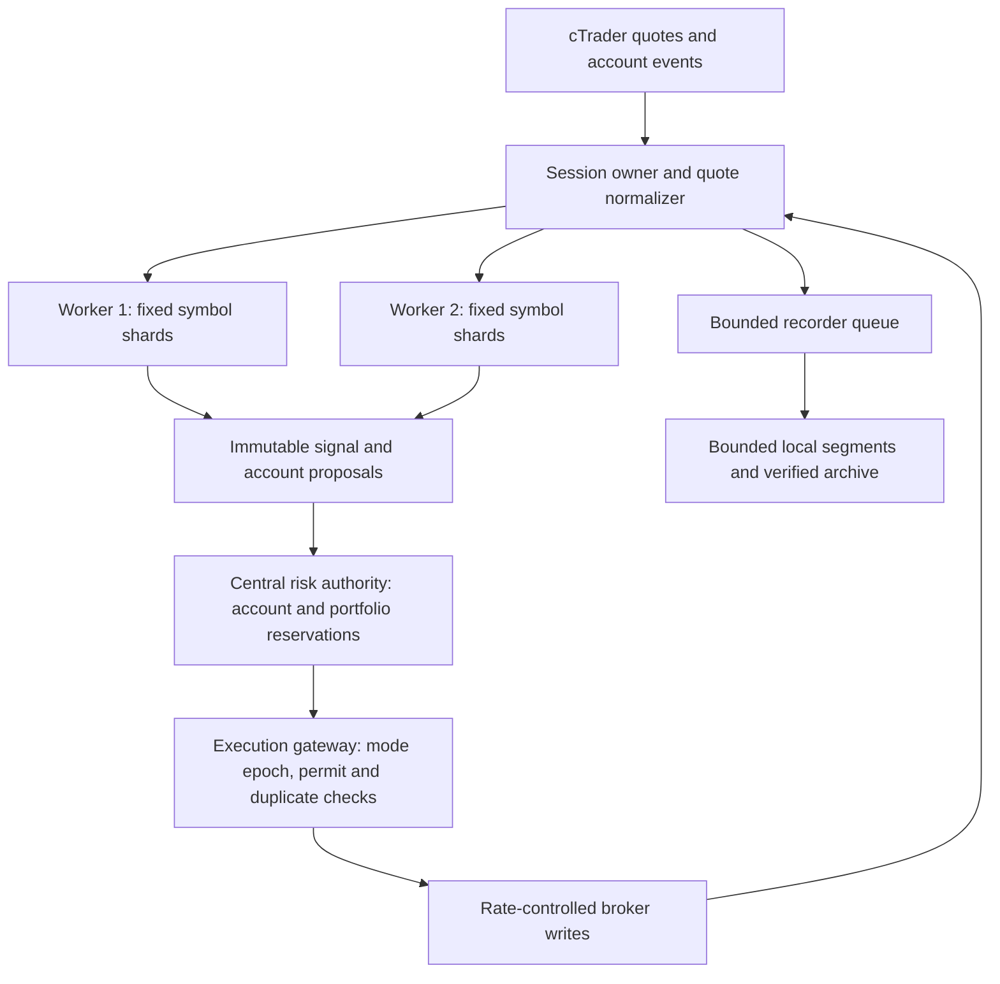

# Tick-momentum breakout: implementation and verification plan

Prepared 10 September 2026 for `ang-kl/bot-trade`. Source baseline: [`a0f6d8bd48794e1c9e81e633311c11045fc64285`](https://github.com/ang-kl/bot-trade/tree/a0f6d8bd48794e1c9e81e633311c11045fc64285), verified against remote `main` during this investigation. This is a plan; it does not enable trading, change account settings, or establish profitability.

Companion deliverables: [42-requirement completion register](/Users/akla/Documents/Codex/2026-09-10/github-plugin-github-openai-curated-remote/outputs/tick-momentum-readiness-register.csv), [storage capacity scenarios](/Users/akla/Documents/Codex/2026-09-10/github-plugin-github-openai-curated-remote/outputs/tick-storage-capacity.csv), and [research parameter proposal](/Users/akla/Documents/Codex/2026-09-10/github-plugin-github-openai-curated-remote/outputs/tick-momentum-research-profile.json). The JSON is labelled research-only and is not a deployable trading configuration.

**1. The agreed outcome is an account-wide, exclusive choice of entry engine.** Every authorized account can be configured for `TIME_BASED`, `TICK_MOMENTUM`, or `STOPPED`. The user confirmed that tick/time exclusivity applies to the whole automatic entry engine, and that tick trading should be available to all accounts but initially off, with shadow and demo validation before live use. Existing time-mode configuration is retained for switching back. Adding the feature does not automatically stop today's time strategies or enable tick orders.

> **Amendment 25-09-2026 (WP-A, dual admission; `docs/dual-environment-plan-2026-09-25.md` P0).** The exclusive choice above is superseded by the owner's order 8,991 ("tick and time in parallel"). An account may now admit both bases at once: `TIME_BASED` with `admittedBases ['bar','tick']` ("Time + tick"), set in ONE `POST /actions/entry-mode` request that takes the whole ack protocol (epoch bump, WARMING, the sidecar's echo, STABLE). The modes themselves are unchanged (`ENTRY_MODES` is still the three above; "Time + tick" is an overlay, not a mode). **Promotion adds tick next to bar**: the automatic pass (`entry-mode-auto.js`, policy `auto`) now promotes to `TIME_BASED` + `['bar','tick']` instead of switching the account to `TICK_MOMENTUM`, so time entries keep running; tick alone is a human-only choice. Demotion removes tick from any account whose requested bases include it (back to `TIME_BASED`, bar only). The gates are unchanged: any request that admits tick is refused unless tick readiness is clean at the request AND the evidence is pinned (profile hash, `SHADOW_PASSED`), on the record the ack will write. The entry basis is now taken from the registered producer (`lib/entry-producers.js`), never a `'bar'` default.

Tick momentum will generate its signal directly from an ordered sequence of quote changes. No M1/M15/H4 candle, ATR-from-candles, candle-volume confirmation, or minute pulse is required by the signal. Clock time remains necessary for stale-data detection, market sessions, news restrictions, connection health, risk accounting, holding-time safeguards, and performance measurement.

All-account support means account-specific routing, symbol metadata, permissions, sizing and risk decisions. It does not mean copying one account's symbol IDs, quotes, order volume or trading permission to every other account. Legitimate risk and broker restrictions remain enforced and visible. No investigation can establish that every production setting is ready without observing those settings; the unresolved runtime checks below are explicit release gates.

**2. Separate observation, entry selection and readiness.** Use one authoritative account record with these fields:

| Field | Values / purpose |
|---|---|
| `requested_entry_mode` | `TIME_BASED`, `TICK_MOMENTUM`, `STOPPED` |
| `effective_entry_mode` | Gateway-acknowledged mode; never inferred from a saved UI choice |
| `transition_state` | `STABLE`, `QUIESCING`, `RECONCILING`, `WARMING`, `BLOCKED` |
| `tick_observation` | `OFF`, `RECORD`, `SHADOW`; observation can run while time entries continue |
| `validation_stage` | `UNVALIDATED`, `REPLAY_PASSED`, `SHADOW_PASSED`, `TRADED_PASSED` — one ladder for every account (PR-B, 11-09-2026, owner principle 1: the demo-only stage and the typed live approval it replaced collapse into `TRADED_PASSED`, judged on the account's own closed tick trades in R; stored records carrying the old names read as `TRADED_PASSED`) |
| `config_revision`, `mode_epoch` | Monotonic, persisted revisions; reject stale commands and proposals |
| `profile_id`, `profile_hash` | Exact tick parameters and strategy implementation version |
| `environment`, `account_id`, `risk_group_id` | Immutable execution identity and explicit portfolio grouping |
| `readiness`, `blocked_reasons` | Structured checks with source, observed value, timestamp and remediation |
| `fence_ack_epoch`, entry counts | Separate unsent, in-flight, owned resting and unknown entries; distinguish a write fence from completed reconciliation |

Observation does not reserve real account capacity or generate broker writes. Shadow uses its own simulated portfolio. Demo/live is the account's broker environment, not a toggle that rewrites an account's identity. Live and demo capacity never subtract from each other. Future accounts are discovered dynamically and start with tick entries off; no five-account hardcoded registry is introduced.

**3. Start, stop and switch must be enforced at the last order-writing boundary.** An account mode command includes its expected configuration revision. The control service persists the desired mode and a new epoch, then performs this sequence:

1. Fence the old entry epoch at the execution gateway and reject new proposals from it. Cancel unsent old-mode entry intents and release only reservations proved not submitted.
2. Classify requests already written to the broker as in flight. A UI click cannot retract such a request; show the outstanding count. Continue handling fills and protecting positions.
3. Cancel account-owned resting entry orders from the old automatic engine and await terminal evidence. Identify them by stored origin and broker IDs; never cancel unrelated/manual orders by symbol alone. A fill during cancellation becomes an owned position to reconcile.
4. Resolve accepted, partially filled and ambiguous submissions. An unknown order outcome prevents activation of the new entry engine. A timeout is not proof that the order failed.
5. Reconcile account exposure, reservations and owned orders. For tick mode, verify its profile, feed, warm-up, validation stage and resource readiness; for time mode, restore the saved time configuration.
6. Activate the new epoch at the gateway and report its acknowledgement to the UI. If any dependency fails, remain visibly blocked with new automatic entries stopped; do not silently fall back to time trading.

`Stop entries` retains existing positions, broker stops, exits and reconciliation. It does not flatten the account or disconnect the protective price feed. Existing positions retain their original strategy/profile and exit manager, including any bar data that manager still requires. A separate `Close positions` action remains explicit. A manual new-order command is labelled `MANUAL` and uses the same risk authority; it is never a hidden automatic fallback. The existing account-wide emergency halt also blocks manual new risk. Mode exclusivity covers every automatic producer, including the ordinary scanner, VPO, daily momentum/book, adaptive/autopilot and LLM-originated automatic proposals.

An all-accounts command returns individual account states and failures. Do not call a distributed bulk change atomic. Stop can fence every reachable gateway immediately and show unacknowledged accounts; an unreachable gateway must cease entries on lease expiry and reconcile before reconnecting. Switching target mode waits for each account's own barrier. The UI must not display “all stopped” while a gateway is unacknowledged or an entry is still in flight.

**4. Build a new tick strategy contract.** The current `StrategyModule::recompute(macroBars, microBars)` contract is bar-specific. Add a separate pure `TickStrategy::onQuote(QuoteEvent, TickState)` contract and a versioned `tick_momentum_breakout` registry entry. Reuse order transport and risk policy after correcting their lifecycle, not the current mutable VPO arm/fire mechanism. [Existing interface](https://github.com/ang-kl/bot-trade/blob/a0f6d8bd48794e1c9e81e633311c11045fc64285/cpp-exec/src/vpo_strategy.hpp#L45).

Each normalized quote event includes environment, broker/feed identity, entitled account/feed group, symbol ID, subscription generation, local receive sequence, broker timestamp when supplied, monotonic receipt time, bid/ask wire integers, changed-side mask, each side's last-update time, and quality flags. Use fixed-width encoding and checked conversions. The current callback carries only symbol ID, bid and ask, so this metadata is new work. [Current callback](https://github.com/ang-kl/bot-trade/blob/a0f6d8bd48794e1c9e81e633311c11045fc64285/cpp-exec/src/spot_feed.hpp#L28).

cTrader's first spot message can be a snapshot even when the market is closed; it must warm the book, not count as a new momentum event. Bid and ask are optional independently. Retain the last known side but reject entry calculations when either side is missing, stale, crossed or otherwise invalid. Request spot timestamps explicitly. Local sequences establish what this process observed; they cannot prove that cTrader supplied every market event. A disconnect or local queue loss invalidates continuity, starts a new generation, and requires warm-up rather than replaying missed historical signals as live opportunities. [Spot event and subscription contract](https://help.ctrader.com/open-api/messages/#protooaspotevent).

Define a strategy tick as a valid quote state whose bid or ask changed. Keep raw observations and normalization decisions in the recorder; exclude identical repeats and reconnect snapshots from signal counters. Track spread changes separately. These are quote ticks, not executed trade prints. No “buy volume”, “sell volume”, exchange volume delta or trade VWAP is inferred from them. Optional depth is broker-specific and is not required for the first candidate.

**5. Candidate specification: momentum-confirmed quote-range breakout.** This is a falsifiable research hypothesis, not a preset proven edge. Event-time research motivates measuring activity directly, but does not establish profitable parameter values for this broker, symbol universe or latency. [Glattfelder and Olsen, *The Theory of Intrinsic Time*](https://arxiv.org/abs/2406.07354).

Let `m[i] = (bid[i] + ask[i]) / 2` for accepted event `i`. Maintain rolling statistics incrementally, without rescanning every history buffer on every event:

- Range: `H = max(m[i-N] ... m[i-1])`, `L = min(...)`. The candidate event is excluded.
- Signed movement over `M` events: `D = m[i] - m[i-M]`.
- Directional efficiency: `E = abs(D) / sum(abs(delta_m), last M events)`, with zero denominator producing no signal.
- Volatility scale: `V = sqrt(M * mean(delta_m^2, prior N events))`. This is a normalization scale, not a claim that returns are independent or that future volatility is predicted exactly.
- Spread baseline: median spread over the prior N valid observations, with a broker/symbol-specific absolute maximum.
- Breakout buffer: `B = max(2 * permitted_price_increment, k_spread * median_spread)`. Validate permitted increments/precision from broker metadata; do not treat a wire scaling factor as an instrument tick size.

Warm-up requires N+1 prior prices for N prior price differences; the candidate event is excluded from the volatility estimate and spread median. Represent midpoint as twice-mid in integer wire units to preserve half increments, then apply a specified numeric/rounding policy to derived values. Zero/nonfinite volatility or an unusable price grid yields no signal.

Use the state machine `WARMING -> ARMED -> CONFIRMING -> SIGNALLED/EXPIRED -> RESET`. Arm only after warm-up with valid quality, a positive qualifying range and the current midpoint inside that range. Freeze the midpoint/bid/ask ranges, buffer and setup generation at arm time; expire an untriggered setup after N accepted events. A long requires an upward crossing of `H+B`, positive D, sufficient E, and confirmation that bid has also exceeded the frozen prior bid range; a short mirrors below `L-B` with ask confirmation. This prevents an ask-only spread widening from masquerading as a long breakout.

The crossing is latched once and counts as confirmation event 1. For baseline confirmation=2, one further accepted event must remain beyond the frozen boundary while directional, spread, freshness and cost conditions still pass. Repeated identical quotes do not advance the count; a valid quote change with unchanged midpoint can confirm only if the two-sided breakout and all other conditions remain true. Retracement or a failed signal condition resets confirmation; invalid/missing/stale data invalidates the setup and readiness. Do not require two independent crossings. A rolling boundary falling beneath a stationary price cannot create a crossing. An emitted setup cannot emit again. After SIGNALLED, RESET requires return inside the frozen range and the event cooldown before a new window can arm. An untriggered EXPIRED setup waits N/4 accepted events, then may arm from a newly calculated prior window only while price is inside that window; it still needs a subsequent crossing. Expiry itself never emits a signal.

Use a conservative round-trip cost estimate, converted to the same price or cash units as the planned move: spread plus both commissions plus slippage allowance, without double-counting spread when the simulator already fills at bid/ask. Confirm the estimate again using the actual account volume. Require sufficient planned move relative to costs and cap overshoot beyond the trigger. Tick-derived stop distance is the greatest of a volatility-scaled distance, the broker's minimum valid distance and the account's policy floor; recalculate volume from the account's existing risk budget. Reject unaffordable minimum lots rather than increasing risk to force a trade. A wider required stop does not justify extending a target beyond the strategy's validated reachable-move assumptions.

After one signal, disarm that setup. Rearming requires a reset inside the range and an event cooldown; neither a new worker nor another callback can reclaim the same setup. One account's rejection must not create an endless retry loop on the same event. Account-specific eligibility may differ, but all proposals retain the shared signal ID and their own intent IDs.

**6. Research parameters must be versioned and tested economically.** The following is an initial experiment envelope, deliberately small enough to audit. All values are proposed research settings, not production defaults approved for trading.

| Parameter | Initial baseline | Limited research values | Purpose |
|---|---:|---|---|
| Prior range events `N` | 256 | 128, 256, 512, 1024 | Market-activity horizon |
| Momentum events `M` | N/4 | N/4 initially | Avoid an independent grid dimension |
| Minimum efficiency `E` | 0.40 | 0.25, 0.40, 0.55 | Reject oscillating paths |
| Spread buffer multiplier | 0.50 | 0.25, 0.50, 1.00 | Require a material crossing |
| Confirmation events | 2 | 1, 2, 3 | Trade-off between false breaks and delay |
| Stop scale | 2 × V | 1.5, 2, 3 × V | Event-derived protective distance |
| Gross target | At least the account's effective minimum; current source default is 3R | 3R and policy-compatible larger targets | Evaluate turnover and payoff without relaxing policy |
| Minimum target / estimated round-trip cost | 3 | 2, 3, 4 | Screening threshold, not proof of positive expected value |
| Maximum event holding period | 4N | 2N, 4N | Avoid unlimited stagnant positions |
| Rearm cooldown | N/4 | Fixed initially | Avoid duplicate/churning entries |

Do not run the Cartesian product. First test the 12 combinations of N and efficiency with other settings frozen. Apply cost/quality rejection before fitting. Then test a predeclared small set of local changes to the training winner plus ablations: range-only baseline, momentum gate removed, and two-sided quote confirmation removed. Record every trial, including failures and abandoned variants. Choose a stable parameter region rather than the single highest Sharpe result. A new strategy or normalization rule is a new experiment/version and consumes the research trial budget.

Quote age, side skew, signal TTL, absolute spread ceiling, maximum wall-clock holding time and latency assumptions are environment/symbol safety settings. Obtain them from recorded feed and broker measurements, version them, and stress them; do not optimize them on the final test set. Time-based safety limits do not make the entry signal a timeframe strategy. Keep a finite hard holding cap because an event-count exit may never arrive in a halted market.

**7. Validation must use executable bid/ask prices and account economics.** The current bar backtester cannot certify this candidate. Build a deterministic event replayer using the same strategy implementation as live execution, with an independent small reference implementation for audit fixtures. Store exact data manifests, decoder version, normalization rules, strategy commit, profile hash, seed, fee schedule and risk configuration for every run.

Own-feed recording is the principal evidence for quote ordering, side freshness and received-event behavior. Historical cTrader ticks are useful supplementary data: bid and ask are requested separately, responses use newest-first/delta encoding, and each request covers at most one week with `hasMore` pagination. Decode and reverse correctly, paginate without skipping equal-timestamp boundary records, and document ambiguous ordering between separately retrieved bid and ask streams. Never forward-fill a side from the future. Historical reconstruction alone cannot validate sub-event ordering claims. [Historical messages](https://help.ctrader.com/open-api/messages/#protooagettickdatares), [retrieval constraints](https://help.ctrader.com/open-api/symbol-data/).

Use chronological train/validation/test blocks across active sessions and quiet/volatile regimes. Purge observations whose labels or positions overlap split boundaries, with separation based on maximum feature and holding windows. Reserve a final untouched period and freeze the model before evaluating it. Start with enough recording to characterize activity and costs, then extend until independent-day uncertainty is estimable; neither a fixed two-day burn-in nor a fixed count of fills establishes profitability. Inspect parameter stability by broker, symbol class and environment. Demo execution does not prove live fill quality.

The replay must buy at the next eligible ask and sell at the next eligible bid after simulated decision/network delay, include commissions and realistic adverse slippage, and apply actual volume steps, margin, partial/rejected fills and order restrictions. A crossed trigger is not a guaranteed fill. Market protection can gap; model it. Use measured latency distributions plus a pessimistic tail scenario. If reliable execution data is missing, report an assumption range rather than an optimistic point estimate.

Evaluate net return, expectancy, drawdown, turnover, tail losses, missed opportunities, slippage, time in market, capacity, rejected signals, CPU and storage cost. Mark-to-market equity in regular clock-time intervals for Sharpe comparisons; do not annualize irregular tick returns with an arbitrary ticks-per-year constant. Keep performance attribution by signal basis, version, account, environment, risk group and symbol. Copies of the same signal across accounts are correlated exposure, not independent samples.

Research acceptance requires positive net out-of-sample expectancy with a conservative interval based on independent blocks, robustness under cost/latency stress and neighboring parameters, and drawdown within the unchanged account policy. Report an inconclusive result when evidence is insufficient. Use an appropriate multiple-testing adjustment and inspect backtest-overfitting risk; these are diagnostics, not guarantees. [Bailey et al., *The Probability of Backtest Overfitting*](https://www.davidhbailey.com/dhbpapers/backtest-prob.pdf), [Bailey and López de Prado, *The Deflated Sharpe Ratio*](https://www.davidhbailey.com/dhbpapers/deflated-sharpe.pdf).

**8. Parallelize symbols while keeping execution ownership explicit.** One asynchronous broker-session owner per environment multiplexes entitled account feeds and execution events, with one serialized physical writer. Start with one execution replica per environment. The existing separate spot connection is a migration detail; consolidate safely rather than multiplying connections to obtain more quota.

Use a feed key containing environment, broker/entitlement and symbol identity. Share calculations only for accounts proven to share identical entitled feed semantics; numeric symbol IDs alone are insufficient. Assign each key to one worker, so its sequence and strategy state have one owner. Different symbols run concurrently. Account fan-out occurs after a signal, then risk is evaluated per account. Avoid a thread per tick, symbol or account. Start with two calculation workers on a measured four-vCPU deployment candidate, and benchmark one/two/four workers under the actual cgroup quota. Linux schedules threads; this investigation establishes no dedicated physical-core guarantee. Check service/plan resource ceilings and actual CPU throttling. [Railway scaling](https://docs.railway.com/deployments/scaling).

Implement bounded queues and fixed-capacity history, monotonic deques for extrema, and incremental sums for movement statistics. If a symbol's queue overflows, invalidate its generation and stop new entries for it until re-warmed; do not silently sample the most recent quote and continue a sequence-dependent strategy. A hot symbol must not starve the other shards indefinitely: limit batch size, monitor per-symbol lag, and rebalance only at an explicit drain/restart boundary. Keep research jobs and compression-heavy work outside the trading CPU budget.

Preserve the order of each symbol's signals across worker counts for identical normalized inputs, control/configuration events and gap decisions. Replay TTLs use recorded timing, not replay-worker completion speed. Specify exact equality for events/IDs and documented numeric tolerances or deterministic arithmetic for features; cross-platform floating-point bit identity is not automatic. Cross-symbol risk admission has its own recorded order; do not promise identical portfolio fills under arbitrary thread scheduling. Deterministic portfolio replay additionally needs contemporaneous account/risk/news/session snapshots, mode changes, permit timing and fills. Measure feed-to-decision, decision-to-admission, queue-to-write, acknowledgement and fill delays separately. A fast HTTP acknowledgement is not a broker fill.

**9. Central risk must be a transaction, not a repeated balance check.** Route all automatic entry producers and manual orders through one reservation authority built from the existing policy. Its transaction validates account identity and permissions, effective mode/epoch, profile approval, prices, news/session rules, existing exposure, correlated portfolio capacity, leverage/margin, lot sizing, stop/target constraints and duplicate identity; it then durably reserves capacity before any broker write. Risk groups are explicit and do not mix demo money with live exposure.

Require fresh account-scoped equity/margin, quote with both-side ages, contract/lot/fee metadata, currency conversions and policy snapshots. Missing, stale, selected-account fallback or unscoped data blocks new tick entries; existing fail-open error paths are not inherited. Include pending exposure and an explicit adverse-fill/slippage allowance in the reservation. The gateway rejects and requests re-admission if the current executable quote or bracket falls outside the permit's bounds.

Return a one-use execution permit bound to intent ID, account, environment, symbol, side, actual volume/bracket, signal generation, config epoch and expiry. The **central durable intent ledger is the consumption authority**: gateway redemption atomically moves `RESERVED -> DISPATCHING` once, records its gateway instance/session identity and broker correlation ID, then returns authorization. This short transaction performs no broker I/O. The gateway's serialized writer rechecks epoch, lease, payload bounds and one-use execution state immediately before writing. If fencing wins before the write, a proven-unsent cancellation releases the reservation. If a redemption response is lost, the gateway crashes, or the send is uncertain, DISPATCHING remains conservatively UNKNOWN pending reconciliation. A consumed permit, expired token or expired lease never releases possibly submitted capacity automatically and is never replayed as a fresh send authorization. Internal retry can query state but cannot repeat a broker write.

A cached VPO volume or a boolean HTTP “approved” response is not a permit. All old direct-entry endpoints must either require a permit or route internally through this authority. Readiness audits enumerate them; a new tick path must not create a second policy implementation. There is no atomic transaction spanning the central database and broker; fault tests must cover every inter-process acknowledgement and crash boundary.

The lifecycle includes proposed, reserved, queued, submitted, accepted, partially filled, filled, rejected, cancelled and unknown states, with explicit terminal criteria. Track client correlation IDs and broker IDs, but do not assume `clientOrderId` supplies server-side exactly-once execution. After an uncertain send, retain the reservation and reconcile; never blindly retry. Update partial-fill exposure and unfilled reservation amounts transactionally. A restarted owner restores unresolved intents before accepting entries. Keep mutations to the same position ordered and preserve TP intent during stop changes.

Mode fencing and physical sends share the execution serialization boundary so an old queued order cannot slip through after a fence acknowledgement. A write begun before that boundary is in flight, even if its frame/acknowledgement finishes later. Gateways use a local monotonic control-lease deadline with bounded duration; wall-clock rollback cannot extend it. Restart never restores an old lease. Lease expiry stops new entries; a coordinator unable to reach a gateway cannot claim immediate remote stoppage. Existing risk-reducing management remains available during coordinator outages subject to known position identity and broker availability. A future standby needs broker-write fencing that a stale process cannot bypass; peer liveness alone is not sufficient.

cTrader documents 50 non-historical requests/second/connection and 5 historical requests/second/connection, recommends at most one live and one demo connection, and advises heartbeats every 10 seconds. Start tests with paced budgets below the limits, such as 40 and 4 requests/second, including reserved control/protection capacity, then lower them if broker-specific constraints require it. Honor retry delays. Processing incoming quotes does not require one outgoing request per tick. [API limits](https://help.ctrader.com/open-api/), [connection guidance](https://help.ctrader.com/open-api/connection/), [heartbeat guidance](https://help.ctrader.com/open-api/faq/).

**10. Treat each 10GB Railway volume as an independent, finite filesystem.** The user reports `Pure-volume` and `bot-trade-vol` at 10GB each. Their service attachments, mount paths, current usage and permissions were not available to this investigation. They are not a pooled 20GB. Do not assume either is empty or that both C++ services can mount one volume. Railway documents one volume per service and no replicas for services with attached volumes. It also documents 3,000 read/write IOPS, so increasing capacity alone does not address synchronous per-tick I/O. [Railway volume reference](https://docs.railway.com/volumes/reference).

Keep raw ticks outside the operational SQLite database. Use three storage layers: fixed in-memory history for calculation; a bounded local spool of closed binary segments; and immutable archive objects for research. SQLite retains small configuration, intent/reservation, trade and segment-manifest records. Do not insert one operational DB row or emit one action-log record per tick. Aggregate repeated non-actionable rejection counters; persist state changes, candidate lineage and order lifecycle.

| Initial design budget | Proposed bound / behavior |
|---|---|
| Per-feed-symbol history | 4,096 fixed records; configuration must prove all feature windows fit |
| Symbol universe | Initial hard maximum 128 feed-symbol keys per process, configurable only with a capacity check |
| Tick/features working memory | Initial 128MiB total per C++ service, including rings and feature state |
| Recorder queue | Initial 32MiB, independent of the execution/control channels |
| Local tick spool | At most 2GiB **per actual recorder mount**, and smaller when free-space reserve requires it. *GW-CAP (owner, 25-09-2026 22:03 SGT): the cap is `TICK_SPOOL_CAP_BYTES` on each gateway, 2GiB when unset; approved at 20GiB on cpp-exec's 50GB volume and 5GiB on cpp-acct's 10GB volume. See `cpp-exec/README.md`.* |
| Segment | At most 64MiB; also seal after a short wall-clock interval for recovery/archive latency |
| Archive uploads | Small bounded concurrency and retry backlog; no per-tick synchronous upload |
| Replay cache | Separate explicit byte cap; never share unbounded cache with the live process |

These are proposed starting limits, not measured requirements. At 20 feed-symbols × 4,096 × 96 bytes, ring payload is about 7.86MB; at 128 keys it is 50.33MB. Object overhead, queue storage, compression, TLS buffers, feature arrays and process baseline are additional. Enforce caps on configuration count, frame length, subscriptions, open positions, request queues and worker tasks as well as tick history. Do not allocate a separate full tape for each account when its feed is genuinely shared.

The following assumes 20 independent feed-symbols, sustained 24-hour rates, and 64–96 bytes per recorded event before compression and container overhead. GB means 10^9 bytes; GiB means 2^30 bytes. It is a capacity scenario, not a measurement of your broker. Multiple independent live/demo/broker feeds increase these totals; unchanged-price raw events can exceed the strategy's counted-tick rate.

| Received events/s/symbol | Events/day | Raw GB/day at 64 bytes | Raw GB/day at 96 bytes | 2GiB spool duration, 64 / 96 bytes |
|---:|---:|---:|---:|---:|
| 5 | 8.64 million | 0.553 | 0.829 | 93.2 / 62.1 hours |
| 20 | 34.56 million | 2.212 | 3.318 | 23.3 / 15.5 hours |
| 100 | 172.8 million | 11.059 | 16.589 | 4.66 / 3.11 hours |

Thus a busy stream can produce more than a 10GB volume in one day. A month of the 20-events/s case is approximately 66–100GB uncompressed per such feed set. Compression must be measured, not assumed to make the budget safe. The companion capacity CSV includes the arithmetic, hypothetical empty-volume duration, and 30-day totals.

For the operational DB mount, allocate no raw-tick allowance. Introduce byte caps for reports (initially 250MB total) and noncritical diagnostics (initially 150MB), with preservation/archival rules for important evidence. Account, open-position, pending-intent and recovery records are never deleted merely to accommodate tick collection. Existing report count limits are not a byte budget.

For a verified recorder mount, the 2GiB spool includes open and sealed segments, compression output, temporary files, retry objects and quarantine. Require `availableBytes - reservedPendingWrites - nextWriteBytes >= requiredReserve`, where reserve is at least the greater of 2GiB and 20% of the mount, plus maintenance needs if a DB shares it. Coordinate write-byte reservations across writers sharing a mount; also handle external consumption and short writes honestly. Warn at 70% total usage or earlier reserve erosion; stop optional recording before 85% or before the byte reserve is breached, whichever happens first. Cap checks occur before bounded writes, not only on a periodic dashboard poll. Actual filesystem available bytes, including quotas and permissions, are authoritative.

*GW-CAP (25-09-2026), as built:* the reserve's two terms are `TICK_SPOOL_RESERVE_MIN_BYTES` (default 2GiB) and `TICK_SPOOL_RESERVE_PCT` (default 20, at most 90); unset, they are exactly the rule above. Setting them BELOW these defaults is possible and is an operator decision the 85% stop still bounds. The sidecar reports each limit, its source (`default` / `env` / `refused`) and `fitsMount` — whether the cap plus one open segment (up to one queue's worth past 64MiB) keeps the reserve free and the mount under 70% and 85%; a cap that does not fit pauses recording with gaps instead of retiring segments, and the boot log names the largest cap that fits.

If neither named volume can safely host a recorder, use a dedicated recorder service with its own provisioned volume or an explicitly bounded ephemeral spool whose loss is recorded. Do not mount a volume belonging to another service by assumption. Both environment executors need a defined recording destination and independent outage behavior. A third persistent service/volume is an infrastructure change to budget, not a hidden prerequisite that can be wished away.

Use a versioned binary encoding with record/block lengths, schema, feed/session/sequence provenance, quote-side freshness and checksums. Native C++ struct layout is not the persistent format. Seal, flush/fsync under the chosen measured durability policy, close and atomically rename a segment before uploading. Verify remote size/checksum and commit the manifest before deleting the local copy. Retry by immutable object key. Recover only complete verified blocks after a crash and record any torn tail as a gap. Never delete a file currently used by replay, upload or recovery.

Railway offers private S3-compatible buckets for archive objects. Its current docs do not offer native lifecycle policies, object versioning or object locks, so implement bounded retention and pinned-evidence protection in application logic. A proposed 90-day rolling raw archive is a budget starting point; retain datasets/manifests used for model approval according to an explicit evidence policy. Bound object counts and storage cost too. Uploads never block the order-processing path; a sustained outage can exhaust the bounded spool and pause new tick entries under the evidence policy below. [Railway storage buckets](https://docs.railway.com/storage-buckets).

On archive outage, retain only up to the local cap. In record/shadow mode, stop recording and mark missing intervals while time entries can continue. For this initial tick rollout, complete required recording is part of tick readiness: a recorder gap blocks new tick entries, with existing-position protection retained. Resume only after visible recovery and fresh warm-up. An operational intent journal failure blocks all new risk. Neither case silently starts time-mode entries. Cleanup, retention and health operate even when entry mode is stopped.

**11. Correct existing storage hazards before increasing event volume.** Current telemetry has 64MiB rotation plus one previous generation, so it is not wholly unbounded; however rotation runs after draining the queue, and continuous load can postpone that check. Its `fwrite`/`fflush` failures are not accurately counted. Use bounded drain batches, pre-write rotation accounting and checked write/flush/rename results. The previously reproduced multi-producer/SPSC loss also needs correction. Tick recording and durable order journaling must have separate contracts. [Telemetry](https://github.com/ang-kl/bot-trade/blob/a0f6d8bd48794e1c9e81e633311c11045fc64285/cpp-exec/src/telemetry.cpp#L17).

Existing housekeeping is tied to the trading loop and report counts; it cannot enforce high-rate byte caps. Existing emergency cleanup begins extremely late and includes broad temporary/backup/journal filename deletion. Move new recorder files to a directory it cannot touch and replace deletion rules with verified, closed, application-owned manifests. Never unlink a live SQLite WAL or recovery journal. [Emergency cleanup](https://github.com/ang-kl/bot-trade/blob/a0f6d8bd48794e1c9e81e633311c11045fc64285/agent/services/emergency-reclaim.js#L42), [report retention](https://github.com/ang-kl/bot-trade/blob/a0f6d8bd48794e1c9e81e633311c11045fc64285/agent/services/report-retention.js#L28).

The current compaction guard allows 1.15× DB size in free space; SQLite documents that ordinary VACUUM can need up to twice the original DB size **in free space**. A 3GB database can therefore need roughly 6GB extra plus reserve. Do not fill a 10GB mount and rely on emergency compaction. Correct the guard for actual DB, WAL, temporary filesystem and headroom; run maintenance outside the latency-sensitive path, with tested backup/cutover procedures. Deleting rows frees reusable pages but does not automatically shrink the file. [Current guard](https://github.com/ang-kl/bot-trade/blob/a0f6d8bd48794e1c9e81e633311c11045fc64285/agent/services/db-compact.js#L69), [SQLite VACUUM](https://sqlite.org/lang_vacuum.html).

The lockfile pins `better-sqlite3` 11.10.0, whose tagged bundled header reports SQLite 3.49.2. SQLite documents a rare WAL-reset race involving multiple connections in different threads/processes with overlapping writes/checkpoints, fixed in 3.51.3 and specified backports. The current ordinary main process uses one connection; this audit does not demonstrate corruption or the race's conditions in production. Before adding database concurrency, update to a tested dependency containing a fixed runtime and verify `sqlite_version()`/`sqlite_source_id()` inside each deployed image. WAL still has one writer, and long readers can prevent complete checkpoints. [Pinned dependency](https://github.com/ang-kl/bot-trade/blob/a0f6d8bd48794e1c9e81e633311c11045fc64285/agent/package-lock.json#L78), [bundled version](https://raw.githubusercontent.com/WiseLibs/better-sqlite3/v11.10.0/deps/sqlite3/sqlite3.h), [SQLite WAL guidance](https://sqlite.org/wal.html#walresetbug).

Risk reservations and intents need a verified durable commit policy. The current DB's `synchronous=NORMAL` is not a promise of survival of the most recent commit after power loss. Specify and test FULL durability or an equivalent durable journal/outbox for financial transitions; keep one authoritative writer and no network waits inside a transaction. Detect the existing disk-error fallback into exclusive/degraded database mode before adding any connections, and block conflicting maintenance/workers. Fsync batch decisions must be explicit. A transaction cannot make an external broker operation exactly once, so ambiguous send recovery remains necessary. [Existing fallback](https://github.com/ang-kl/bot-trade/blob/a0f6d8bd48794e1c9e81e633311c11045fc64285/agent/lib/wal-open.js#L86).

**12. The code/settings audit identifies concrete release blockers.** These findings are from source review, with the VPO re-arm and telemetry loss additionally reproduced in the preceding investigation. Defaults are not claims about current deployed values.

| ID | Finding | Required resolution and evidence |
|---|---|---|
| B01 | VPO feeder reads selected-account credentials/global sizing; dispatcher has one mutable account ID | Replace with immutable account/feed-scoped proposals and central admission; two-account mixed-symbol test. [Feeder](https://github.com/ang-kl/bot-trade/blob/a0f6d8bd48794e1c9e81e633311c11045fc64285/agent/services/vpo-feeder.js#L123) |
| B02 | Quote callback omits timestamps, side freshness and generation | Introduce normalized tick schema, continuity/warm-up and replay fixtures. [Callback](https://github.com/ang-kl/bot-trade/blob/a0f6d8bd48794e1c9e81e633311c11045fc64285/cpp-exec/src/spot_feed.hpp#L28) |
| B03 | Shared VPO trigger is buy `ask <= trigger`; pending state can rearm; queue retains mutable strategy pointers | Correct legacy behavior and use independent owner-thread tick setup state/immutable intents. [Trigger](https://github.com/ang-kl/bot-trade/blob/a0f6d8bd48794e1c9e81e633311c11045fc64285/cpp-exec/src/vpo_dispatcher.cpp#L81) |
| B04 | VPO cached sizing uses minimum stop, while actual order uses strategy stop and incomplete admission | Size actual brackets per account and consume a bound permit; no direct path bypass. [Sizing](https://github.com/ang-kl/bot-trade/blob/a0f6d8bd48794e1c9e81e633311c11045fc64285/agent/services/vpo-feeder.js#L186) |
| B05 | Ordinary Autotrade Off is conditionally reflected in C++ guard; sync is periodic; account halt comparison uses count | Mode acknowledgement protocol and full identity comparison; stop race tests. [Guard sync](https://github.com/ang-kl/bot-trade/blob/a0f6d8bd48794e1c9e81e633311c11045fc64285/agent/services/exec-guard-sync.js#L60) |
| B06 | C++ guard is validated before waiting for the socket mutex | Validate/fence at the serialized send boundary; queued-old-epoch regression. [Order path](https://github.com/ang-kl/bot-trade/blob/a0f6d8bd48794e1c9e81e633311c11045fc64285/cpp-exec/src/engine.cpp#L475) |
| B07 | Blocking request loop and discarded unsolicited execution events | Async reader/writer plus full accepted/partial/final/unknown lifecycle; delayed/out-of-order simulator. [Event handler](https://github.com/ang-kl/bot-trade/blob/a0f6d8bd48794e1c9e81e633311c11045fc64285/cpp-exec/src/engine.cpp#L163) |
| B08 | Risk checks precede asynchronous work; no complete atomic cross-symbol reservation contract | Transactional account/portfolio admission including pending and unknown exposure. [Position limit](https://github.com/ang-kl/bot-trade/blob/a0f6d8bd48794e1c9e81e633311c11045fc64285/agent/services/risk.js#L1426) |
| B09 | 60-second dispatch locks and default 20-minute submission dedupe can suppress legitimate later tick setups | Durable event identity plus separate cooldown; preserve uncertainty blocking and time-mode dedupe. [Dispatch identity](https://github.com/ang-kl/bot-trade/blob/a0f6d8bd48794e1c9e81e633311c11045fc64285/agent/lib/exec-engine.js#L608), [submission window](https://github.com/ang-kl/bot-trade/blob/a0f6d8bd48794e1c9e81e633311c11045fc64285/agent/loop.js#L126) |
| B10 | Registry, stage matrix, timeframe arming and bar backtests do not represent tick basis | Explicit basis/profile schema and validators throughout; no fake `1m`/`1h` value. [Registry](https://github.com/ang-kl/bot-trade/blob/a0f6d8bd48794e1c9e81e633311c11045fc64285/agent/services/strategies.js#L60) |
| B11 | Unknown timeframe can bypass account horizon classification | Explicit allowed basis/holding-risk classification; unknown new-mode inputs fail readiness. [Horizon](https://github.com/ang-kl/bot-trade/blob/a0f6d8bd48794e1c9e81e633311c11045fc64285/agent/services/account-horizon.js#L64) |
| B12 | Symbol picks intersect global enabled strategies even with account pins | Resolve effective per-account policy once; test global-off/account-on and explicit exclusions. [Picks](https://github.com/ang-kl/bot-trade/blob/a0f6d8bd48794e1c9e81e633311c11045fc64285/agent/services/watchlists.js#L292) |
| B13 | Boot pins/horizon/momentum files and autopilot mutate settings; account selection can activate account | Durable mode veto and revisioned seed/migration authority; restart/select/autopilot tests cannot undo Stop. [Seed logic](https://github.com/ang-kl/bot-trade/blob/a0f6d8bd48794e1c9e81e633311c11045fc64285/agent/services/stage-matrix.js#L443) |
| B14 | Closed-market limit placement precedes evidence gate; some admission errors fail open | Common mandatory admission before every placement branch; never convert an expired tick signal to tomorrow's limit. [Branch](https://github.com/ang-kl/bot-trade/blob/a0f6d8bd48794e1c9e81e633311c11045fc64285/agent/loop.js#L325) |
| B15 | Existing pins or `tsmom_long` exception can admit without tick-version evidence | Independent profile-hash promotion record; no borrowed bar/momentum track record. [Evidence](https://github.com/ang-kl/bot-trade/blob/a0f6d8bd48794e1c9e81e633311c11045fc64285/agent/services/evidence-gate.js#L83) |
| B16 | Trailing has multiple writers, incomplete account identity and SL-only TP ambiguity | Environment/account/position key and one ordered protection owner preserving full amendment intent. [Trail write](https://github.com/ang-kl/bot-trade/blob/a0f6d8bd48794e1c9e81e633311c11045fc64285/cpp-exec/src/trail_engine.cpp#L171) |
| B17 | Telemetry producer race, unchecked I/O, soft rotation and unsafe cleanup assumptions | Producer-safe bounded logger, strict bytes, fault tests, manifest-owned retention; sections 10–11 |
| B18 | Volume mounts, C++ UID permissions, CPU quotas, deployed SQLite and service versions unknown | Authenticated runtime preflight with actual evidence; source changes alone cannot close this item |

The current source risk defaults include a 60-minute loss/symbol cooldown, five-position cap, 0.15% minimum stop distance and 3R target, plus spread, drift, cluster, margin and notional constraints. Some accounts may override them. A 0.15% stop with 3R implies a 0.45% gross price target before costs; many proposed small breakouts may not support that move. Research must run with each account's effective policy and report `no feasible setup` where applicable; it must not lower stops, weaken caps, inflate targets or mislabel tick windows to pass. Any needed policy change becomes a separate measured proposal. [Defaults and controls](https://github.com/ang-kl/bot-trade/blob/a0f6d8bd48794e1c9e81e633311c11045fc64285/agent/services/risk.js#L338).

Build a read-only per-account readiness endpoint with every applicable value, source, age, revision, verdict and remedy. Include global/account arming, phase semantics, engine mode, strategy stage, watchlist overrides, horizon/basis, symbol metadata, authentication, routing, promotion, cost/stop/RR feasibility, dedupe/cooldown, risk group, margin/caps, profile/feed version, journal health, disk reserve, queue lag and warm-up. Classify reasons as intentional operator policy, broker constraint, missing evidence, infrastructure failure or integration defect. This replaces a misleading “enabled” flag with an explainable effective status.

**13. Every entry route and every UI page needs a mode-aware contract.** Inventory all automatic producers: normal scan and synthesis; daily momentum; cross-sectional book; bar-fed VPO; pending Fibonacci; closed-market and high-timeframe limits; deferred market-reopen signals; burn-in/probe; automated Trade Now; restored pending orders; C++ and JS fallback. Every route must reject stale mode epochs at the final admission boundary even if an early producer check is missing. User-typed/manual-assisted orders retain explicit manual attribution and risk checks.

The manual `/position-double` action and the opening leg of `/position-reverse` also create new risk. Route both through account-scoped admission; reversal is a close followed by a separately permitted entry, not an exempt protection operation. A halt between the two legs must prevent the new leg. Verify the requested position belongs to the explicit account, rather than trusting selected-account credentials. [Position add](https://github.com/ang-kl/bot-trade/blob/a0f6d8bd48794e1c9e81e633311c11045fc64285/agent/routes/actions.js#L2065), [reverse](https://github.com/ang-kl/bot-trade/blob/a0f6d8bd48794e1c9e81e633311c11045fc64285/agent/routes/actions.js#L2135).

Add database columns/contracts for `signal_basis`, strategy implementation version, profile hash, feed identity/generation, signal sequence, intent/reservation ID, mode epoch and exit-owner version. Keep `timeframe` nullable for ticks and represent tick sample windows in dedicated fields. Migrate NOT NULL timeframe assumptions in dependent tables and joins with explicit schema changes. Never use a fake `M1` or an unrecognized `tick` string to escape existing gates. Preserve historical time rows and expose `legacy/unknown` attribution honestly where provenance was never recorded.

All current routes were traced in `src/App.jsx`. Use one server-derived engine status component with revision and freshness, rather than separate UI interpretations of flags. “Tick” describes the signal basis; hourly/daily profit reporting and a contextual candle chart can remain useful. [Routes](https://github.com/ang-kl/bot-trade/blob/a0f6d8bd48794e1c9e81e633311c11045fc64285/src/App.jsx#L400).

| Surface | Required behavior in tick mode |
|---|---|
| Shared account header / all pages | Account and live/demo identity; requested/effective engine; warming/shadow/active/stopped/switching/blocked; stale/unknown status; mixed-account counts |
| Accounts | All discovered accounts and capabilities; per-account and bulk mode actions; exact blockers; selecting a row never starts trading |
| Tune → Pipeline | Start/Stop entries; exclusive engine selector; transition acknowledgement; saved inactive time controls; independent recorder/shadow controls |
| Tune → Strategy / replay | Tick parameters and profile hash; immutable run evidence; costs and data coverage; promotion stage; no candle GO button that enables ticks |
| Tune → Watchlists | Account-specific tick eligibility, actual feed/symbol mapping, subscription and warm-up status, explicit override sources |
| Desk | Tick candidates, range/momentum/efficiency, quote freshness, received/valid event rates, queue lag, risk refusals and old positions still managed |
| Trade | `Tick · N=256/M=64` basis label; trigger/decision/entry quote and latency; optional tick trace; candle chart labelled contextual; manual origin explicit |
| Accounts → Workspace | Mode/config changes, actor, revisions, acknowledgements, artifacts and deployment/promotion evidence |
| Accounts → Workflow audit | Trace quote → feature → signal → account proposal → reservation → submission → fill/exit, with no lost steps |
| Risk | Current and reserved exposure across account/risk group; cost/stop feasibility; per-account cooldowns; journal/feed/mode vetoes; protection independent of engine |
| Performance | Separate tick/time/manual and shadow/demo/live; net fees/slippage, version, drawdown, latency and correlated signal groups; tick rows survive joins |
| Connect / engineering | Actual service/commit/host/account roster; runtime protocol support, permissions, warm-up, reconnects, queue usage, recording gaps and each real volume's reserve |

Use the existing UI vocabulary, compact status text and blue/orange/shape distinctions required by repository checks. Render `Entries stopped; 3 positions managed` rather than suggesting that the whole service is dead. Show `Switching: one entry outcome unresolved` rather than an optimistic success toast. Present useful operational facts without exposing internal protocol jargon in normal controls; detailed epochs and IDs belong in audit views.

**14. Deliver in gated changes with reviewable contracts.** There is no justification for a single large “enable ticks everywhere” patch. The maker roles below implement after the common schemas and invariants are fixed.

| Phase | Concrete work / principal files | Exit evidence |
|---|---|---|
| P0 Baseline and contracts | Effective account/settings inventory, volume/CPU/runtime manifest, dependency version check, current time behavior fixtures; define `QuoteEvent`, `SignalIntent`, `ExecutionPermit`, `EngineStatus` schemas | All known entry producers mapped; unknown runtime values labelled; contracts reviewed independently |
| P1 Correctness and control | New `entry-mode`/admission services and DB migrations; integrate `loop.js`, `actions.js`, `exec-engine.js`, guard sync; fix VPO/telemetry/TP/shutdown defects | Stop/switch crash matrix, producer closure, no account misroutes, old time behavior preserved |
| P2 Session and reservation boundary | `engine.*`, `ws_client.*`, new async session/lifecycle gateway; transactional risk reservations and durable outbox | Accepted/partial/unknown recovery, final-slot races, stale permit rejection, protection during broker delays |
| P3 Tick feed, buffers and archive | Extend `spot_feed.*`; new normalized event, symbol-worker/history and segment-recorder components; retention/runtime health | Ordered 1/2/4-worker replay, bounded 24h soak, disk/archive faults, restore from archive |
| P4 Strategy and research | New `tick_momentum_breakout.*`, reference oracle, tick replay simulator, experiment registry and profile evidence | No-lookahead fixtures, costs/latency accounting, versioned trial ledger and held-out results; no real tick entries yet |
| P5 Account integration and UI | Registry/stages/watchlists/horizon/labels; all pages above; readiness/action APIs and mode revision conflicts | Selected/nonselected and live/demo account matrix; browser route fixtures; no timeframe/LLM dependency for tick signals |
| P6 Shadow and demo | Record/shadow with time mode preserved; then explicitly start validated demo tick profiles per account | Zero tick broker orders in shadow; measured demo latency/costs; switched account emits no automatic time entries; soak/fault pass |
| P7 Live rollout and rollback | Revalidate actual deploy SHAs/settings, exact approved profile, canary eligibility; retain prior time profile and compatible schema | Independent release audit; live activation remains a separate deliberate operator action; rollback preserves positions and unresolved intents |

Candidate new source names are design suggestions, not files already implemented. Research recording can be developed early in isolation, but it must pass storage caps before touching a production volume. UI work can proceed from fixtures while session work continues. P4/P5 may overlap after contracts stabilize; P6 cannot precede P1–P5 acceptance. Deployable artifacts default the new feature off at every stage.

Follow existing repository checks at implementation time: backend Node tests, ESLint, Vitest, frontend build, `check:no-green`, appropriate C++ tests and CI for the exact proposed commit. Add AddressSanitizer/UndefinedBehaviorSanitizer, ThreadSanitizer where supported, and deterministic broker/clock/failure simulation. Sanitizers supplement behavioral assertions; lack of a sanitizer warning did not detect the previously reproduced telemetry loss. Planning completion is not a substitute for those implementation gates.

**15. Use maker, checker, acceptance-marker and release-auditor roles with distinct evidence.** Three read-only agents were used in this planning investigation: account/UI policy, execution/concurrency, and Railway/storage. Their findings were integrated above. For implementation, keep the orchestrator plus at most three active workers, and rotate responsibilities as phases complete.

| Role | Bounded assignment | Must deliver / cannot self-certify |
|---|---|---|
| Contract owner / orchestrator | Freeze schemas, risk invariants, phase dependencies and integration order | Resolve contradictions; maintain requirement IDs and baseline; no unsupported “all done” claim |
| Execution maker | Async session, gateway, permits, mode fence, lifecycle and protection | Implementation + tests; a different checker attacks races and recovery |
| Market-data/storage maker | Quote normalization, symbol workers, bounded recorder/archive and metrics | Byte/RAM budgets, soak results, ENOSPC/recovery evidence; no self-approval of persistence safety |
| Account/UI maker | Registry/policy adapters, mode actions, readiness, all page states | Account matrix + browser evidence; no authority to weaken risk/promote a profile |
| Quant researcher | Predeclared candidate variants, replay/cost model, trial ledger | Full results including failed trials; cannot certify own out-of-sample methodology |
| Independent checker | Test contracts using fixtures/faults not copied from implementation | Counterexamples, race/failure traces and a tested entry-producer inventory |
| Acceptance marker | Map every requirement ID to actual code/test/artifact/runtime proof | Status `PLANNED`, `IMPLEMENTED`, `TESTED`, `RUNTIME_VERIFIED`, or `BLOCKED`; never mark source presence as runtime verification |
| Release auditor | Review integrated exact commit, datasets, policy/config versions and Railway evidence | Pass/block decision with unresolved findings; no order execution or policy changes |

A practical four-slot schedule is orchestrator + execution maker + data/storage maker + UI maker after contract approval, then replace completed makers with the quant/checker/auditor roles. The checker should write adversarial tests independently before reading the maker's expected outputs where feasible. Review reports identify commit, environment, test command, artifact checksum and limitations. A failed invariant is resolved and retested; it is not waived by another agent's optimistic summary. User-facing separate tasks are unnecessary for these bounded subagents.

**16. Acceptance must cover behavior, limits and operating truth.** The companion readiness CSV is the completion register; every row starts as planned because no feature was implemented in this turn. Core acceptance includes:

- Tick signals execute with candle fetch and LLM services disabled, while independent risk/session controls still work. No fabricated timeframe appears in storage, joins or UI.
- Replayed data produces identical per-symbol normalized events, features, signals and IDs at one/two/four workers. Bid-only/ask-only, repeated timestamps, stale sides, no-change messages, spread widening, boundary motion and reconnect gaps have explicit expected behavior.
- Competing symbols/accounts cannot exceed final position, risk, margin or correlated exposure capacity. Same numeric symbol/position IDs in different accounts cannot collide. Unknown exposure stays reserved.
- All automatic entry producers reject the wrong basis or stale epoch. Stop/switch tests cover every interval from calculation through broker write and late fill, including C++ direct and JS fallback routes. No successful switch is reported with unresolved old entry exposure.
- Every broker lifecycle case is handled: out-of-order/duplicate events, accepted-before-filled, partial fills, id-less account events, timeout/late response, disconnect during write, cancel/fill race and credential revocation. No blind resend.
- Existing positions retain correct protection and TP through engine switches, concurrent amendments, restart and coordinator outage. Disabling entries does not disable exits or storage cleanup.
- Storage soak for at least 24 hours at the proposed 20×100 events/s scenario with short 10× bursts stays within declared memory/queue/file bounds. Slow disk, short writes, ENOSPC/EIO, inode exhaustion, failed rename, unwritable mounts and archive outage produce accurate counters and controlled stopping.
- Archive recovery matches sequence/checksum manifests; no unacknowledged gap is called complete. Dataset pinning, active WAL/journal protection and retention with all trading stopped are tested.
- Restart, account selection, boot seeds, old UI requests, autopilot and failover cannot revive stopped entries. Newly discovered accounts stay unarmed.
- Every UI route is exercised with time-active, tick-warming, tick-shadow, demo/live tick-active, stopped-with-positions, switching, mixed-account and stale-server fixtures. Controls are keyboard/touch usable and read back gateway acknowledgement.
- Quant evidence uses actual bid/ask economics, predeclared trials, chronological held-out data and account-specific constraints. Insufficient or negative net evidence blocks promotion rather than triggering weaker risk settings.

Local performance targets must be set after measuring the baseline under the chosen cgroup quota. Report p50/p95/p99 and maxima for each stage, queue saturation and rejected-stale signals. A proposed starting objective is sub-50ms p99 receive-to-local-admission under the intended load, but this is a benchmark target, not a promise about broker fills. Tick strategies whose expected advantage decays faster than measured end-to-end execution are rejected or redesigned.

**17. Production preflight remains a required observation step.** Before enabling even a demo candidate, collect a redacted signed-off inventory: all registry accounts/statuses/environments and OAuth permissions; actual per-account symbol IDs and contract metadata; current effective risk/phase/pin/watchlist/horizon/dedupe settings and their provenance; Node and both C++ deployed commits/protocol versions; host pins and roster ownership; measured quote/response rates; cgroup CPU/memory limits and throttling; actual volume attachment/mount/UID/access/free space/inodes; SQLite runtime/durability/checkpoint state; backup restoration; archive availability and costs; and actual UI status readback.

The repository verifies neither the reported volume attachments nor production readiness. No authenticated Railway or broker configuration was inspected in this turn. The earlier public Node health snapshot is not evidence of current C++ flags, free disk, account authorization or tick profitability. Avoid treating five account IDs in seed files as the entire live registry.

The plan is complete when every requirement has an implementer, an independent test and a runtime evidence condition. The feature is complete only after those conditions pass. Live profitability remains an empirical result to measure, not an outcome a threading or storage change can guarantee.
